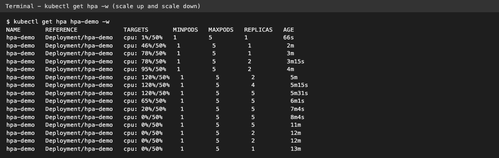
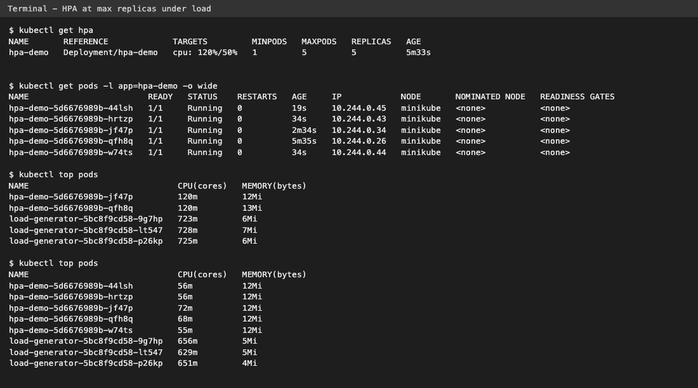

# Task 2 - HPA Hands-on (Horizontal Pod Autoscaler)

In this task I deployed an nginx app, attached an HPA to it (`hpa.yml`), then created CPU load with a busybox load generator and watched Kubernetes add Pods automatically. After I stopped the load, it removed the extra Pods again. Everything ran on minikube in the `default` namespace (metrics-server addon enabled).

## Files

| File | What it does |
|------|--------------|
| `deployment.yaml` | nginx Deployment `hpa-demo`, 1 replica, **CPU request 100m**, limit 200m |
| `service.yaml` | ClusterIP Service `hpa-demo-service` on port 80 |
| `hpa.yml` | HPA: min 1, max 5 Pods, target **50% average CPU** |
| `load-generator.yaml` | busybox Deployment running `wget` against the Service in an endless loop |

## How HPA works

```text
   load-generator pods  --- wget loop --->  hpa-demo-service  --->  hpa-demo pods (nginx)
                                                                         |
                                                       kubelet/cAdvisor  | CPU usage
                                                                         v
                                                                  metrics-server
                                                                         |
                                                every 15s reads CPU      v
   Deployment hpa-demo  <--- changes replicas ---  HPA controller (target 50% of 100m)
```

Formula the HPA uses:

```text
desiredReplicas = ceil( currentReplicas * currentCPU% / targetCPU% )
example: ceil( 2 * 120 / 50 ) = ceil(4.8) = 5
```

The `%` is measured against the CPU **request** (100m). So 50% = 50m per Pod on average. Without a CPU request the HPA cannot calculate a percentage and shows `<unknown>`.

`hpa.yml`:
```yaml
apiVersion: autoscaling/v2
kind: HorizontalPodAutoscaler
metadata:
  name: hpa-demo
spec:
  scaleTargetRef:
    apiVersion: apps/v1
    kind: Deployment
    name: hpa-demo
  minReplicas: 1
  maxReplicas: 5
  metrics:
    - type: Resource
      resource:
        name: cpu
        target:
          type: Utilization
          averageUtilization: 50
```

---

## Step 1 - Deploy the application

```bash
kubectl apply -f deployment.yaml -f service.yaml
kubectl rollout status deployment/hpa-demo
kubectl get pods -l app=hpa-demo -o wide
kubectl get svc hpa-demo-service
```
```text
deployment.apps/hpa-demo created
service/hpa-demo-service created
Waiting for deployment "hpa-demo" rollout to finish: 0 of 1 updated replicas are available...
deployment "hpa-demo" successfully rolled out
NAME                            READY   STATUS    RESTARTS   AGE   IP            NODE       NOMINATED NODE   READINESS GATES
pod/hpa-demo-5d6676989b-qfh8q   1/1     Running   0          1s    10.244.0.26   minikube   <none>           <none>
NAME               TYPE        CLUSTER-IP       EXTERNAL-IP   PORT(S)   AGE
hpa-demo-service   ClusterIP   10.106.122.165   <none>        80/TCP    1s
```
What I observed: 1 nginx Pod running behind a ClusterIP service.

## Step 2 - Configure HPA

```bash
kubectl apply -f hpa.yml
kubectl get hpa
```
```text
horizontalpodautoscaler.autoscaling/hpa-demo created
NAME       REFERENCE             TARGETS              MINPODS   MAXPODS   REPLICAS   AGE
hpa-demo   Deployment/hpa-demo   cpu: <unknown>/50%   1         5         1          0s
```
What I observed: right after creating it the target is `<unknown>` because metrics-server had not collected any data for the Pod yet.

## Step 3 - Verify HPA

About a minute later:
```bash
kubectl get hpa
kubectl top pods -l app=hpa-demo
kubectl describe hpa hpa-demo
```
```text
NAME       REFERENCE             TARGETS       MINPODS   MAXPODS   REPLICAS   AGE
hpa-demo   Deployment/hpa-demo   cpu: 1%/50%   1         5         1          61s

NAME                        CPU(cores)   MEMORY(bytes)   
hpa-demo-5d6676989b-qfh8q   1m           11Mi            

Name:                                                  hpa-demo
Namespace:                                             default
...
Reference:                                             Deployment/hpa-demo
Metrics:                                               ( current / target )
  resource cpu on pods  (as a percentage of request):  1% (1m) / 50%
Min replicas:                                          1
Max replicas:                                          5
Deployment pods:                                       1 current / 1 desired
Conditions:
  Type            Status  Reason              Message
  ----            ------  ------              -------
  AbleToScale     True    ReadyForNewScale    recommended size matches current size
  ScalingActive   True    ValidMetricFound    the HPA was able to successfully calculate a replica count from cpu resource utilization (percentage of request)
  ScalingLimited  False   DesiredWithinRange  the desired count is within the acceptable range
Events:
  Type     Reason                        Age                From                       Message
  ----     ------                        ----               ----                       -------
  Warning  FailedGetResourceMetric       16s (x4 over 61s)  horizontal-pod-autoscaler  failed to get cpu utilization: unable to get metrics for resource cpu: no metrics returned from resource metrics API
  ...
```
What I observed:
- Now the HPA shows `1%/50%` (1m out of 100m request) and `ScalingActive True / ValidMetricFound`, so it is working.
- The warning events are only from the first minute when metrics were not ready yet.

## Step 4 - Deploy a load generator

I started two watches in other terminals first (`kubectl get hpa hpa-demo -w` and `kubectl get pods -l app=hpa-demo -w`), then:

```bash
kubectl apply -f load-generator.yaml
kubectl rollout status deployment/load-generator
kubectl get pods -l app=load-generator
```
```text
deployment.apps/load-generator created
Waiting for deployment "load-generator" rollout to finish: 0 of 1 updated replicas are available...
deployment "load-generator" successfully rolled out
NAME                              READY   STATUS    RESTARTS   AGE
load-generator-5bc8f9cd58-9g7hp   1/1     Running   0          1s
```

About 2 minutes later:
```bash
kubectl get hpa
kubectl top pods
```
```text
NAME       REFERENCE             TARGETS        MINPODS   MAXPODS   REPLICAS   AGE
hpa-demo   Deployment/hpa-demo   cpu: 78%/50%   1         5         1          3m2s

NAME                              CPU(cores)   MEMORY(bytes)   
hpa-demo-5d6676989b-qfh8q         78m          12Mi            
load-generator-5bc8f9cd58-9g7hp   790m         7Mi             
```
What I observed: one load generator pushed nginx to 78m CPU = 78% of its request, which is above the 50% target. A few seconds later the HPA scaled to 2:

```bash
kubectl get hpa; kubectl get pods -l app=hpa-demo
```
```text
NAME       REFERENCE             TARGETS        MINPODS   MAXPODS   REPLICAS   AGE
hpa-demo   Deployment/hpa-demo   cpu: 78%/50%   1         5         2          3m16s
NAME                        READY   STATUS    RESTARTS   AGE
hpa-demo-5d6676989b-jf47p   1/1     Running   0          16s
hpa-demo-5d6676989b-qfh8q   1/1     Running   0          3m17s
```

## Step 5 - Increase application load

I scaled the load generator from 1 to 3 Pods to send 3x more requests:

```bash
kubectl scale deployment load-generator --replicas=3
kubectl get pods -l app=load-generator
```
```text
deployment.apps/load-generator scaled
NAME                              READY   STATUS              RESTARTS   AGE
load-generator-5bc8f9cd58-9g7hp   1/1     Running             0          2m10s
load-generator-5bc8f9cd58-lt547   0/1     ContainerCreating   0          0s
load-generator-5bc8f9cd58-p26kp   0/1     ContainerCreating   0          0s
```

## Step 6 - Observe CPU utilization

```bash
kubectl get hpa
kubectl top pods
```
```text
NAME       REFERENCE             TARGETS         MINPODS   MAXPODS   REPLICAS   AGE
hpa-demo   Deployment/hpa-demo   cpu: 120%/50%   1         5         5          5m33s

NAME                              CPU(cores)   MEMORY(bytes)   
hpa-demo-5d6676989b-jf47p         120m         12Mi            
hpa-demo-5d6676989b-qfh8q         120m         13Mi            
load-generator-5bc8f9cd58-9g7hp   723m         6Mi             
load-generator-5bc8f9cd58-lt547   728m         7Mi             
load-generator-5bc8f9cd58-p26kp   725m         6Mi             
```
What I observed: with 3 load generators the 2 nginx Pods hit 120m each = 120% of request (close to their 200m limit). The 3 new Pods do not show in `kubectl top` yet because metrics-server needs one scrape for them.

20 seconds later, after the new Pods had metrics, the load was spread across 5 Pods:
```bash
kubectl top pods
```
```text
NAME                              CPU(cores)   MEMORY(bytes)   
hpa-demo-5d6676989b-44lsh         56m          12Mi            
hpa-demo-5d6676989b-hrtzp         56m          12Mi            
hpa-demo-5d6676989b-jf47p         72m          12Mi            
hpa-demo-5d6676989b-qfh8q         68m          12Mi            
hpa-demo-5d6676989b-w74ts         55m          12Mi            
load-generator-5bc8f9cd58-9g7hp   656m         5Mi             
load-generator-5bc8f9cd58-lt547   629m         5Mi             
load-generator-5bc8f9cd58-p26kp   651m         4Mi             
```
What I observed: CPU per Pod dropped from 120m to about 55-72m because the Service now load balances to 5 Pods.

## Step 7 - Observe Pod scaling

```bash
kubectl get pods -l app=hpa-demo -o wide
```
```text
NAME                        READY   STATUS    RESTARTS   AGE     IP            NODE       NOMINATED NODE   READINESS GATES
hpa-demo-5d6676989b-44lsh   1/1     Running   0          19s     10.244.0.45   minikube   <none>           <none>
hpa-demo-5d6676989b-hrtzp   1/1     Running   0          34s     10.244.0.43   minikube   <none>           <none>
hpa-demo-5d6676989b-jf47p   1/1     Running   0          2m34s   10.244.0.34   minikube   <none>           <none>
hpa-demo-5d6676989b-qfh8q   1/1     Running   0          5m35s   10.244.0.26   minikube   <none>           <none>
hpa-demo-5d6676989b-w74ts   1/1     Running   0          34s     10.244.0.44   minikube   <none>           <none>
```

```bash
kubectl describe hpa hpa-demo
```
```text
Metrics:                                               ( current / target )
  resource cpu on pods  (as a percentage of request):  120% (120m) / 50%
Min replicas:                                          1
Max replicas:                                          5
Deployment pods:                                       5 current / 5 desired
...
Events:
  Type     Reason                        Age                    From                       Message
  ----     ------                        ----                   ----                       -------
  ...
  Normal   SuccessfulRescale             2m34s                  horizontal-pod-autoscaler  New size: 2; reason: cpu resource utilization (percentage of request) above target
  Normal   SuccessfulRescale             34s                    horizontal-pod-autoscaler  New size: 4; reason: cpu resource utilization (percentage of request) above target
  Normal   SuccessfulRescale             19s                    horizontal-pod-autoscaler  New size: 5; reason: cpu resource utilization (percentage of request) above target
```
What I observed: the HPA went 1 -> 2 -> 4 -> 5. It stopped at 5 because that is `maxReplicas`. Using the formula: ceil(2 x 120 / 50) = 5, but scale-up is rate limited, so it went to 4 first and 5 fifteen seconds later.

### Scale down after stopping the load

```bash
kubectl delete deployment load-generator
```
```text
deployment.apps "load-generator" deleted from default namespace
```

About 7 minutes later:
```bash
kubectl get hpa
kubectl get pods -l app=hpa-demo
kubectl describe hpa hpa-demo | sed -n '/^Events/,$p'
```
```text
NAME       REFERENCE             TARGETS       MINPODS   MAXPODS   REPLICAS   AGE
hpa-demo   Deployment/hpa-demo   cpu: 0%/50%   1         5         1          13m

NAME                        READY   STATUS    RESTARTS   AGE
hpa-demo-5d6676989b-qfh8q   1/1     Running   0          13m

Events:
  ...
  Normal   SuccessfulRescale             10m                horizontal-pod-autoscaler  New size: 2; reason: cpu resource utilization (percentage of request) above target
  Normal   SuccessfulRescale             8m6s               horizontal-pod-autoscaler  New size: 4; reason: cpu resource utilization (percentage of request) above target
  Normal   SuccessfulRescale             7m51s              horizontal-pod-autoscaler  New size: 5; reason: cpu resource utilization (percentage of request) above target
  Normal   SuccessfulRescale             76s                horizontal-pod-autoscaler  New size: 2; reason: All metrics below target
  Normal   SuccessfulRescale             16s                horizontal-pod-autoscaler  New size: 1; reason: All metrics below target
```
What I observed: CPU went to 0% about 2 minutes after stopping the load, but the HPA waited ~5 more minutes before removing Pods. This is the default **scale-down stabilization window (300s)** - it stops the HPA from flapping up and down on short dips.

## Step 8 - Captured output (full HPA watch)

This is the full output of `kubectl get hpa hpa-demo -w` that ran in a second terminal for the whole test:

```text
NAME       REFERENCE             TARGETS       MINPODS   MAXPODS   REPLICAS   AGE
hpa-demo   Deployment/hpa-demo   cpu: 1%/50%   1         5         1          66s
hpa-demo   Deployment/hpa-demo   cpu: 46%/50%   1         5         1          2m
hpa-demo   Deployment/hpa-demo   cpu: 78%/50%   1         5         1          3m
hpa-demo   Deployment/hpa-demo   cpu: 78%/50%   1         5         2          3m15s
hpa-demo   Deployment/hpa-demo   cpu: 95%/50%   1         5         2          4m
hpa-demo   Deployment/hpa-demo   cpu: 120%/50%   1         5         2          5m
hpa-demo   Deployment/hpa-demo   cpu: 120%/50%   1         5         4          5m15s
hpa-demo   Deployment/hpa-demo   cpu: 120%/50%   1         5         5          5m31s
hpa-demo   Deployment/hpa-demo   cpu: 65%/50%    1         5         5          6m1s
hpa-demo   Deployment/hpa-demo   cpu: 20%/50%    1         5         5          7m4s
hpa-demo   Deployment/hpa-demo   cpu: 0%/50%     1         5         5          8m4s
hpa-demo   Deployment/hpa-demo   cpu: 0%/50%     1         5         5          11m
hpa-demo   Deployment/hpa-demo   cpu: 0%/50%     1         5         2          12m
hpa-demo   Deployment/hpa-demo   cpu: 0%/50%     1         5         2          12m
hpa-demo   Deployment/hpa-demo   cpu: 0%/50%     1         5         1          13m
```

And part of `kubectl get pods -l app=hpa-demo -w` (Pods being created, then terminated on scale down):
```text
NAME                        READY   STATUS    RESTARTS   AGE
hpa-demo-5d6676989b-qfh8q   1/1     Running   0          67s
hpa-demo-5d6676989b-jf47p   0/1     Pending   0          0s
hpa-demo-5d6676989b-jf47p   0/1     ContainerCreating   0          0s
hpa-demo-5d6676989b-jf47p   1/1     Running             0          1s
hpa-demo-5d6676989b-hrtzp   0/1     Pending             0          0s
hpa-demo-5d6676989b-w74ts   0/1     Pending             0          0s
hpa-demo-5d6676989b-w74ts   0/1     ContainerCreating   0          0s
hpa-demo-5d6676989b-hrtzp   0/1     ContainerCreating   0          0s
hpa-demo-5d6676989b-hrtzp   1/1     Running             0          2s
hpa-demo-5d6676989b-w74ts   1/1     Running             0          2s
hpa-demo-5d6676989b-44lsh   0/1     Pending             0          0s
hpa-demo-5d6676989b-44lsh   0/1     ContainerCreating   0          0s
hpa-demo-5d6676989b-44lsh   1/1     Running             0          1s
...
hpa-demo-5d6676989b-hrtzp   1/1     Terminating         0          6m50s
hpa-demo-5d6676989b-w74ts   1/1     Terminating         0          6m50s
hpa-demo-5d6676989b-jf47p   1/1     Terminating         0          8m50s
...
hpa-demo-5d6676989b-44lsh   1/1     Terminating         0          7m35s
hpa-demo-5d6676989b-44lsh   0/1     Completed           0          7m36s
```

## Step 9 - Screenshots

The terminal output above saved as images:





## Cleanup

```bash
kubectl delete -f hpa.yml -f service.yaml -f deployment.yaml
```
```text
horizontalpodautoscaler.autoscaling "hpa-demo" deleted from default namespace
service "hpa-demo-service" deleted from default namespace
deployment.apps "hpa-demo" deleted from default namespace
```

## Useful commands

| Command | Why |
|---------|-----|
| `kubectl get hpa` / `kubectl get hpa -w` | current vs target CPU and replica count (watch mode) |
| `kubectl get pods` / `kubectl get pods -w` | see new Pods being created / terminated |
| `kubectl top pods` | real CPU/memory of each Pod from metrics-server |
| `kubectl describe hpa hpa-demo` | conditions + `SuccessfulRescale` events with the reason |

## What I learned
- HPA needs **metrics-server** and a **CPU request** on the container, otherwise the target is `<unknown>`.
- Utilization % is calculated against the request, not the limit.
- Scale up is fast (seconds), scale down is slow on purpose (5 min stabilization window).
- HPA never goes above `maxReplicas` even if the formula wants more.
