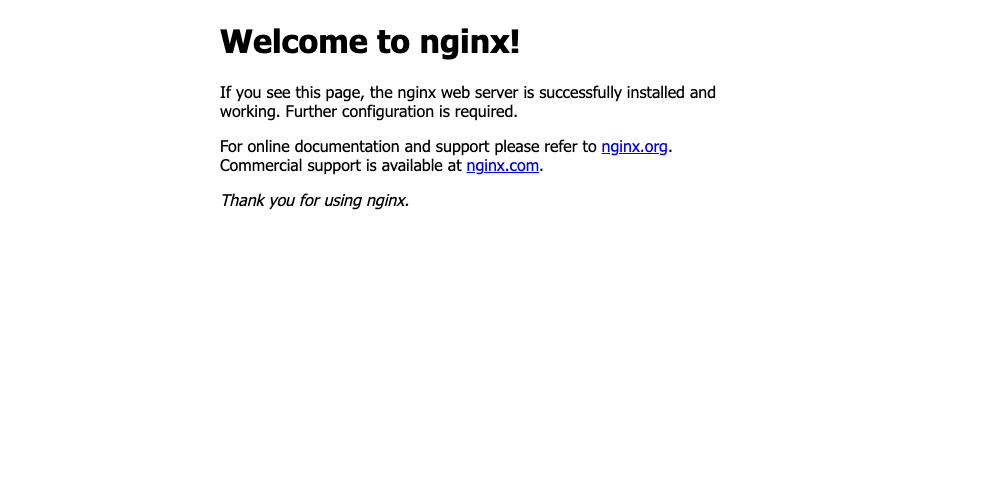
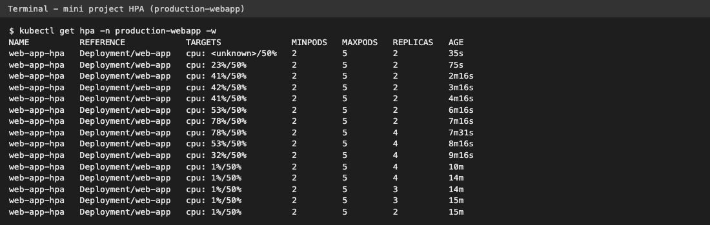

# Task 3 - Mini Project: Production-Ready Kubernetes Web App

In this mini project I deployed an nginx web app that combines everything from Session 13:

1. **Persistent storage** - a PVC (`web-data`, 500Mi) mounted at `/data`, so files survive Pod deletion.
2. **Autoscaling** - an HPA that keeps 2 to 5 replicas at 50% average CPU.
3. **Health checks** - startup, readiness and liveness probes on every Pod.

Everything runs in its own namespace `production-webapp` on minikube. I used the instructor's manifests from the session as the base.

## Architecture

```text
                        [ Service: web-service (ClusterIP :80) ]
                                        |
                 +----------------------+----------------------+
                 v                      v                      v
          [ Pod web-app-1 ]      [ Pod web-app-2 ]  ...  [ Pod web-app-N ]
          startup probe          startup probe           (N = 2..5, set by HPA)
          readiness probe        readiness probe
          liveness probe         liveness probe
          cpu req 100m           cpu req 100m
                 |                      |                      |
                 +---------- /data -----+----------------------+
                                        |
                          PVC web-data (500Mi, RWO)
                                        |
                          StorageClass standard (k8s.io/minikube-hostpath)
                                        |
                          PV pvc-xxxx (created automatically)

   metrics-server --CPU--> HPA web-app-hpa (min 2, max 5, 50%) --scales--> Deployment web-app
```

## Files

```text
03-mini-project/
├── namespace.yaml    # namespace production-webapp
├── pvc.yaml          # 500Mi ReadWriteOnce claim (default StorageClass -> dynamic PV)
├── deployment.yaml   # 2 replicas, probes, /data volume mount, requests/limits
├── service.yaml      # ClusterIP service on port 80
├── hpa.yaml          # min 2, max 5, target 50% CPU
└── README.md
```

Note: all replicas mount the same `ReadWriteOnce` PVC. This works on minikube because RWO means "one **node**" and minikube has only one node. On a multi node cluster you would need `ReadWriteMany` storage (or a StatefulSet with one PVC per Pod).

---

## Step 1 - Create the namespace

```bash
kubectl apply -f namespace.yaml
```
```text
namespace/production-webapp created
```

## Step 2 - Create the PersistentVolumeClaim

```bash
kubectl apply -f pvc.yaml
kubectl get pvc -n production-webapp
```
```text
persistentvolumeclaim/web-data created
NAME       STATUS   VOLUME                                     CAPACITY   ACCESS MODES   STORAGECLASS   VOLUMEATTRIBUTESCLASS   AGE
web-data   Bound    pvc-285d96a0-9491-443c-b17f-0c615acd1ed2   500Mi      RWO            standard       <unset>                 0s
```
What I observed: the PVC was `Bound` straight away - the `standard` StorageClass created the PV dynamically.

## Step 3 - Deploy the application and Service

```bash
kubectl apply -f deployment.yaml
kubectl apply -f service.yaml
kubectl rollout status deployment/web-app -n production-webapp --timeout=120s
kubectl get pods -n production-webapp -o wide
```
```text
deployment.apps/web-app created
service/web-service created
Waiting for deployment "web-app" rollout to finish: 0 of 2 updated replicas are available...
Waiting for deployment "web-app" rollout to finish: 1 of 2 updated replicas are available...
deployment "web-app" successfully rolled out
NAME                      READY   STATUS    RESTARTS   AGE   IP            NODE       NOMINATED NODE   READINESS GATES
web-app-d45775485-m25j9   1/1     Running   0          8s    10.244.0.63   minikube   <none>           <none>
web-app-d45775485-sfplf   1/1     Running   0          8s    10.244.0.62   minikube   <none>           <none>
```

## Step 4 - Deploy the HPA

```bash
kubectl apply -f hpa.yaml
kubectl get hpa -n production-webapp
```
```text
horizontalpodautoscaler.autoscaling/web-app-hpa created
NAME          REFERENCE            TARGETS              MINPODS   MAXPODS   REPLICAS   AGE
web-app-hpa   Deployment/web-app   cpu: <unknown>/50%   2         5         2          0s
```
What I observed: `<unknown>` at first, it changed to a real number after about a minute when metrics-server had data (see Task 3 below).

## Step 5 - Check probes, resources and volume on the Pods

```bash
kubectl describe pod -n production-webapp -l app=web-app | grep -E '^Name:|Liveness|Readiness|Startup|Mounts|/data|ClaimName|Requests|cpu|memory' | head -20
```
```text
Name:             web-app-d45775485-m25j9
      cpu:     200m
      memory:  128Mi
    Requests:
      cpu:        100m
      memory:     64Mi
    Liveness:     http-get http://:80/ delay=5s timeout=2s period=5s #success=1 #failure=3
    Readiness:    http-get http://:80/ delay=5s timeout=2s period=5s #success=1 #failure=2
    Startup:      http-get http://:80/ delay=0s timeout=1s period=2s #success=1 #failure=30
    Mounts:
      /data from persistent-storage (rw)
    ClaimName:  web-data
...
```

```bash
kubectl get endpoints web-service -n production-webapp
```
```text
Warning: v1 Endpoints is deprecated in v1.33+; use discovery.k8s.io/v1 EndpointSlice
NAME          ENDPOINTS                       AGE
web-service   10.244.0.62:80,10.244.0.63:80   14s
```
What I observed: all 3 probes are configured, and both Pod IPs are in the Service endpoints, which means both Pods passed their readiness probe.

| Probe | Question it asks | What happens on failure |
|-------|------------------|-------------------------|
| Startup | Has the app finished starting? (up to 30 x 2s = 60s) | container restarted; liveness/readiness are paused until it passes |
| Readiness | Can this Pod take traffic now? | Pod IP removed from Service endpoints (no restart) |
| Liveness | Is the app still alive? | kubelet restarts the container |

---

## Verification Task 1 - Storage persistence

Write a file from the first Pod:
```bash
POD_NAME=$(kubectl get pods -n production-webapp -l app=web-app -o jsonpath='{.items[0].metadata.name}')
echo $POD_NAME
kubectl exec -n production-webapp "$POD_NAME" -- sh -c 'echo "Student: Shubham Kapoor" > /data/student.txt'
kubectl exec -n production-webapp "$POD_NAME" -- cat /data/student.txt
```
```text
web-app-d45775485-m25j9
Student: Shubham Kapoor
```

Delete that Pod and let the Deployment create a new one:
```bash
kubectl delete pod -n production-webapp web-app-d45775485-m25j9
kubectl rollout status deployment/web-app -n production-webapp --timeout=120s
kubectl get pods -n production-webapp
```
```text
pod "web-app-d45775485-m25j9" deleted from production-webapp namespace
Waiting for deployment "web-app" rollout to finish: 1 of 2 updated replicas are available...
deployment "web-app" successfully rolled out
NAME                      READY   STATUS    RESTARTS   AGE
web-app-d45775485-rfxxn   1/1     Running   0          8s
web-app-d45775485-sfplf   1/1     Running   0          23s
```

Read the file from the **new** Pod (`rfxxn`) and from the other Pod:
```bash
kubectl exec -n production-webapp web-app-d45775485-rfxxn -- cat /data/student.txt
kubectl exec -n production-webapp web-app-d45775485-sfplf -- cat /data/student.txt
```
```text
Student: Shubham Kapoor
Student: Shubham Kapoor
```
Result: the Pod was deleted and replaced, but the data stayed on the PersistentVolume. The other replica also sees the same file because both mount the same PVC.

---

## Verification Task 2 - Service

```bash
kubectl port-forward -n production-webapp svc/web-service 8080:80
```
```text
Forwarding from 127.0.0.1:8080 -> 80
Forwarding from [::1]:8080 -> 80
Handling connection for 8080
```

In another terminal:
```bash
curl -s http://localhost:8080 | head -8
curl -s -o /dev/null -w '%{http_code}\n' http://localhost:8080
```
```text
<!DOCTYPE html>
<html>
<head>
<title>Welcome to nginx!</title>
<style>
html { color-scheme: light dark; }
body { width: 35em; margin: 0 auto;
font-family: Tahoma, Verdana, Arial, sans-serif; }

200
```

Same page opened in a browser through the port-forward:



---

## Verification Task 3 - Trigger HPA scaling

I started a watch in another terminal (`kubectl get hpa -n production-webapp -w`) and then ran the load generator from the project guide:

```bash
kubectl run load-generator -n production-webapp \
  --image=busybox:1.36 \
  --restart=Never \
  -- /bin/sh -c "while true; do wget -q -O- http://web-service; done"
```
```text
pod/load-generator created
```

A few minutes later:
```bash
kubectl get hpa -n production-webapp; kubectl top pods -n production-webapp
```
```text
NAME          REFERENCE            TARGETS        MINPODS   MAXPODS   REPLICAS   AGE
web-app-hpa   Deployment/web-app   cpu: 41%/50%   2         5         2          5m38s
NAME                      CPU(cores)   MEMORY(bytes)   
load-generator            790m         6Mi             
web-app-d45775485-rfxxn   41m          11Mi            
web-app-d45775485-sfplf   41m          11Mi            
```
What I observed: with only **one** load generator the CPU stayed around 41%, which is below the 50% target, so the HPA (correctly) did not scale. The single busybox loop can only push about 80m of nginx CPU in total, split across 2 Pods.

So I added a second load generator to make more traffic:
```bash
kubectl run load-generator-2 -n production-webapp --image=busybox:1.36 --restart=Never -- /bin/sh -c 'while true; do wget -q -O- http://web-service; done'
```
```text
pod/load-generator-2 created
```

```bash
kubectl get hpa -n production-webapp
kubectl get pods -n production-webapp
kubectl top pods -n production-webapp
```
```text
NAME          REFERENCE            TARGETS        MINPODS   MAXPODS   REPLICAS   AGE
web-app-hpa   Deployment/web-app   cpu: 78%/50%   2         5         4          8m16s

NAME                      READY   STATUS    RESTARTS   AGE
load-generator            1/1     Running   0          7m41s
load-generator-2          1/1     Running   0          2m31s
web-app-d45775485-2mggs   1/1     Running   0          60s
web-app-d45775485-8lff4   1/1     Running   0          60s
web-app-d45775485-rfxxn   1/1     Running   0          8m9s
web-app-d45775485-sfplf   1/1     Running   0          8m24s

NAME                      CPU(cores)   MEMORY(bytes)   
load-generator            743m         5Mi             
load-generator-2          737m         5Mi             
web-app-d45775485-2mggs   35m          12Mi            
web-app-d45775485-8lff4   37m          12Mi            
web-app-d45775485-rfxxn   53m          12Mi            
web-app-d45775485-sfplf   53m          12Mi            
```

The new Pods also got the PVC mounted, and can read the file:
```bash
kubectl exec -n production-webapp web-app-d45775485-2mggs -- cat /data/student.txt
```
```text
Student: Shubham Kapoor
```

```bash
kubectl describe hpa web-app-hpa -n production-webapp | sed -n '/^Metrics/,$p'
```
```text
Metrics:                                               ( current / target )
  resource cpu on pods  (as a percentage of request):  53% (53m) / 50%
Min replicas:                                          2
Max replicas:                                          5
Deployment pods:                                       4 current / 4 desired
Conditions:
  Type            Status  Reason              Message
  ----            ------  ------              -------
  AbleToScale     True    ReadyForNewScale    recommended size matches current size
  ScalingActive   True    ValidMetricFound    the HPA was able to successfully calculate a replica count from cpu resource utilization (percentage of request)
  ScalingLimited  False   DesiredWithinRange  the desired count is within the acceptable range
...
Events:
  ...
  Normal   SuccessfulRescale             67s                   horizontal-pod-autoscaler  New size: 4; reason: cpu resource utilization (percentage of request) above target
```
What I observed: 78% on 2 Pods -> ceil(2 x 78 / 50) = 4 Pods. After that the average dropped to 53%. The HPA did not go to 5 because 53/50 = 1.06 is inside the HPA's default **10% tolerance**, so it kept 4 replicas.

Stop the load and watch scale down:
```bash
kubectl delete pod load-generator load-generator-2 -n production-webapp
```
```text
pod "load-generator" deleted from production-webapp namespace
pod "load-generator-2" deleted from production-webapp namespace
```

About 5 minutes later:
```bash
kubectl get hpa -n production-webapp; kubectl get pods -n production-webapp
```
```text
NAME          REFERENCE            TARGETS       MINPODS   MAXPODS   REPLICAS   AGE
web-app-hpa   Deployment/web-app   cpu: 1%/50%   2         5         2          15m
NAME                      READY   STATUS    RESTARTS   AGE
web-app-d45775485-rfxxn   1/1     Running   0          15m
web-app-d45775485-sfplf   1/1     Running   0          15m
```

Full `kubectl get hpa -n production-webapp -w` log from the second terminal:
```text
NAME          REFERENCE            TARGETS              MINPODS   MAXPODS   REPLICAS   AGE
web-app-hpa   Deployment/web-app   cpu: <unknown>/50%   2         5         2          35s
web-app-hpa   Deployment/web-app   cpu: 23%/50%         2         5         2          75s
web-app-hpa   Deployment/web-app   cpu: 41%/50%         2         5         2          2m16s
web-app-hpa   Deployment/web-app   cpu: 42%/50%         2         5         2          3m16s
web-app-hpa   Deployment/web-app   cpu: 41%/50%         2         5         2          4m16s
web-app-hpa   Deployment/web-app   cpu: 53%/50%         2         5         2          6m16s
web-app-hpa   Deployment/web-app   cpu: 78%/50%         2         5         2          7m16s
web-app-hpa   Deployment/web-app   cpu: 78%/50%         2         5         4          7m31s
web-app-hpa   Deployment/web-app   cpu: 53%/50%         2         5         4          8m16s
web-app-hpa   Deployment/web-app   cpu: 32%/50%         2         5         4          9m16s
web-app-hpa   Deployment/web-app   cpu: 1%/50%          2         5         4          10m
web-app-hpa   Deployment/web-app   cpu: 1%/50%          2         5         4          14m
web-app-hpa   Deployment/web-app   cpu: 1%/50%          2         5         3          14m
web-app-hpa   Deployment/web-app   cpu: 1%/50%          2         5         3          15m
web-app-hpa   Deployment/web-app   cpu: 1%/50%          2         5         2          15m
```



What I observed: it scaled 2 -> 4 under load and back 4 -> 3 -> 2 after the load stopped. It never went below `minReplicas: 2`.

---

## Cleanup

```bash
kubectl delete -f hpa.yaml -f service.yaml -f deployment.yaml -f pvc.yaml -f namespace.yaml
```
```text
horizontalpodautoscaler.autoscaling "web-app-hpa" deleted from production-webapp namespace
service "web-service" deleted from production-webapp namespace
deployment.apps "web-app" deleted from production-webapp namespace
persistentvolumeclaim "web-data" deleted from production-webapp namespace
namespace "production-webapp" deleted
```

## Problems I hit / what I learned
- One load generator was not enough to cross 50% with 2 replicas - I had to add a second one. The HPA target is per Pod average, so more replicas = more load needed.
- HPA has a 10% tolerance, so 53% vs 50% does not trigger a scale up.
- `<unknown>` in the HPA for the first minute is normal (metrics-server needs time).
- Storage, scaling and probes work together: new Pods created by the HPA automatically mount the same PVC and only get traffic after the readiness probe passes.
