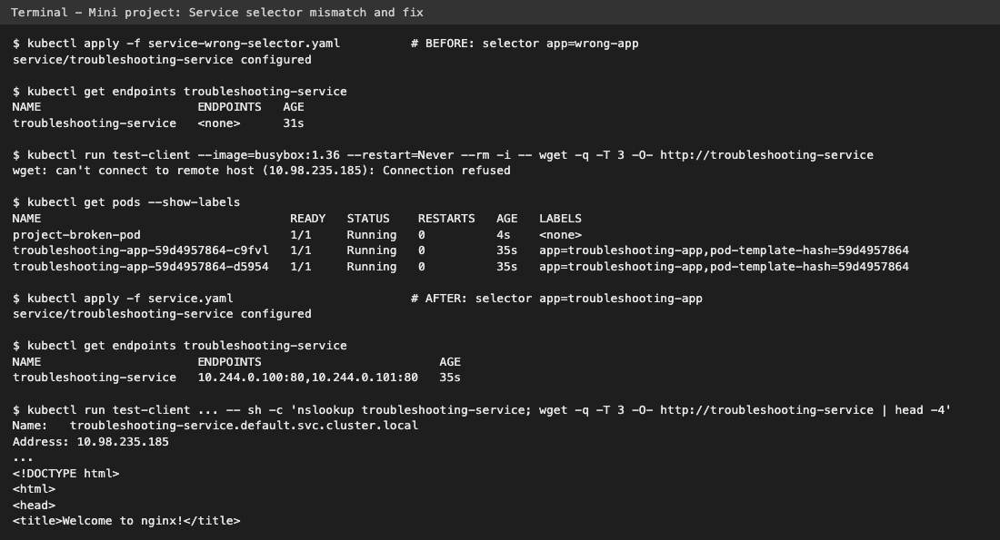

# Task 3 - Mini Project: Kubernetes Troubleshooting Challenge

In this mini project I followed the instructor's challenge: deploy a simple nginx app (Deployment + Service), check it, then break things on purpose and fix them using only the troubleshooting process - **no guessing**.

```text
 Deploy -> Observe -> Break -> Investigate -> Find root cause -> Fix -> Verify
```

## Files

| File | What it is |
|------|------------|
| `deployment.yaml` | `troubleshooting-app`, 2 nginx:1.27 replicas, label `app: troubleshooting-app` |
| `service.yaml` | `troubleshooting-service` (ClusterIP, port 80) - correct selector |
| `broken-pod.yaml` | `project-broken-pod` with image `nginx:this-tag-does-not-exist` (given by instructor) |
| `fixed-pod.yaml` | same Pod with `nginx:1.27` (my fix) |
| `service-wrong-selector.yaml` | the Service with selector `app: wrong-app` (for the Service challenge) |

---

## 1. Deploy the application

```bash
kubectl apply -f deployment.yaml
kubectl apply -f service.yaml
kubectl get pods
kubectl get service
```
```text
deployment.apps/troubleshooting-app created
service/troubleshooting-service created

NAME                                   READY   STATUS    RESTARTS   AGE
troubleshooting-app-59d4957864-c9fvl   1/1     Running   0          1s
troubleshooting-app-59d4957864-d5954   1/1     Running   0          1s

NAME                      TYPE        CLUSTER-IP      EXTERNAL-IP   PORT(S)   AGE
kubernetes                ClusterIP   10.96.0.1       <none>        443/TCP   59m
troubleshooting-service   ClusterIP   10.98.235.185   <none>        80/TCP    1s
```

## 2. Check the application

```bash
kubectl get pods -o wide
```
```text
NAME                                   READY   STATUS    RESTARTS   AGE   IP             NODE       NOMINATED NODE   READINESS GATES
troubleshooting-app-59d4957864-c9fvl   1/1     Running   0          1s    10.244.0.101   minikube   <none>           <none>
troubleshooting-app-59d4957864-d5954   1/1     Running   0          1s    10.244.0.100   minikube   <none>           <none>
```

```bash
kubectl describe pod troubleshooting-app-59d4957864-c9fvl
```
```text
Name:             troubleshooting-app-59d4957864-c9fvl
Namespace:        default
Node:             minikube/192.168.49.2
Labels:           app=troubleshooting-app
                  pod-template-hash=59d4957864
Status:           Running
IP:               10.244.0.101
Controlled By:  ReplicaSet/troubleshooting-app-59d4957864
Containers:
  app:
    Image:          nginx:1.27
    Port:           80/TCP
    State:          Running
      Started:      Thu, 08 Oct 2026 01:10:46 +0530
    Ready:          True
    Restart Count:  0
...
Events:
  Type    Reason     Age   From               Message
  ----    ------     ----  ----               -------
  Normal  Scheduled  1s    default-scheduler  Successfully assigned default/troubleshooting-app-59d4957864-c9fvl to minikube
  Normal  Pulled     0s    kubelet            Container image "nginx:1.27" already present on machine and can be accessed by the pod
  Normal  Created    0s    kubelet            Container created
  Normal  Started    0s    kubelet            Container started
```

```bash
kubectl logs troubleshooting-app-59d4957864-c9fvl
```
```text
/docker-entrypoint.sh: /docker-entrypoint.d/ is not empty, will attempt to perform configuration
/docker-entrypoint.sh: Looking for shell scripts in /docker-entrypoint.d/
...
/docker-entrypoint.sh: Configuration complete; ready for start up
2026/10/07 19:40:46 [notice] 1#1: using the "epoll" event method
2026/10/07 19:40:46 [notice] 1#1: nginx/1.27.5
...
2026/10/07 19:40:46 [notice] 1#1: start worker processes
2026/10/07 19:40:46 [notice] 1#1: start worker process 29
...
```

The guide says `kubectl exec -it <pod> -- bash` and then `curl localhost`. I sent the same commands into bash with `-i`:
```bash
printf 'curl -s localhost | head -4\nexit\n' | kubectl exec -i troubleshooting-app-59d4957864-c9fvl -- bash
```
```text
<!DOCTYPE html>
<html>
<head>
<title>Welcome to nginx!</title>
```
What I observed: the Pod is healthy - Running, Ready, 0 restarts, clean nginx logs, and it answers on localhost.

## 3. Check the Service

```bash
kubectl describe service troubleshooting-service
```
```text
Name:                     troubleshooting-service
Namespace:                default
Selector:                 app=troubleshooting-app
Type:                     ClusterIP
IP:                       10.98.235.185
Port:                     <unset>  80/TCP
TargetPort:               80/TCP
Endpoints:                10.244.0.101:80,10.244.0.100:80
...
```
- **Selector** `app=troubleshooting-app` = the Pod label.
- **TargetPort** 80 = nginx containerPort.
- **Endpoints** = both Pod IPs.

## 4. Check Endpoints

```bash
kubectl get endpoints troubleshooting-service
```
```text
Warning: v1 Endpoints is deprecated in v1.33+; use discovery.k8s.io/v1 EndpointSlice
NAME                      ENDPOINTS                         AGE
troubleshooting-service   10.244.0.100:80,10.244.0.101:80   2s
```
(The deprecation warning is because k8s 1.33+ prefers EndpointSlices; the command still works.)

---

## 5. Create a broken Pod

```bash
kubectl apply -f broken-pod.yaml
kubectl get pod project-broken-pod
```
```text
pod/project-broken-pod created
NAME                 READY   STATUS             RESTARTS   AGE
project-broken-pod   0/1     ImagePullBackOff   0          17s
```

## 6. Troubleshoot it (without touching the YAML first)

```bash
kubectl describe pod project-broken-pod
```
```text
    Image:          nginx:this-tag-does-not-exist
    State:          Waiting
      Reason:       ImagePullBackOff
Events:
  Type     Reason     Age               From               Message
  ----     ------     ----              ----               -------
  Normal   Scheduled  17s               default-scheduler  Successfully assigned default/project-broken-pod to minikube
  Warning  Failed     15s               kubelet            Failed to pull image "nginx:this-tag-does-not-exist": rpc error: code = NotFound desc = failed to pull and unpack image "docker.io/library/nginx:this-tag-does-not-exist": failed to resolve reference "docker.io/library/nginx:this-tag-does-not-exist": docker.io/library/nginx:this-tag-does-not-exist: not found
  Warning  Failed     15s               kubelet            Error: ErrImagePull
  Normal   BackOff    15s               kubelet            Back-off pulling image "nginx:this-tag-does-not-exist"
  Warning  Failed     15s               kubelet            Error: ImagePullBackOff
  Normal   Pulling    1s (x2 over 16s)  kubelet            Pulling image "nginx:this-tag-does-not-exist"
```

## 7. My answers

**Question 1: What is the Pod status?**
*Answer:* `ImagePullBackOff` (READY `0/1`, RESTARTS `0`). For a moment it is also `ErrImagePull`.

**Question 2: What is the actual error?**
*Answer:* `Failed to pull image "nginx:this-tag-does-not-exist": ... docker.io/library/nginx:this-tag-does-not-exist: not found`

**Question 3: Which command helped you find the reason?**
*Answer:* `kubectl describe pod project-broken-pod` - the `Events` section at the bottom (`kubectl events --for pod/project-broken-pod` shows the same).

**Question 4: What is wrong with the image?**
*Answer:* The image name `nginx` is fine and Docker Hub is reachable, but the **tag** `this-tag-does-not-exist` does not exist in the `nginx` repository, so the registry returns "not found".

**Question 5: How would you fix it?**
*Answer:* Change the image to a tag that exists (`nginx:1.27`, same as the Deployment) - see `fixed-pod.yaml` - delete the Pod and apply again:

```bash
kubectl delete pod project-broken-pod
kubectl apply -f fixed-pod.yaml
kubectl get pod project-broken-pod
```
```text
pod "project-broken-pod" deleted from default namespace
pod/project-broken-pod created
NAME                 READY   STATUS    RESTARTS   AGE
project-broken-pod   1/1     Running   0          0s
```

---

## 8. Service troubleshooting challenge (break the selector)

I made `service-wrong-selector.yaml` with the selector changed:
```bash
diff service.yaml service-wrong-selector.yaml
```
```text
9c9
<     app: troubleshooting-app
---
>     app: wrong-app
```

```bash
kubectl apply -f service-wrong-selector.yaml
kubectl get service
kubectl get endpoints troubleshooting-service
```
```text
service/troubleshooting-service configured

NAME                      TYPE        CLUSTER-IP      EXTERNAL-IP   PORT(S)   AGE
kubernetes                ClusterIP   10.96.0.1       <none>        443/TCP   60m
troubleshooting-service   ClusterIP   10.98.235.185   <none>        80/TCP    31s

NAME                      ENDPOINTS   AGE
troubleshooting-service   <none>      31s
```

Test the Service from a temporary Pod:
```bash
kubectl run test-client --image=busybox:1.36 --restart=Never --rm -i -- wget -q -T 3 -O- http://troubleshooting-service
```
```text
wget: can't connect to remote host (10.98.235.185): Connection refused
pod "test-client" deleted from default namespace
pod default/test-client terminated (Error)
```
What I observed: `kubectl get service` looks completely normal - the problem is only visible in the endpoints (`<none>`). The Service has an IP but nothing behind it.

## 9. Find the root cause

```bash
kubectl get pods --show-labels
```
```text
NAME                                   READY   STATUS    RESTARTS   AGE   LABELS
project-broken-pod                     1/1     Running   0          4s    <none>
troubleshooting-app-59d4957864-c9fvl   1/1     Running   0          35s   app=troubleshooting-app,pod-template-hash=59d4957864
troubleshooting-app-59d4957864-d5954   1/1     Running   0          35s   app=troubleshooting-app,pod-template-hash=59d4957864
```

```bash
kubectl describe service troubleshooting-service
```
```text
Name:                     troubleshooting-service
Namespace:                default
Selector:                 app=wrong-app
Type:                     ClusterIP
IP:                       10.98.235.185
Port:                     <unset>  80/TCP
TargetPort:               80/TCP
Endpoints:                
...
```

**Root cause:** Pod label is `app=troubleshooting-app` but the Service selector is `app=wrong-app`. No Pod has that label, so the Service selects zero Pods -> no endpoints -> connection refused.

**Fix:** put the selector back to `app: troubleshooting-app`:
```bash
kubectl apply -f service.yaml
kubectl get endpoints troubleshooting-service
```
```text
service/troubleshooting-service configured
NAME                      ENDPOINTS                         AGE
troubleshooting-service   10.244.0.100:80,10.244.0.101:80   35s
```

**Verify** (DNS + HTTP from a temporary Pod):
```bash
kubectl run test-client --image=busybox:1.36 --restart=Never --rm -i -- sh -c 'nslookup troubleshooting-service; wget -q -T 3 -O- http://troubleshooting-service | head -4'
```
```text
Server:		10.96.0.10
Address:	10.96.0.10:53

Name:	troubleshooting-service.default.svc.cluster.local
Address: 10.98.235.185

** server can't find troubleshooting-service.svc.cluster.local: NXDOMAIN

** server can't find troubleshooting-service.cluster.local: NXDOMAIN
...
<!DOCTYPE html>
<html>
<head>
<title>Welcome to nginx!</title>
pod "test-client" deleted from default namespace
```
The NXDOMAIN lines are normal: busybox nslookup also tries the other `search` domains from resolv.conf. The important line is the first answer - `troubleshooting-service.default.svc.cluster.local -> 10.98.235.185` - and the nginx page loads again.



Final state:
```bash
kubectl get pods,svc,endpointslices -o wide
```
```text
NAME                                       READY   STATUS    RESTARTS   AGE   IP             NODE       NOMINATED NODE   READINESS GATES
pod/project-broken-pod                     1/1     Running   0          12s   10.244.0.103   minikube   <none>           <none>
pod/troubleshooting-app-59d4957864-c9fvl   1/1     Running   0          43s   10.244.0.101   minikube   <none>           <none>
pod/troubleshooting-app-59d4957864-d5954   1/1     Running   0          43s   10.244.0.100   minikube   <none>           <none>

NAME                              TYPE        CLUSTER-IP      EXTERNAL-IP   PORT(S)   AGE   SELECTOR
service/kubernetes                ClusterIP   10.96.0.1       <none>        443/TCP   60m   <none>
service/troubleshooting-service   ClusterIP   10.98.235.185   <none>        80/TCP    43s   app=troubleshooting-app

NAME                                                           ADDRESSTYPE   PORTS   ENDPOINTS                   AGE
endpointslice.discovery.k8s.io/kubernetes                      IPv4          8443    192.168.49.2                60m
endpointslice.discovery.k8s.io/troubleshooting-service-zx8qh   IPv4          80      10.244.0.100,10.244.0.101   43s
```

Cleanup:
```bash
kubectl delete -f fixed-pod.yaml -f service.yaml -f deployment.yaml
```
```text
pod "project-broken-pod" deleted from default namespace
service "troubleshooting-service" deleted from default namespace
deployment.apps "troubleshooting-app" deleted from default namespace
```

---

## 10. Final troubleshooting checklist (what I actually used)

```bash
kubectl get pods                       # status
kubectl describe pod <pod-name>        # details + events
kubectl logs <pod-name>                # app output
kubectl exec -it <pod-name> -- sh      # test from inside
kubectl get events                     # timeline

# Service problems
kubectl describe service <service-name>
kubectl get endpoints <service-name>
nslookup <service-name>                # from inside a Pod
```

## 11. Troubleshooting table

| Problem | What I Saw | Command I Used | Root Cause | Fix |
| :--- | :--- | :--- | :--- | :--- |
| **Broken Pod** | `project-broken-pod` `0/1 ImagePullBackOff`, 0 restarts | `kubectl get pod`, `kubectl describe pod project-broken-pod` | container could not be created because its image could not be pulled | recreate the Pod with a valid image (`fixed-pod.yaml`) |
| **Service Problem** | Service exists with ClusterIP, but `ENDPOINTS <none>` and `Connection refused` | `kubectl get endpoints`, `kubectl get pods --show-labels`, `kubectl describe service` | selector `app=wrong-app` does not match Pod label `app=troubleshooting-app` | set selector back to `app: troubleshooting-app` and re-apply |
| **Image Problem** | event `docker.io/library/nginx:this-tag-does-not-exist: not found` | `kubectl describe pod` (Events) | tag `this-tag-does-not-exist` does not exist on Docker Hub | use an existing tag `nginx:1.27` |

## 12. README questions (my own words)

1. **What does `kubectl get` tell us?**
   A short status list of resources: name, ready count, status (Running/Pending/...), restarts, age. With `-o wide` also IP and node. It tells me *what* state things are in, but not *why*.

2. **What is the difference between `get` and `describe`?**
   `get` = one line summary per object. `describe` = full details of one object (containers, image, state, exit code, volumes, conditions) plus the **Events** list, which usually explains *why* something is wrong.

3. **Why do we use `kubectl logs`?**
   To see what the application itself printed (stdout/stderr) - error messages, stack traces, "config missing" etc. `--previous` shows the logs of the last crashed container, which is key for CrashLoopBackOff.

4. **When would you use `kubectl exec`?**
   When the Pod is running but something does not work, and I need to test from inside: `curl localhost`, `nslookup <service>`, check env vars, config files, mounted volumes, or which port the app listens on (`netstat`).

5. **What does `CrashLoopBackOff` mean?**
   The container starts and then exits/crashes again and again. Kubernetes keeps restarting it, waiting longer each time (back-off). Usually an app or config problem - check exit code in describe and `logs --previous`.

6. **What does `ImagePullBackOff` mean?**
   kubelet could not pull the container image (wrong name/tag, private registry without credentials, registry unreachable) and is now waiting before retrying. The container was never created.

7. **Why can a Pod remain `Pending`?**
   The scheduler cannot find a node for it: not enough CPU/memory for its requests, nodeSelector/affinity that no node matches, taints without tolerations, an unbound PVC, or no nodes ready. The `FailedScheduling` event says which.

8. **Why can a Service have no endpoints?**
   The selector doesn't match any Pod labels (typo / wrong label), the matching Pods are not Ready (failing readiness probe), the Pods are in a different namespace, or there are simply no Pods running.

9. **What is the relationship between a Service selector and Pod labels?**
   The Service picks its backend Pods by labels. Every Pod (in the same namespace) whose labels contain all key=value pairs of the selector - and is Ready - becomes an endpoint. If they don't match, the Service has nobody to send traffic to.

10. **What is Kubernetes DNS?**
    CoreDNS running in `kube-system` (Service IP `10.96.0.10`). It gives every Service a name `<service>.<namespace>.svc.cluster.local` that resolves to the ClusterIP. Pods get it in `/etc/resolv.conf` automatically, so apps can use names like `http://troubleshooting-service` instead of IPs.

## 13. Final architecture

```text
                    Kubernetes Cluster (minikube)
                            |
                            v
              +-----------------------------+
              |  troubleshooting-service    |
              |  ClusterIP 10.98.235.185:80 |
              +--------------+--------------+
                             |
              selector app=troubleshooting-app
                             |
              +--------------+--------------+
              |                             |
              v                             v
        Pod 10.244.0.101              Pod 10.244.0.100
              |                             |
              +--------------+--------------+
                             |
                    nginx:1.27 on port 80
```

## What I learned
- The rule "GET -> DESCRIBE -> EVENTS -> LOGS -> EXEC -> TEST -> FIX -> VERIFY" works. In both problems the answer was in `describe` or `get endpoints` - no need to guess or edit YAML blindly.
- A Service that "looks fine" in `kubectl get service` can still be broken - always check endpoints.
