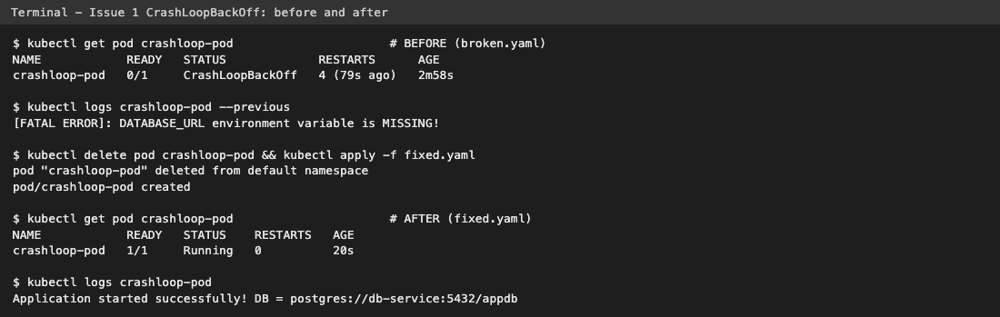

# Session 14 - Kubernetes Troubleshooting

Everything was done on minikube (docker driver, Kubernetes v1.37) in the `default` namespace. All outputs in the READMEs are real outputs from my terminal. Every resource was deleted after each exercise.

| Task | Folder | What I did |
|------|--------|------------|
| 1. Kubernetes Commands | [01-kubectl-commands](01-kubectl-commands/README.md) | Practiced `get`, `get -o wide`, `describe`, `logs`, `exec`, `events`, `explain`, `top` on a small nginx app |
| 2. Troubleshoot Common Issues | [02-common-issues](02-common-issues/README.md) | 9 issues, each with `broken.yaml`, `fixed.yaml` and README (identify -> investigate -> root cause -> fix -> verify) |
| 3. Mini Project | [03-mini-project](03-mini-project/README.md) | Instructor's troubleshooting challenge: broken image Pod + Service selector mismatch, questions answered, troubleshooting table |

## Issues covered in Task 2

| # | Issue | Root cause I created |
|---|-------|----------------------|
| 01 | [CrashLoopBackOff](02-common-issues/01-crashloopbackoff/README.md) | missing `DATABASE_URL` env var |
| 02 | [ImagePullBackOff](02-common-issues/02-imagepullbackoff/README.md) | wrong image tag |
| 03 | [ErrImagePull](02-common-issues/03-errimagepull/README.md) | registry host does not exist |
| 04 | [Pending](02-common-issues/04-pending/README.md) | requests bigger than the node |
| 05 | [ContainerCreating](02-common-issues/05-containercreating/README.md) | Secret volume not created |
| 06 | [Service connectivity](02-common-issues/06-service-connectivity/README.md) | wrong `targetPort` |
| 07 | [DNS](02-common-issues/07-dns-issues/README.md) | wrong Service hostname |
| 08 | [Pod networking](02-common-issues/08-pod-networking/README.md) | app listening on 127.0.0.1 only |
| 09 | [Configuration](02-common-issues/09-configuration-issues/README.md) | wrong ConfigMap key |

## Deliverables checklist

| Deliverable | Where |
|-------------|-------|
| Commands | `01-kubectl-commands/README.md` |
| Problem statement | top of every issue README |
| Investigation steps | "2. Investigate" in every issue README |
| Root cause | "3. Root cause" in every issue README |
| Solution | "4. Fix" + `fixed.yaml` |
| Before/after output | "Before / After" table + outputs in every issue README |
| Screenshots | `screenshots/` (real terminal output rendered as images) |
| README.md | this file + one per task / issue |

## Screenshots




## My troubleshooting flow

```text
 kubectl get  ->  kubectl describe  ->  events  ->  kubectl logs  ->  kubectl exec  ->  test  ->  fix  ->  verify
```
