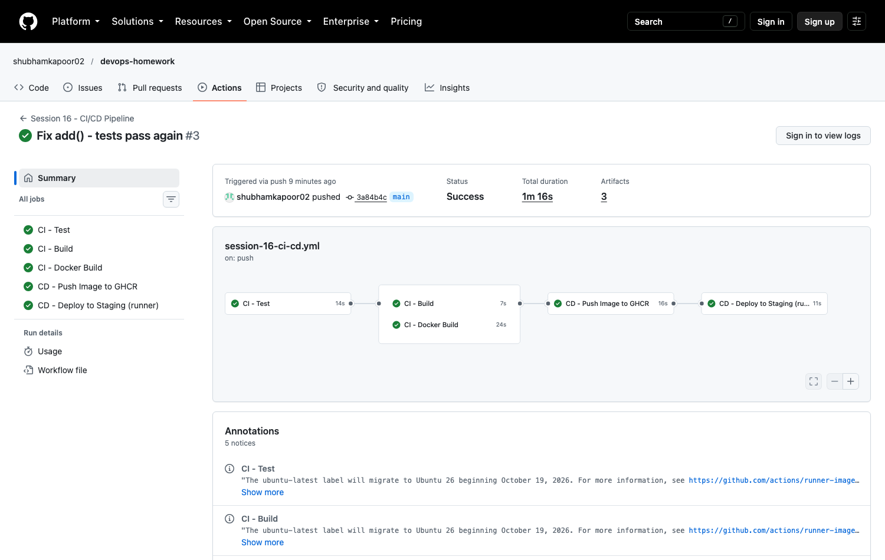
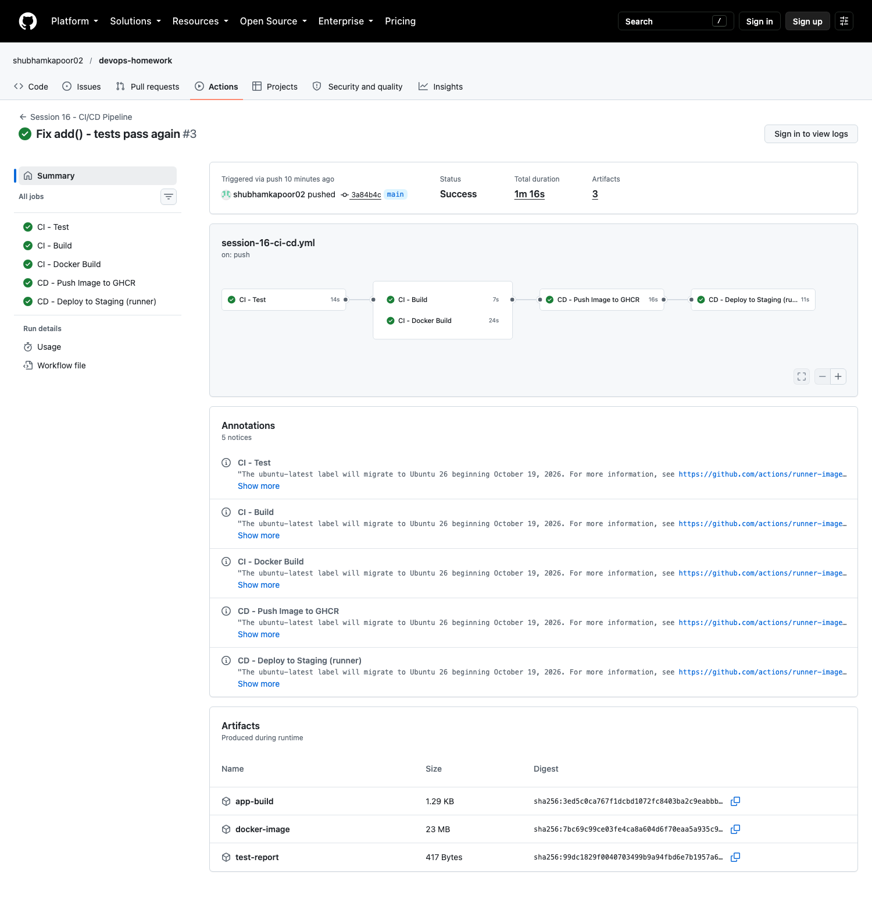
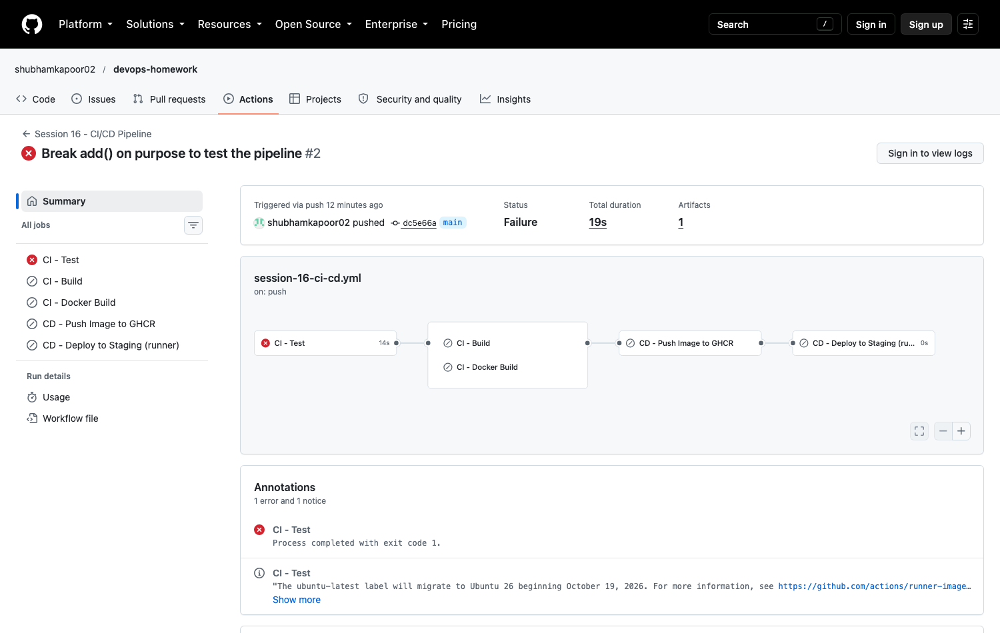
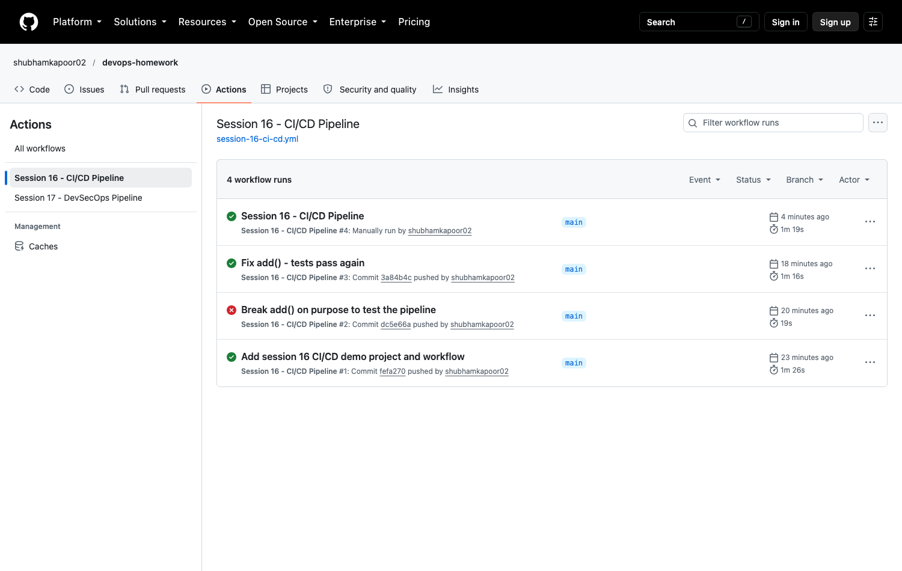

# 01 - CI/CD Demo Project with GitHub Actions

In this task I built a small CI/CD demo project and ran it on GitHub Actions.
I used the instructor's `10-final-cicd-pipeline` as the starting point (calculator + pytest + build.sh + test/build jobs) and
extended it with a Flask app, a Dockerfile, a Docker build job, and a CD part that pushes the image to
GitHub Container Registry (GHCR) and deploys it.

> **Where is the workflow?** GitHub only runs workflows from the `.github/workflows/` folder at the **root** of the repo.
> So the active copy is [`/.github/workflows/session-16-ci-cd.yml`](../../.github/workflows/session-16-ci-cd.yml).
> I kept the same file here in [`.github/workflows/ci-cd.yml`](.github/workflows/ci-cd.yml) so this folder is complete on its own.

---

## 1. CI vs CD

| | CI - Continuous Integration | CD - Continuous Delivery / Deployment |
|---|---|---|
| Question it answers | "Is my code change OK?" | "Can I ship this change?" |
| What runs | build, unit tests, docker build, smoke test | push image to registry, deploy, verify |
| When | on every push / pull request | only after CI passes, only on `main` |
| Output | test report, build artifact, docker image | image in GHCR, running app |

In my workflow the jobs are named `CI - ...` and `CD - ...` so it is easy to see which part is which.

```text
 developer
    |  git push (only files in session-16-github-actions/ trigger it)
    v
 GitHub repo  ------>  GitHub Actions (workflow: session-16-ci-cd.yml)
                           |
         ==================|=========== CI =====================
                           v
                     +-----------+
                     | CI - Test |  pytest, upload test-report artifact
                     +-----------+
                      |         |
                      v         v
             +------------+  +------------------+
             | CI - Build |  | CI - Docker Build|  docker build + smoke test
             +------------+  +------------------+
              app-build          docker-image
              artifact           artifact
                      |         |
         =============|=========|====== CD ======================
                      v         v
              +----------------------------+
              | CD - Push Image to GHCR    |  login with GITHUB_TOKEN
              +----------------------------+
                           |
                           v
              +----------------------------+
              | CD - Deploy to Staging     |  pull from GHCR, run with secret,
              |    (runner)                |  curl to verify
              +----------------------------+
```

---

## 2. Project structure

```text
01-cicd-demo-project/
├── app/
│   ├── __init__.py
│   ├── app.py              # Flask app (/, /health, /api/calc, /api/message)
│   └── calculator.py       # add / subtract / multiply / divide (from the instructor demo)
├── tests/
│   └── test_app.py         # 10 pytest tests (calculator + endpoints)
├── build.sh                # build step -> build/ folder + app-build.tar.gz
├── Dockerfile
├── .dockerignore
├── requirements.txt        # Flask
├── requirements-dev.txt    # + pytest
├── pytest.ini
└── .github/workflows/ci-cd.yml   # copy of the workflow (active one is at repo root)
```

---

## 3. Run it locally first

Before putting anything in a pipeline I checked that every step works on my laptop.

### Step 1: Run the tests

```bash
cd session-16-github-actions/01-cicd-demo-project
python3 -m venv venv && source venv/bin/activate
pip install -r requirements-dev.txt
pytest -v
```

```text
============================= test session starts ==============================
platform darwin -- Python 3.13.13, pytest-9.1.1, pluggy-1.6.0
rootdir: /Users/shubhamkapoor/Desktop/devops /session-16-github-actions/01-cicd-demo-project
configfile: pytest.ini
testpaths: tests
collecting ... collected 10 items

tests/test_app.py::test_add PASSED                                       [ 10%]
tests/test_app.py::test_subtract PASSED                                  [ 20%]
tests/test_app.py::test_multiply PASSED                                  [ 30%]
tests/test_app.py::test_divide PASSED                                    [ 40%]
tests/test_app.py::test_divide_by_zero PASSED                            [ 50%]
tests/test_app.py::test_home PASSED                                      [ 60%]
tests/test_app.py::test_health PASSED                                    [ 70%]
tests/test_app.py::test_calc_add PASSED                                  [ 80%]
tests/test_app.py::test_calc_divide_by_zero PASSED                       [ 90%]
tests/test_app.py::test_calc_unknown_op PASSED                           [100%]

============================== 10 passed in 0.49s ==============================
```

What I observed: all 10 tests pass. `pytest.ini` sets `pythonpath = .` so `from app.app import app` works without the `sys.path` hack.

### Step 2: Run the build script

```bash
./build.sh
```

```text
=================================
Starting Application Build
=================================

Build files:
total 24
drwxr-xr-x@  6 shubhamkapoor  staff   192 Oct  8 00:19 .
drwxr-xr-x@ 14 shubhamkapoor  staff   448 Oct  8 00:19 ..
drwxr-xr-x@  5 shubhamkapoor  staff   160 Oct  8 00:19 app
-rw-r--r--@  1 shubhamkapoor  staff  1631 Oct  8 00:19 app-build.tar.gz
-rw-r--r--@  1 shubhamkapoor  staff   130 Oct  8 00:19 build-info.txt
-rw-r--r--@  1 shubhamkapoor  staff    13 Oct  8 00:19 requirements.txt

Build completed successfully.
```

What I observed: the script byte-compiles the code (`python3 -m compileall`, fails on syntax errors), copies the app into `build/`
and makes `app-build.tar.gz`. This tar file is what the pipeline uploads as the `app-build` artifact.

### Step 3: Build and run the Docker image

```bash
docker build -t session16-demo:local .
docker run -d --rm --name s16test -p 5055:5000 -e APP_MESSAGE="hello local" session16-demo:local
curl -s localhost:5055/health
curl -s "localhost:5055/api/calc?op=multiply&a=6&b=7"
curl -s localhost:5055/api/message
```

```text
{"status":"healthy"}
{"a":6.0,"b":7.0,"op":"multiply","result":42.0}
{"message":"hello local"}
```

What I observed: `/api/message` returns whatever is in the `APP_MESSAGE` env var. In the CD job this value comes from a GitHub secret.

---

## 4. The workflow explained

File: [`/.github/workflows/session-16-ci-cd.yml`](../../.github/workflows/session-16-ci-cd.yml)

### Workflow + triggers

```yaml
name: Session 16 - CI/CD Pipeline

on:
  push:
    branches: [main]
    paths:
      - "session-16-github-actions/**"
      - ".github/workflows/session-16-ci-cd.yml"
  pull_request:
    branches: [main]
    paths: [ ...same... ]
  workflow_dispatch:
```

* **Workflow** = one YAML file in `.github/workflows/`. It has a name, triggers (`on:`) and jobs.
* `paths:` - my repo has many sessions in it, so the workflow only runs when something in my session 16 folder
  (or the workflow file itself) changes. Pushes for other sessions do not start it.
* `workflow_dispatch` - adds a "Run workflow" button so I can start it by hand (I also used `gh workflow run`, see section 6).

### Jobs

| Job | Type | needs | What it does |
|---|---|---|---|
| `CI - Test` | CI | - | install deps, `pytest`, upload `test-report` artifact |
| `CI - Build` | CI | test | run `build.sh`, upload `app-build` artifact |
| `CI - Docker Build` | CI | test | `docker build`, run container + curl (smoke test), upload `docker-image` artifact |
| `CD - Push Image to GHCR` | CD | build, docker-build | load image, login to GHCR, push `:sha` and `:latest` |
| `CD - Deploy to Staging (runner)` | CD | deliver | pull image from GHCR, run it with the secret, curl it |

* Each **job** runs on a fresh runner (fresh VM), so jobs do not share files. That is why I use artifacts to pass
  the build output and the Docker image from CI jobs to CD jobs.
* `needs:` creates the order. `CI - Build` and `CI - Docker Build` both only need `test`, so they run **in parallel**.
* If `CI - Test` fails, everything after it is skipped (I tested this, see section 7).
* The CD jobs have `if: github.event_name != 'pull_request'` - a pull request only runs CI, it never pushes or deploys.

### Steps

Every job is a list of **steps**. A step is either an action (`uses:`) or a shell command (`run:`):

```yaml
steps:
  - name: Checkout source code
    uses: actions/checkout@v7          # ready-made action
  - name: Run unit tests
    run: pytest -v --junitxml=test-results.xml   # my own command
```

I also set `defaults.run.working-directory` so all `run:` steps execute inside my project folder.

### Runners

All jobs use `runs-on: ubuntu-latest`, which is a GitHub-hosted runner (a fresh Ubuntu VM that is thrown away after the job).
The first job prints the runner details:

```text
Runner OS   : Linux
Runner arch : X64
Runner name : GitHub Actions 1000000008
Event       : push
Commit      : 3a84b4cfbba30ec8697da470ea0bd5bbb56dc8b1
```

### Secrets

There are two kinds of secrets in the workflow:

1. **`GITHUB_TOKEN`** - created automatically by GitHub for every run. I use it to log in to GHCR. The job must ask
   for permission to write packages:
   ```yaml
   permissions:
     contents: read
     packages: write
   ...
   - uses: docker/login-action@v4
     with:
       registry: ghcr.io
       username: ${{ github.actor }}
       password: ${{ secrets.GITHUB_TOKEN }}
   ```
2. **`APP_ENV_MESSAGE`** - a repository secret I created myself (see section 5). The deploy job passes it into the
   container as an env var. GitHub **masks** it in the logs (shows `***`).

### Artifacts

| Artifact | Made by | Used by |
|---|---|---|
| `test-report` | `CI - Test` (JUnit XML) | me - download from the run page |
| `app-build` | `CI - Build` (`app-build.tar.gz`) | `CD - Deploy` reads `build-info.txt` from it |
| `docker-image` | `CI - Docker Build` (`docker save` + gzip) | `CD - Push Image to GHCR` (`docker load`) |

The image is built **once** in CI and the exact same image is pushed in CD (no rebuild).

---

## 5. Creating the repository secret

```bash
gh secret set APP_ENV_MESSAGE -R shubhamk0205/devops-homework \
  --body "Hello from a GitHub repository secret (session 16 demo)"
gh secret list -R shubhamk0205/devops-homework
```

```text
APP_ENV_MESSAGE	2026-10-07T18:50:35Z
```

What I observed: `gh secret set` prints nothing on success. `gh secret list` only shows the name and date - the value can never be read back, only used in a workflow.

---

## 6. Pipeline execution

I pushed the project to `main` and the workflow started automatically.

| Run | Trigger | Commit | Result |
|---|---|---|---|
| #1 | push | Add session 16 CI/CD demo project and workflow | success |
| #2 | push | Break add() on purpose to test the pipeline | **failure** (test job) |
| #3 | push | Fix add() - tests pass again | success |
| #4 | workflow_dispatch | (manual run with `gh workflow run`) | success |

### Successful run (#3)

```bash
gh run view 37670581843 -R shubhamk0205/devops-homework
```

```text
✓ main Session 16 - CI/CD Pipeline · 37670581843
Triggered via push about 13 minutes ago

JOBS
✓ CI - Test in 14s (ID 112961008055)
✓ CI - Docker Build in 24s (ID 112961130578)
✓ CI - Build in 7s (ID 112961130734)
✓ CD - Push Image to GHCR in 16s (ID 112961320733)
✓ CD - Deploy to Staging (runner) in 11s (ID 112961454437)

ANNOTATIONS
...

ARTIFACTS
test-report
docker-image
app-build

View this run on GitHub: https://github.com/shubhamk0205/devops-homework/actions/runs/37670581843
```

Run link: https://github.com/shubhamk0205/devops-homework/actions/runs/37670581843



What I observed: the job graph shows `CI - Build` and `CI - Docker Build` running side by side after `CI - Test`, then the two CD jobs.

Below are the important lines from each job's log (`gh run view 37670581843 --log`):

**CI - Test**

```text
tests/test_app.py::test_add PASSED                                       [ 10%]
...
tests/test_app.py::test_calc_unknown_op PASSED                           [100%]
- generated xml file: /home/runner/work/devops-homework/devops-homework/session-16-github-actions/01-cicd-demo-project/test-results.xml -
============================== 10 passed in 0.12s ==============================
Artifact test-report has been successfully uploaded! Final size is 417 bytes. Artifact ID is 11505530451
```

**CI - Build**

```text
=================================
Starting Application Build
=================================

Build files:
total 24
drwxr-xr-x 3 runner runner 4096 Oct  7 18:56 .
drwxr-xr-x 6 runner runner 4096 Oct  7 18:56 ..
drwxr-xr-x 2 runner runner 4096 Oct  7 18:56 app
-rw-r--r-- 1 runner runner 1168 Oct  7 18:56 app-build.tar.gz
-rw-r--r-- 1 runner runner  161 Oct  7 18:56 build-info.txt
-rw-r--r-- 1 runner runner   13 Oct  7 18:56 requirements.txt

Build completed successfully.

Application: Session 16 CI/CD Demo
Commit: 3a84b4cfbba30ec8697da470ea0bd5bbb56dc8b1
Run number: 3
Build Date: Wed Oct  7 18:56:10 UTC 2026
Build Status: SUCCESS
Artifact app-build has been successfully uploaded! Final size is 1319 bytes. Artifact ID is 11504621921
```

**CI - Docker Build** (smoke test of the container)

```text
#12 naming to docker.io/library/session16-demo:3a84b4cfbba30ec8697da470ea0bd5bbb56dc8b1 done
{"status":"healthy"}
{"a":2.0,"b":3.0,"op":"add","result":5.0}
Artifact docker-image has been successfully uploaded! Final size is 24085426 bytes. Artifact ID is 11505021689
```

**CD - Push Image to GHCR**

```text
Artifact download completed successfully.
The push refers to repository [ghcr.io/shubhamk0205/session16-cicd-demo]
87ec1c23aedc: Pushed
...
3a84b4cfbba30ec8697da470ea0bd5bbb56dc8b1: digest: sha256:83df3fb396e45737ce414e07d37c7a537b432d88944818db776ff9d298f0a018 size: 2195
latest: digest: sha256:83df3fb396e45737ce414e07d37c7a537b432d88944818db776ff9d298f0a018 size: 2195
```

**CD - Deploy to Staging (runner)**

```text
Artifact download completed successfully.
Application: Session 16 CI/CD Demo
Commit: 3a84b4cfbba30ec8697da470ea0bd5bbb56dc8b1
Run number: 3
Build Status: SUCCESS
Status: Downloaded newer image for ghcr.io/shubhamk0205/session16-cicd-demo:3a84b4cfbba30ec8697da470ea0bd5bbb56dc8b1
Secret length: 55 characters
Secret value in logs: ***
9a5281b2e00c   ghcr.io/shubhamk0205/session16-cicd-demo:3a84b4cfbba30ec8697da470ea0bd5bbb56dc8b1   "python -m app.app"   3 seconds ago   Up 3 ...
{"app":"Session 16 CI/CD Demo","endpoints":["/health","/api/calc?op=add&a=1&b=2","/api/message"],"version":"3a84b4cfbba30ec8697da470ea0bd5bbb56dc8b1"}
{"status":"healthy"}
{"message":"***"}
```

What I observed:
* The deploy job read `build-info.txt` from the `app-build` artifact made by another job - artifacts really do move files between jobs.
* The image was pulled back from GHCR using only `GITHUB_TOKEN` (no personal token needed).
* The secret is 55 characters long, but every place it would be printed shows `***` - even inside the JSON response from the app.

The artifacts are listed at the bottom of the run page:



### Manual run (#4) with workflow_dispatch

```bash
gh workflow run session-16-ci-cd.yml -R shubhamk0205/devops-homework --ref main
gh run list -R shubhamk0205/devops-homework -w "Session 16 - CI/CD Pipeline"
```

```text
https://github.com/shubhamk0205/devops-homework/actions/runs/37672365822

completed	success	Session 16 - CI/CD Pipeline	Session 16 - CI/CD Pipeline	main	workflow_dispatch	37672365822	1m19s	2026-10-07T19:09:39Z
completed	success	Fix add() - tests pass again	Session 16 - CI/CD Pipeline	main	push	37670581843	1m16s	2026-10-07T18:55:48Z
completed	failure	Break add() on purpose to test the pipeline	Session 16 - CI/CD Pipeline	main	push	37670252222	19s	2026-10-07T18:53:15Z
completed	success	Add session 16 CI/CD demo project and workflow	Session 16 - CI/CD Pipeline	main	push	37669951355	1m26s	2026-10-07T18:50:52Z
```

---

## 7. Failure scenario (from the 10-final-cicd-pipeline README)

I broke the `add` function on purpose:

```python
def add(a, b):
    return a + b + 1
```

Locally first:

```bash
pytest
```

```text
FAILED tests/test_app.py::test_add - assert 16 == 15
FAILED tests/test_app.py::test_calc_add - assert 6.0 == 5
========================= 2 failed, 8 passed in 0.25s ==========================
```

Then I pushed it (run #2):

```bash
gh run view 37670252222 -R shubhamk0205/devops-homework
```

```text
X main Session 16 - CI/CD Pipeline · 37670252222
Triggered via push about 2 minutes ago

JOBS
X CI - Test in 14s (ID 112959886634)
  ✓ Set up job
  ✓ Checkout source code
  ✓ Show runner details
  ✓ Setup Python
  ✓ Install dependencies
  X Run unit tests
  ✓ Upload test report (artifact)
  - Post Setup Python
  ✓ Post Checkout source code
  ✓ Complete job
- CI - Build (ID 112960018364)
- CI - Docker Build (ID 112960018799)
- CD - Push Image to GHCR (ID 112960019713)
- CD - Deploy to Staging (runner) in 0s (ID 112960020558)

ANNOTATIONS
X Process completed with exit code 1.
CI - Test: .github#60

ARTIFACTS
test-report

To see what failed, try: gh run view 37670252222 --log-failed
View this run on GitHub: https://github.com/shubhamk0205/devops-homework/actions/runs/37670252222
```

From the failed log (`gh run view 37670252222 --log-failed`):

```text
tests/test_app.py::test_add FAILED                                       [ 10%]
tests/test_app.py::test_calc_add FAILED                                  [ 80%]
>       assert add(10, 5) == 15
E       assert 16 == 15
FAILED tests/test_app.py::test_add - assert 16 == 15
FAILED tests/test_app.py::test_calc_add - assert 6.0 == 5
========================= 2 failed, 8 passed in 0.19s ==========================
```



What I observed: only `CI - Test` ran. Build, Docker Build, Push and Deploy were all **skipped** because of `needs:`.
So broken code never reached the registry. The `test-report` artifact was still uploaded because that step has `if: always()`.
Then I restored `return a + b` and pushed again - run #3 was green (shown above).



---

## 8. What I learned

* **CI** checks every change automatically (test + build). **CD** takes the result of CI and ships it (registry + deploy).
* A **workflow** is a YAML file, a **job** runs on its own **runner**, and a job is made of **steps**.
* `needs:` decides the order and stops the pipeline when something fails. Jobs without a dependency between them run in parallel.
* Jobs do not share a disk, so **artifacts** are how you pass files (build output, docker image) between jobs.
* **Secrets** are never shown in logs (masked as `***`). `GITHUB_TOKEN` is enough to push to GHCR if the job has `packages: write`.
* `paths:` filters are useful in a repo with many projects - the pipeline only runs for the folder that changed.
