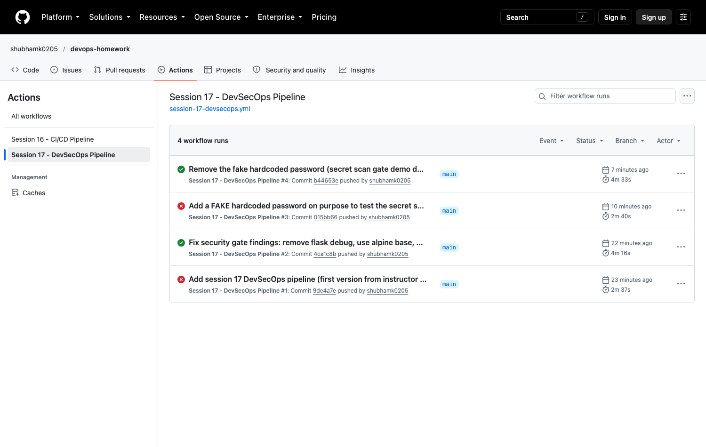
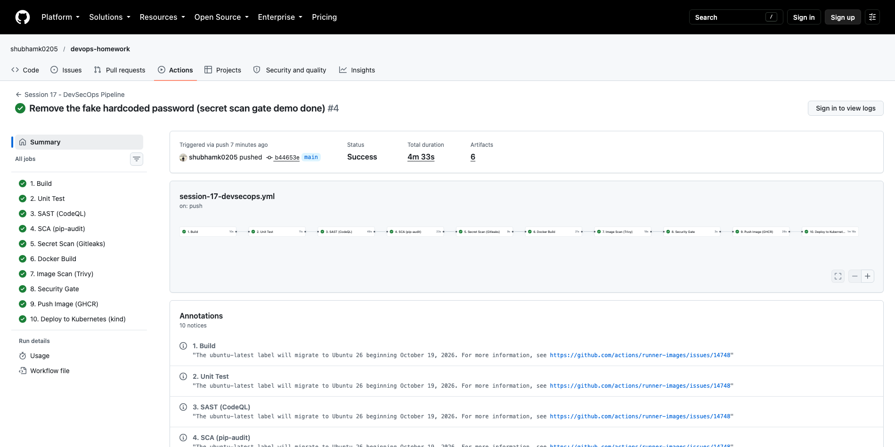
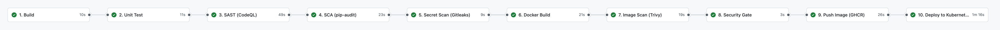
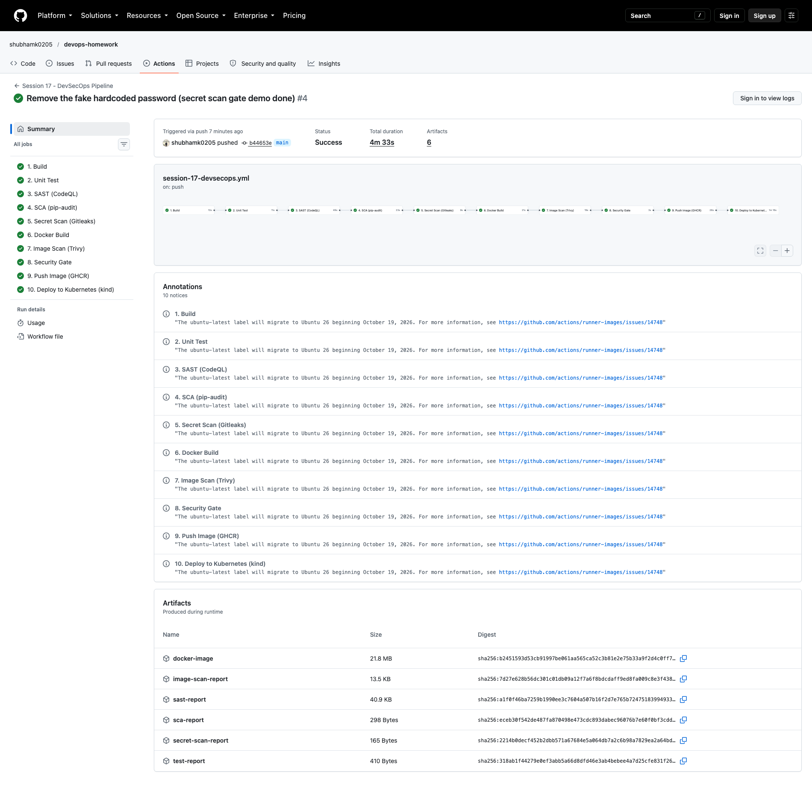
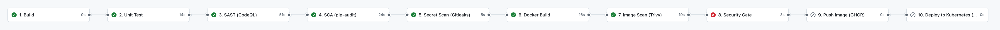
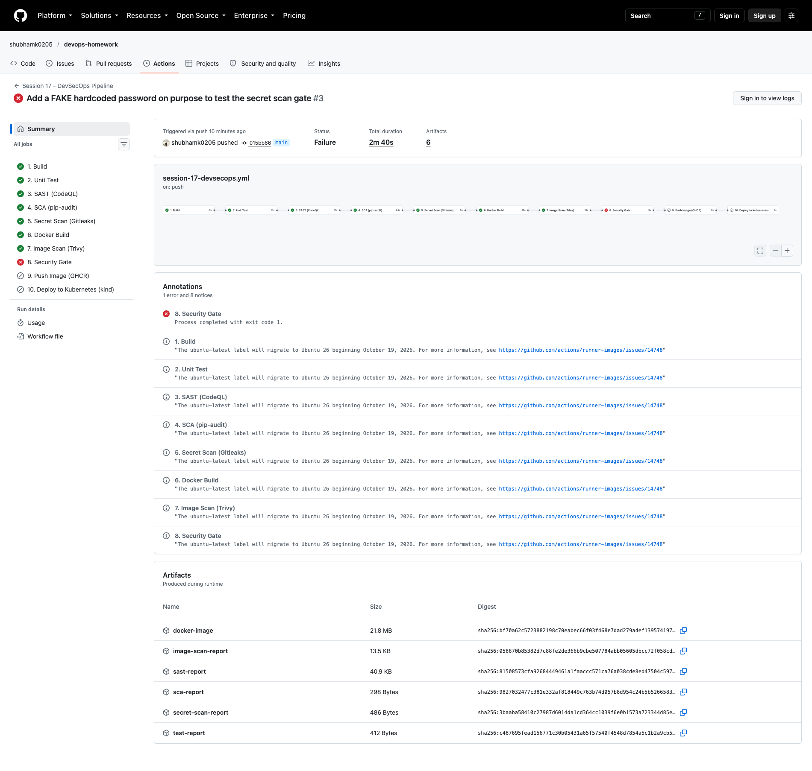

# 01 - DevSecOps Pipeline (CI/CD + Security)

In this task I built a complete CI/CD + DevSecOps pipeline in GitHub Actions for a small Flask app.
I started from the instructor's `session-17-devsecops/demo` (Flask app, pytest, Dockerfile, k8s manifests, `devsecops.yml`)
and changed it so that:

* the jobs follow the exact order from the task,
* every scanner writes a report and a **Security Gate** job decides PASS / FAIL,
* the image goes to **GHCR** (GitHub Container Registry) using `GITHUB_TOKEN` instead of Docker Hub,
* the deployment happens on a **kind** Kubernetes cluster that is created inside the GitHub runner.

> **Where is the workflow?** GitHub only runs workflows from `.github/workflows/` at the **root** of the repo,
> so the active copy is [`/.github/workflows/session-17-devsecops.yml`](../../.github/workflows/session-17-devsecops.yml).
> The same file is kept here in [`.github/workflows/devsecops.yml`](.github/workflows/devsecops.yml) so this folder is complete.

---

## 1. The flow

The task asks for this flow, and my workflow has one job for each box (job names start with the step number):

```text
  Code (git push to main, only files in session-17-devsecops/ trigger it)
    |
    v
 1. Build ............... pip install + python -m compileall
    v
 2. Unit Test ........... pytest + coverage
    v
 3. SAST ................ CodeQL            -> sast-report (SARIF)
    v
 4. SCA ................. pip-audit         -> sca-report.json
    v
 5. Secret Scan ......... Gitleaks          -> secret-scan-report.json
    v
 6. Docker Build ........ docker build + docker save -> docker-image artifact
    v
 7. Container Image Scan  Trivy (HIGH, CRITICAL) -> image-scan-report.json
    v
 8. Security Gate ....... reads the findings of 3,4,5,7 -> PASS or FAIL (exit 1)
    v                       |
    v                       +--> FAIL: push and deploy are SKIPPED
 9. Push Image .......... ghcr.io/shubhamk0205/session17-devsecops-app:<sha> + :latest
    v
10. Deploy to Kubernetes  kind cluster in the runner, kubectl apply, rollout status, curl
```

Why "report first, gate later"? If every scanner failed its own job, the first failing scan would stop the chain and
I would not see the results of the other scanners. Here every scan runs, saves its report as an artifact and passes the
number of findings to the gate as a **job output**. The gate is the single place where the policy lives.

---

## 2. Project structure

```text
01-devsecops-pipeline/
├── app/
│   ├── __init__.py
│   ├── app.py                 # Flask app: /, /health, /api/status, /api/greet/<name>, /api/add
│   └── templates/index.html
├── tests/test_app.py          # 8 pytest tests
├── requirements.txt           # Flask==3.1.3
├── requirements-dev.txt       # + pytest, pytest-cov
├── pytest.ini
├── Dockerfile
├── .dockerignore
├── security/                  # security tools configuration
│   ├── codeql-config.yml      # SAST - what CodeQL scans and which query suite
│   ├── gitleaks.toml          # Secret scanning - default rules + allowlist
│   └── trivy.yaml             # Image scanning - severities, scanners
├── k8s/
│   ├── deployment.yaml        # 2 replicas, probes, resources, runAsNonRoot, imagePullSecret
│   └── service.yaml           # ClusterIP, port 80 -> 5001
└── .github/workflows/devsecops.yml   # copy of the workflow (active one is at repo root)
```

---

## 3. Security tools and their configuration

| Stage | Tool | Config file | What it checks |
|---|---|---|---|
| SAST | GitHub CodeQL | [`security/codeql-config.yml`](security/codeql-config.yml) | my Python source code for security bugs |
| SCA | pip-audit | flags in the workflow (`-r requirements.txt --format json`) | known CVEs in my Python dependencies |
| Secret scanning | Gitleaks 8.30.1 | [`security/gitleaks.toml`](security/gitleaks.toml) | passwords / API keys / tokens in files |
| Image scanning | Trivy 0.75.0 | [`security/trivy.yaml`](security/trivy.yaml) | OS packages + Python libs inside the image |

### CodeQL config

```yaml
name: "Session 17 CodeQL config"
queries:
  - uses: security-extended      # default security queries + extra security queries
paths:
  - session-17-devsecops/01-devsecops-pipeline/app
paths-ignore:
  - session-17-devsecops/01-devsecops-pipeline/tests
```

My repo has many sessions, so `paths:` makes CodeQL scan only this app. I used the same tool as the instructor (CodeQL),
but in the instructor demo CodeQL only uploads results and never fails the pipeline. In my pipeline the
CodeQL action writes a SARIF file (`output: sarif-results`) and I count the results with `jq`, so findings really block.

### Gitleaks config

```toml
[extend]
useDefault = true      # all built-in rules (AWS keys, GitHub tokens, private keys, generic API keys, ...)

[allowlist]
paths = [ '''\.png$''', '''-report\.json$''' ]   # not source code
```

I run `gitleaks dir` on this folder (current files). I did not use `gitleaks git` (history mode) because the repo history
belongs to all sessions, and also the fake secret from my demo (section 8) stays in history forever - it is fake, so that is OK.

### Trivy config

```yaml
severity: [HIGH, CRITICAL]
scan:
  scanners: [vuln]
vulnerability:
  ignore-unfixed: false    # do NOT hide vulnerabilities that have no fix yet
```

### Security gate policy

Written in the `8. Security Gate` job:

| Check | Blocks the pipeline when |
|---|---|
| SAST (CodeQL) | 1 or more CodeQL findings |
| SCA (pip-audit) | 1 or more known vulnerabilities in dependencies |
| Secret scan (Gitleaks) | 1 or more secrets found |
| Image scan (Trivy) | 1 or more HIGH or CRITICAL vulnerabilities |
| any scan job | the scan job itself did not finish with `success` (crash = fail, not pass) |

```yaml
  security-gate:
    name: "8. Security Gate"
    needs: [sast, sca, secret-scan, image-scan]
    if: ${{ !cancelled() }}          # run even if a scan job failed, so it can report it
    ...
        env:
          SAST_RESULT: ${{ needs.sast.result }}
          SAST_FINDINGS: ${{ needs.sast.outputs.findings }}
          ...
          check "SAST (CodeQL)" "$SAST_RESULT" "$SAST_FINDINGS"     # FAIL if result != success or findings != 0
          ...
          if [ "$FAIL" -ne 0 ]; then exit 1; fi
```

`9. Push Image` has `needs: security-gate`, so when the gate exits with 1, push and deploy are **skipped**.

---

## 4. Run it locally first

```bash
cd session-17-devsecops/01-devsecops-pipeline
python3 -m venv venv && source venv/bin/activate
pip install -r requirements-dev.txt pip-audit
pytest -v --cov=app
pip-audit -r requirements.txt
```

```text
collecting ... collected 8 items

tests/test_app.py::test_home PASSED                                      [ 12%]
tests/test_app.py::test_health PASSED                                    [ 25%]
tests/test_app.py::test_status PASSED                                    [ 37%]
tests/test_app.py::test_greet PASSED                                     [ 50%]
tests/test_app.py::test_add_numbers PASSED                               [ 62%]
tests/test_app.py::test_add_numbers_missing_field PASSED                 [ 75%]
tests/test_app.py::test_add_numbers_not_a_number PASSED                  [ 87%]
tests/test_app.py::test_unknown_route PASSED                             [100%]

================================ tests coverage ================================
Name              Stmts   Miss  Cover
-------------------------------------
app/__init__.py       0      0   100%
app/app.py           41      2    95%
-------------------------------------
TOTAL                41      2    95%
============================== 8 passed in 0.31s ===============================
No known vulnerabilities found
```

What I observed: tests and SCA are clean locally. Before pushing I also tested my Gitleaks and Trivy config files with
their Docker images (`ghcr.io/gitleaks/gitleaks:v8.30.1`, `aquasec/trivy:0.75.0`) to make sure the files are valid.

---

## 5. Pipeline runs - overview

| Run | Commit | Result | Why |
|---|---|---|---|
| #1 | Add session 17 DevSecOps pipeline (first version from instructor demo) | **failed at Security Gate** | real findings: CodeQL `py/flask-debug` + 44 HIGH CVEs in the base image |
| #2 | Fix security gate findings: remove flask debug, use alpine base, drop pip | success | all scans 0, deployed to kind |
| #3 | Add a FAKE hardcoded password on purpose to test the secret scan gate | **failed at Security Gate** | Gitleaks found 1 secret |
| #4 | Remove the fake hardcoded password (secret scan gate demo done) | success | all scans 0, deployed to kind |

```bash
gh run list -R shubhamk0205/devops-homework -w "Session 17 - DevSecOps Pipeline"
```

```text
completed	success	Remove the fake hardcoded password (secret scan gate demo done)	Session 17 - DevSecOps Pipeline	main	push	37687507156	4m33s	2026-10-07T21:10:33Z
completed	failure	Add a FAKE hardcoded password on purpose to test the secret scan gate	Session 17 - DevSecOps Pipeline	main	push	37687120528	2m40s	2026-10-07T21:07:22Z
completed	success	Fix security gate findings: remove flask debug, use alpine base, drop…	Session 17 - DevSecOps Pipeline	main	push	37685679346	4m16s	2026-10-07T20:55:29Z
completed	failure	Add session 17 DevSecOps pipeline (first version from instructor demo)	Session 17 - DevSecOps Pipeline	main	push	37685536527	2m37s	2026-10-07T20:54:19Z
```



---

## 6. Run #1 - the gate blocked the instructor's version (real findings)

For the first push I used the instructor's code as it was: `python:3.12-slim` base image and
`app.run(host="0.0.0.0", port=5001, debug=True)`.

```bash
gh run view 37685536527 -R shubhamk0205/devops-homework
```

```text
X main Session 17 - DevSecOps Pipeline · 37685536527

JOBS
✓ 1. Build in 8s (ID 113012263727)
✓ 2. Unit Test in 11s (ID 113012331491)
✓ 3. SAST (CodeQL) in 50s (ID 113012420914)
✓ 4. SCA (pip-audit) in 16s (ID 113012777847)
✓ 5. Secret Scan (Gitleaks) in 5s (ID 113012904484)
✓ 6. Docker Build in 15s (ID 113012954308)
✓ 7. Image Scan (Trivy) in 29s (ID 113013075877)
X 8. Security Gate in 5s (ID 113013286724)
  ✓ Set up job
  X Check scan results against policy
  ✓ Complete job
- 9. Push Image (GHCR) (ID 113013344254)
- 10. Deploy to Kubernetes (kind) in 0s (ID 113013345237)
```

Log of `3. SAST (CodeQL)`:

```text
CodeQL findings: 1
- py/flask-debug at session-17-devsecops/01-devsecops-pipeline/app/app.py:71 -> A Flask app appears to be run in debug mode. This may allow an attacker to run arbitrary code through the debugger.
```

Log of `7. Image Scan (Trivy)` (first rows of the table):

```text
INFO	Detected OS	family="debian" version="13.7"
INFO	[debian] Detecting vulnerabilities...	os_version="13" pkg_num=87

image.tar (debian 13.7)
=======================
Total: 44 (UNKNOWN: 0, LOW: 0, MEDIUM: 0, HIGH: 44, CRITICAL: 0)

┌───────────────┬────────────────┬──────────┬──────────────┬───────────────────────────────────┬───────────────┬─────────────────────────────────────────────────────────────┐
│    Library    │ Vulnerability  │ Severity │    Status    │         Installed Version         │ Fixed Version │                            Title                            │
├───────────────┼────────────────┼──────────┼──────────────┼───────────────────────────────────┼───────────────┼─────────────────────────────────────────────────────────────┤
│ bsdutils      │ CVE-2026-76642 │ HIGH     │ affected     │ 1:2.41.5-0+deb13u1                │               │ util-linux: util-linux: failed external mount helper still  │
│               │ CVE-2026-78408 │          │              │                                   │               │ util-linux: util-linux: nsenter --join-cgroup leaks root    │
...
│ libacl1       │ CVE-2026-54369 │          │              │ 2.3.2-2+b1                        │               │ acl: Symlink traversal privilege escalation via libacl      │
...
```

Log of `8. Security Gate`:

```text
SAST (CodeQL)                job=success  findings=1    FAIL
SCA (pip-audit)              job=success  findings=0    PASS
Secret scan (Gitleaks)       job=success  findings=0    PASS
Image scan (Trivy HIGH+)     job=success  findings=44   FAIL
SECURITY GATE: FAILED - image will NOT be pushed or deployed
##[error]Process completed with exit code 1.
```


What I observed: all scan jobs are green (they only report), but the gate turns red and jobs 9 and 10 are skipped.
The 44 HIGH CVEs are in Debian packages (util-linux, acl, ...) and have status `affected` = **no fixed version exists yet**,
so `apt-get upgrade` would not help.

### How I fixed it (properly, without switching the gate off)

**Fix 1 - SAST:** removed `debug=True`. Host and port now come from env vars (the Dockerfile sets `HOST=0.0.0.0`):

```python
if __name__ == "__main__":
    # debug=True was removed - CodeQL (py/flask-debug) flagged it because the
    # Werkzeug debugger lets anyone run code on the server.
    host = os.getenv("HOST", "127.0.0.1")
    port = int(os.getenv("PORT", "5001"))
    app.run(host=host, port=port)
```

**Fix 2 - Image:** I compared base images with Trivy on my laptop first:

```bash
docker run --rm -v /var/run/docker.sock:/var/run/docker.sock aquasec/trivy:0.75.0 image -q --severity HIGH,CRITICAL python:3.13-slim
docker run --rm -v /var/run/docker.sock:/var/run/docker.sock aquasec/trivy:0.75.0 image -q --severity HIGH,CRITICAL python:3.13-alpine
```

```text
│ python:3.13-slim (debian 13.7)                                       │   debian   │       44        │    -    │
│ Python                                                               │ python-pkg │        4        │    -    │
...
│ python:3.13-alpine (alpine 3.24.2)                                   │   alpine   │        0        │    -    │
│ Python                                                               │ python-pkg │        4        │    -    │
```

Alpine has **0** OS vulnerabilities. But there were still 4 HIGH in "Python". I built my app on alpine (still with pip) and looked closer:

```text
Python (python-pkg)
===================
Total: 4 (HIGH: 4, CRITICAL: 0)

│ msgpack    │ GHSA-6v7p-g79w-8964 │ HIGH     │ fixed  │ 1.1.2             │ 1.2.1         │ MessagePack for Python: Out-of-bounds read / crash on      │
│ setuptools │ CVE-2025-47273      │          │        │ 70.3.0            │ 78.1.1        │ setuptools: Path Traversal Vulnerability in setuptools     │
│ urllib3    │ CVE-2026-97687      │          │        │ 2.7.0             │ 2.8.0         │ urllib3: urllib3: Traffic interception via HTTPS proxy TLS │
│            │ CVE-2026-97689      │          │        │                   │               │ urllib3: urllib3: Denial of Service via unbounded memory   │
```

These libraries are not used by my app - they are the copies **bundled inside pip** (pip 26.2.1 is already the newest
version, so upgrading pip does not fix it). My app does not need pip at runtime, so the Dockerfile removes it after
installing the requirements:

```dockerfile
FROM python:3.13-alpine
...
RUN pip install --no-cache-dir -r requirements.txt \
    && pip uninstall -y pip \
    && rm -rf /usr/local/lib/python3.13/ensurepip
...
RUN adduser -D -u 10001 appuser
USER 10001
```

Final image scanned locally:

```text
│ s17:v2 (alpine 3.24.2)                                                       │   alpine   │        0        │    -    │
│ usr/local/lib/python3.13/site-packages/blinker-1.9.0.dist-info/METADATA      │ python-pkg │        0        │    -    │
│ usr/local/lib/python3.13/site-packages/click-8.5.0.dist-info/METADATA        │ python-pkg │        0        │    -    │
│ usr/local/lib/python3.13/site-packages/flask-3.1.3.dist-info/METADATA        │ python-pkg │        0        │    -    │
│ usr/local/lib/python3.13/site-packages/itsdangerous-2.2.0.dist-info/METADATA │ python-pkg │        0        │    -    │
│ usr/local/lib/python3.13/site-packages/jinja2-3.1.6.dist-info/METADATA       │ python-pkg │        0        │    -    │
│ usr/local/lib/python3.13/site-packages/markupsafe-3.0.4.dist-info/METADATA   │ python-pkg │        0        │    -    │
│ usr/local/lib/python3.13/site-packages/werkzeug-3.1.9.dist-info/METADATA     │ python-pkg │        0        │    -    │
```

```bash
docker images s17 --format '{{.Tag}} {{.Size}}'
```

```text
alpine-with-pip 104MB
v2 97MB
v1 226MB
```

What I observed: the fixed image has 0 HIGH/CRITICAL and is also less than half the size of the first one.
I also made the container run as user `10001` (not root), which matches `runAsNonRoot: true` in `k8s/deployment.yaml`.
Run #2 with these fixes was fully green.

---

## 7. Successful run (#4) - all 10 jobs green

```bash
gh run view 37687507156 -R shubhamk0205/devops-homework
```

```text
✓ main Session 17 - DevSecOps Pipeline · 37687507156
Triggered via push about 5 minutes ago

JOBS
✓ 1. Build in 10s (ID 113019004176)
✓ 2. Unit Test in 11s (ID 113019094605)
✓ 3. SAST (CodeQL) in 49s (ID 113019181058)
✓ 4. SCA (pip-audit) in 23s (ID 113019527857)
✓ 5. Secret Scan (Gitleaks) in 9s (ID 113019703661)
✓ 6. Docker Build in 21s (ID 113019783658)
✓ 7. Image Scan (Trivy) in 19s (ID 113019944480)
✓ 8. Security Gate in 3s (ID 113020091567)
✓ 9. Push Image (GHCR) in 26s (ID 113020127346)
✓ 10. Deploy to Kubernetes (kind) in 1m16s (ID 113020317269)

ARTIFACTS
test-report
sca-report
image-scan-report
secret-scan-report
docker-image
sast-report

View this run on GitHub: https://github.com/shubhamk0205/devops-homework/actions/runs/37687507156
```



Job graph (close-up):



Full run page with the 6 artifacts (reports + image):



### Output of each job (from `gh run view 37687507156 --log`)

**1. Build**

```text
Successfully installed Flask-3.1.3 blinker-1.9.0 click-8.5.0 itsdangerous-2.2.0 jinja2-3.1.6 markupsafe-3.0.4 werkzeug-3.1.9
Build OK
```

**2. Unit Test**

```text
platform linux -- Python 3.13.16, pytest-9.1.1, pluggy-1.6.0 -- /opt/hostedtoolcache/Python/3.13.16/x64/bin/python
collecting ... collected 8 items

tests/test_app.py::test_home PASSED                                      [ 12%]
tests/test_app.py::test_health PASSED                                    [ 25%]
tests/test_app.py::test_status PASSED                                    [ 37%]
tests/test_app.py::test_greet PASSED                                     [ 50%]
tests/test_app.py::test_add_numbers PASSED                               [ 62%]
tests/test_app.py::test_add_numbers_missing_field PASSED                 [ 75%]
tests/test_app.py::test_add_numbers_not_a_number PASSED                  [ 87%]
tests/test_app.py::test_unknown_route PASSED                             [100%]

Name              Stmts   Miss  Cover   Missing
-----------------------------------------------
app/__init__.py       0      0   100%
app/app.py           44      4    91%   51, 74-76
-----------------------------------------------
TOTAL                44      4    91%
============================== 8 passed in 0.19s ===============================
```

**3. SAST (CodeQL)** - CodeQL only extracted my app folder (from the config file):

```text
Calling python3 -S .../python_tracer.py ... -R session-17-devsecops/01-devsecops-pipeline/app -Y session-17-devsecops/01-devsecops-pipeline/tests --filter include:session-17-devsecops/01-devsecops-pipeline/app --filter exclude:session-17-devsecops/01-devsecops-pipeline/tests
...
CodeQL findings: 0
```

**4. SCA (pip-audit)**

```text
No known vulnerabilities found
Vulnerable dependency findings: 0
```

**5. Secret Scan (Gitleaks)**

```text
8.30.1
...
9:12PM INF scanned ~21977 bytes (21.98 KB) in 11ms
9:12PM INF no leaks found
Secrets found: 0
```

**6. Docker Build**

```text
#12 naming to docker.io/library/session17-app:b44653edc5f0fe0bdf99080f53ea6406c33f05c1 done
REPOSITORY      TAG                                        IMAGE ID       CREATED        SIZE
session17-app   b44653edc5f0fe0bdf99080f53ea6406c33f05c1   9dc3db8b63f6   1 second ago   61MB
```

**7. Image Scan (Trivy)**

```text
INFO	Loaded	file_path="session-17-devsecops/01-devsecops-pipeline/security/trivy.yaml"
INFO	[vuln] Vulnerability scanning is enabled
INFO	Detected OS	family="alpine" version="3.24.2"
INFO	[alpine] Detecting vulnerabilities...	os_version="3.24" repository="3.24" pkg_num=29
INFO	[python-pkg] Detecting vulnerabilities...
HIGH/CRITICAL vulnerabilities: 0
```

(With 0 findings the `trivy convert --format table` step prints no table, the JSON report is in the `image-scan-report` artifact.)

**8. Security Gate**

```text
SAST (CodeQL)                job=success  findings=0    PASS
SCA (pip-audit)              job=success  findings=0    PASS
Secret scan (Gitleaks)       job=success  findings=0    PASS
Image scan (Trivy HIGH+)     job=success  findings=0    PASS
SECURITY GATE: PASSED
```

**9. Push Image (GHCR)** - login with `GITHUB_TOKEN`, job has `permissions: packages: write`:

```text
The push refers to repository [ghcr.io/shubhamk0205/session17-devsecops-app]
b44653edc5f0fe0bdf99080f53ea6406c33f05c1: digest: sha256:669906f379e3545e9d307c1d3071ec4dd1330059bdf5c7134f9807662631efd6 size: 2196
The push refers to repository [ghcr.io/shubhamk0205/session17-devsecops-app]
latest: digest: sha256:669906f379e3545e9d307c1d3071ec4dd1330059bdf5c7134f9807662631efd6 size: 2196
```

The image that was scanned is the same one that is pushed: job 6 saves it with `docker save`, jobs 7 and 9 load the same tar file from the artifact (no rebuild between scan and push).

**10. Deploy to Kubernetes (kind)**

```text
kind v0.31.0 go1.25.5 linux/amd64
Creating kind cluster...
 ✓ Ensuring node image (kindest/node:v1.35.0)
 ✓ Preparing nodes
 ✓ Writing configuration
 ✓ Starting control-plane
 ✓ Installing CNI
 ✓ Installing StorageClass
 ✓ Waiting ≤ 1m0s for control-plane = Ready
 • Ready after 17s
Set kubectl context to "kind-devsecops"

NAME                      STATUS   ROLES           AGE   VERSION   INTERNAL-IP   EXTERNAL-IP   OS-IMAGE                         KERNEL-VERSION      CONTAINER-RUNTIME
devsecops-control-plane   Ready    control-plane   21s   v1.35.0   172.18.0.2    <none>        Debian GNU/Linux 12 (bookworm)   6.17.0-1022-azure   containerd://2.2.0

secret/ghcr-secret created
          image: ghcr.io/shubhamk0205/session17-devsecops-app:b44653edc5f0fe0bdf99080f53ea6406c33f05c1
deployment.apps/session17-devsecops created
service/session17-devsecops created

Waiting for deployment "session17-devsecops" rollout to finish: 0 of 2 updated replicas are available...
Waiting for deployment "session17-devsecops" rollout to finish: 1 of 2 updated replicas are available...
deployment "session17-devsecops" successfully rolled out

NAME                                  READY   UP-TO-DATE   AVAILABLE   AGE   CONTAINERS   IMAGES
deployment.apps/session17-devsecops   2/2     2            2           10s   app          ghcr.io/shubhamk0205/session17-devsecops-app:b44653edc5f0fe0bdf99080f53ea6406c33f05c1

NAME                                       READY   STATUS    RESTARTS   AGE   IP           NODE
pod/session17-devsecops-746bd98455-qw72r   1/1     Running   0          10s   10.244.0.5   devsecops-control-plane
pod/session17-devsecops-746bd98455-z2sdw   1/1     Running   0          10s   10.244.0.6   devsecops-control-plane

NAME                          TYPE        CLUSTER-IP      EXTERNAL-IP   PORT(S)   AGE
service/session17-devsecops   ClusterIP   10.96.196.238   <none>        80/TCP    10s

--- GET / ---
<!DOCTYPE html>
<html lang="en">
<head>
  <meta charset="UTF-8">
  <title>DevSecOps Demo</title>
</head>
<body>
  <h1>Session 17 - DevSecOps Demo</h1>
  <p>Version: 1.0.0</p>
--- GET /health ---
{"status":"healthy"}
--- GET /api/status ---
{"app":"DevSecOps Demo","platform":"Linux","python_version":"3.13.16","status":"running","uptime_seconds":10,"version":"1.0.0"}
```

What I observed:
* The kind cluster lives only inside the GitHub runner and is deleted with it - I did not touch any shared cluster.
* The GHCR package is private by default, so the pipeline creates a `docker-registry` secret (`ghcr-secret`) from
  `GITHUB_TOKEN` and the deployment uses it in `imagePullSecrets`. Without it the pods would get `ImagePullBackOff`.
* `kubectl rollout status` waits until both replicas pass the readiness probe on `/health`. If the rollout fails, the step fails.
* `runAsNonRoot: true` works because the image runs as UID 10001.

---

## 8. Run #3 - demo of the secret scanning gate (fake secret)

To show the gate also stops secrets, I added a file `app/config.py` with a **clearly fake** password
(the first line of the file said `# !!! FAKE secret, added ON PURPOSE to test the secret-scan gate. Not a real password. !!!`
and the value was a made-up string like "not a real password" written in leet-speak). I am not repeating the value here,
otherwise Gitleaks would find it in this README.

```bash
gh run view 37687120528 -R shubhamk0205/devops-homework
```

```text
X main Session 17 - DevSecOps Pipeline · 37687120528

JOBS
✓ 1. Build in 9s (ID 113017687134)
✓ 2. Unit Test in 14s (ID 113017765412)
✓ 3. SAST (CodeQL) in 51s (ID 113017871687)
✓ 4. SCA (pip-audit) in 24s (ID 113018246089)
✓ 5. Secret Scan (Gitleaks) in 5s (ID 113018423146)
✓ 6. Docker Build in 16s (ID 113018485313)
✓ 7. Image Scan (Trivy) in 19s (ID 113018607333)
X 8. Security Gate in 3s (ID 113018745592)
  ✓ Set up job
  X Check scan results against policy
  ✓ Complete job
- 9. Push Image (GHCR) in 0s (ID 113018778897)
- 10. Deploy to Kubernetes (kind) in 0s (ID 113018780770)
```

Log of `5. Secret Scan (Gitleaks)` (the value is redacted because of `--redact`):

```text
Finding:     DB_PASSWORD = "REDACTED"
Secret:      REDACTED
RuleID:      generic-api-key
Entropy:     4.237291
File:        session-17-devsecops/01-devsecops-pipeline/app/config.py
Line:        2
9:09PM INF scanned ~22114 bytes (22.11 KB) in 14.8ms
9:09PM WRN leaks found: 1
Secrets found: 1
```

Log of `8. Security Gate`:

```text
SAST (CodeQL)                job=success  findings=0    PASS
SCA (pip-audit)              job=success  findings=0    PASS
Secret scan (Gitleaks)       job=success  findings=1    FAIL
Image scan (Trivy HIGH+)     job=success  findings=0    PASS
SECURITY GATE: FAILED - image will NOT be pushed or deployed
```





Then I deleted `app/config.py` (`git rm`) and pushed again - run #4 was green (section 7).

What I observed: Gitleaks found it with the generic rule (keyword `PASSWORD` + a random-looking value with high entropy).
Note: deleting the file only removes it from the current code - the string is still in git history. For a **real**
secret that is not enough: the key must be revoked/rotated first (as the instructor's 06-secret-scanning README says).

---

## 9. Kubernetes manifests

[`k8s/deployment.yaml`](k8s/deployment.yaml) (important parts):

```yaml
spec:
  replicas: 2
  template:
    spec:
      imagePullSecrets:
        - name: ghcr-secret          # created by the pipeline from GITHUB_TOKEN
      securityContext:
        runAsNonRoot: true
      containers:
        - name: app
          image: __IMAGE__           # pipeline replaces with ghcr.io/...:<git sha>
          ports:
            - containerPort: 5001
          readinessProbe: { httpGet: { path: /health, port: 5001 } }
          livenessProbe:  { httpGet: { path: /health, port: 5001 } }
          resources:
            requests: { cpu: 50m, memory: 64Mi }
            limits:   { cpu: 200m, memory: 128Mi }
          securityContext:
            allowPrivilegeEscalation: false
```

[`k8s/service.yaml`](k8s/service.yaml): `ClusterIP`, port 80 -> 5001. The pipeline tests it with
`kubectl port-forward service/session17-devsecops 8080:80` + `curl`.

I used the git commit SHA as the image tag (not only `latest`), so every deployment points to the exact image that passed the gate.

---

## 10. What I learned

* **DevSecOps** = security checks are normal pipeline stages, not something done once at the end.
* **SAST** looks at my code (CodeQL found the Flask debug mode), **SCA** looks at my dependencies (pip-audit),
  **secret scanning** looks for credentials in files (Gitleaks), **image scanning** looks at everything inside the
  container - including the base image, which was where almost all of the problems were.
* A **security gate** only means something if it can really fail the pipeline. Mine fails when there is any finding
  or when a scanner crashes, and then push + deploy are skipped.
* When the gate fails, fix the cause instead of lowering the threshold: smaller base image (alpine), remove tools not needed
  at runtime (pip), turn off debug mode, run as non-root.
* "Scan the same image you push": build once, `docker save`, pass it as an artifact.
* `GITHUB_TOKEN` + `permissions: packages: write` is enough for GHCR, and a kind cluster inside the runner is an easy
  way to test a real Kubernetes deployment in CI.
