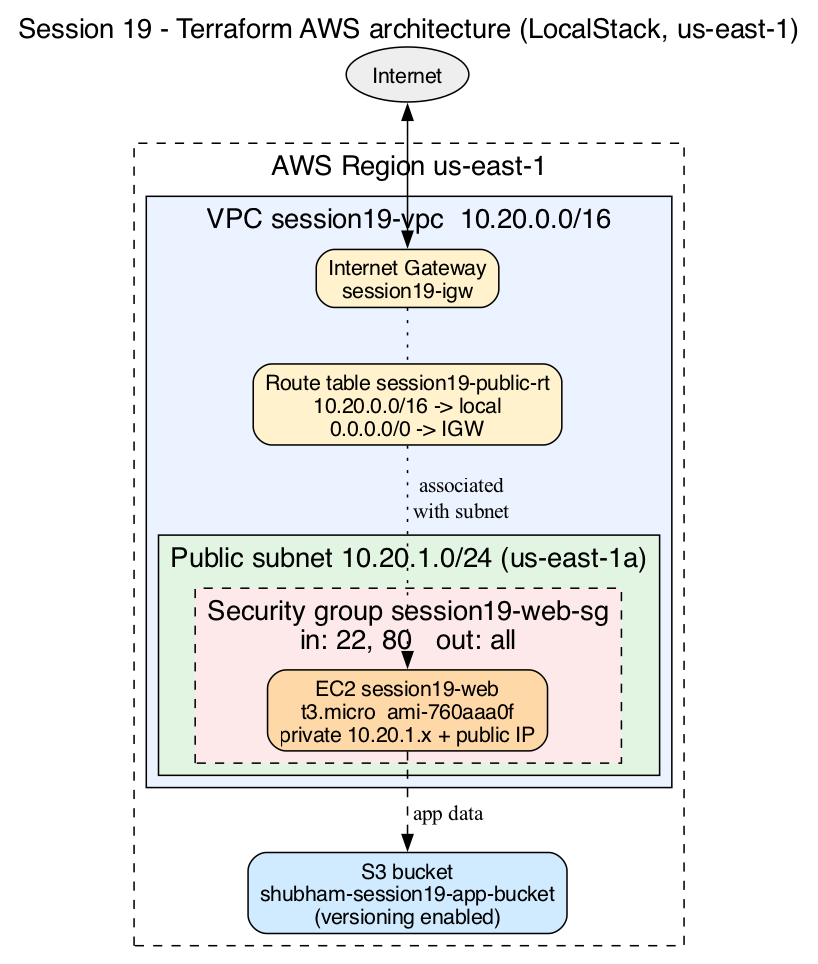
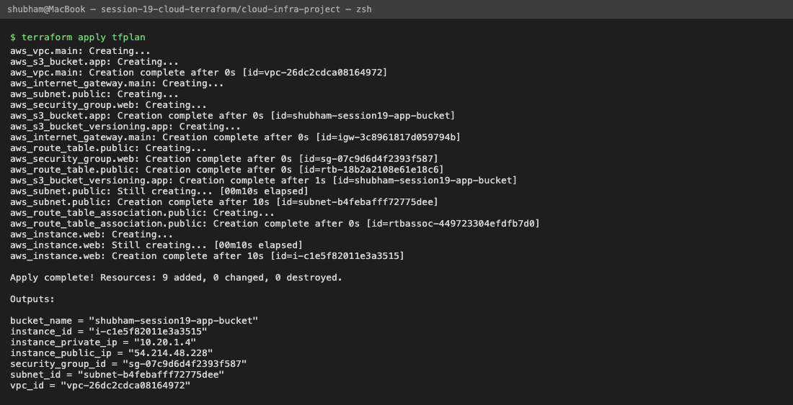
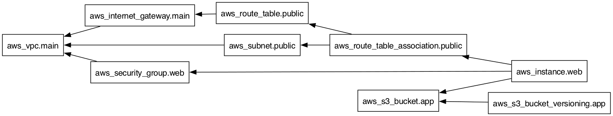
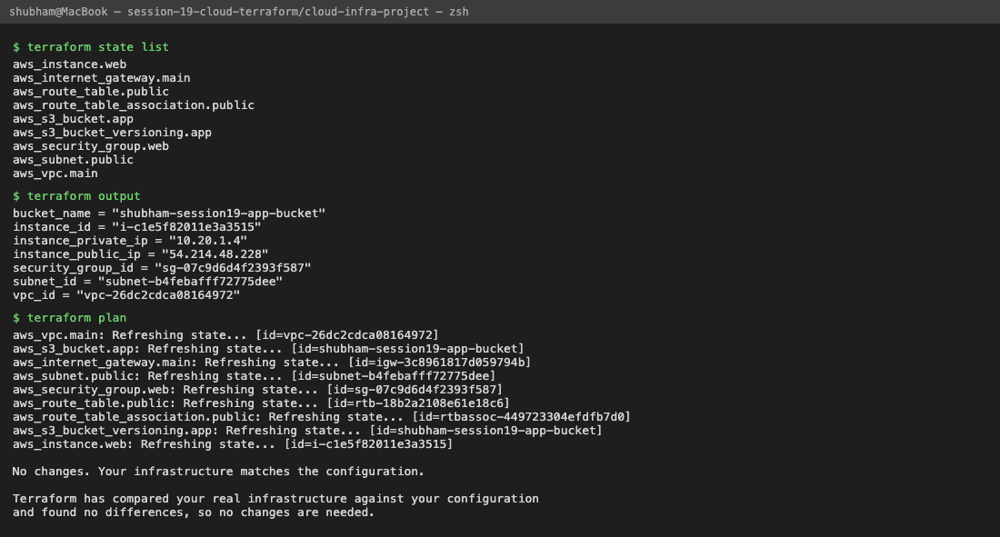
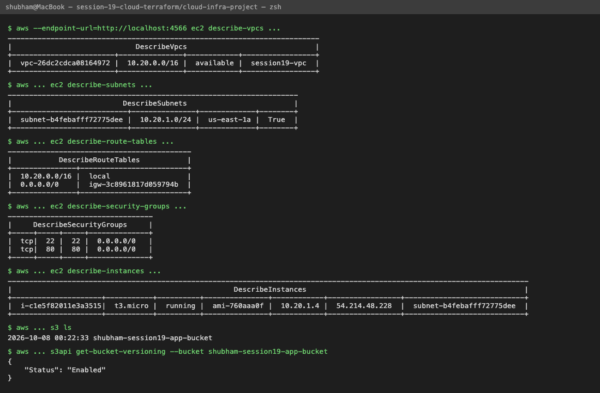
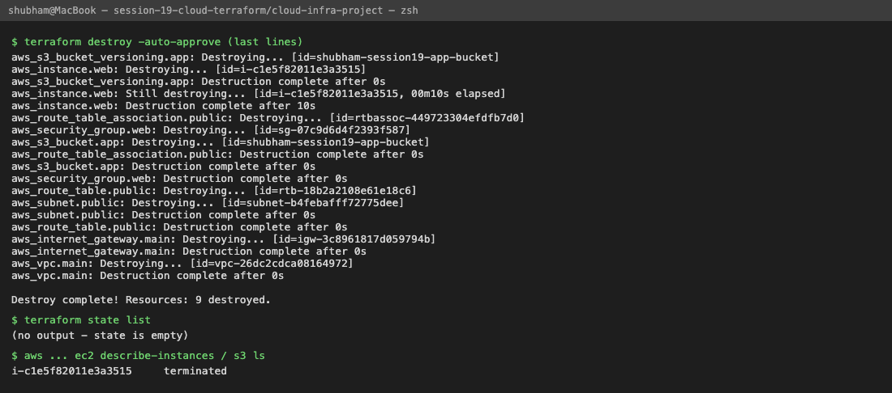

# Cloud Infrastructure Project with Terraform

In this task I built a small end-to-end AWS setup with Terraform: a **VPC**, a **public subnet**
(with Internet Gateway + route table), a **security group**, an **EC2 instance** and an **S3 bucket**.
Then I looked at the state, the dependency graph, and destroyed everything.

The project shows: providers, variables, resources, outputs, dependencies, AWS infrastructure,
Terraform state, `plan`, `apply` and `destroy`.

---

## LocalStack instead of real AWS

I don't have an AWS account, so I ran **LocalStack** in Docker. It emulates the AWS APIs (EC2, S3, STS ...)
on `http://localhost:4566`, so the normal `hashicorp/aws` provider can create "AWS" resources locally for free.

```bash
docker run -d --name localstack -p 4566:4566 localstack/localstack:4.4
```

> I used tag **4.4** (LocalStack 4.4.0) because the `latest` image (2026.9.1) exits with
> `License activation failed! ... set the LOCALSTACK_AUTH_TOKEN variable`.

Note: LocalStack only fakes the API. The EC2 instance is not a real VM I can SSH into, but the VPC,
subnet, security group, instance and bucket all exist in the LocalStack API and the AWS CLI can see them.

**For real AWS:** remove `access_key`, `secret_key`, the `skip_*` lines, `s3_use_path_style` and the
`endpoints {}` block from `provider.tf`, configure real credentials (`aws configure`), and set `ami_id`
in `terraform.tfvars` to a real AMI of your region (for example an Amazon Linux 2023 AMI).

---

## Architecture

```text
                         Internet
                            │
┌─────────────── AWS region us-east-1 ───────────────────────────────┐
│                           │                                        │
│  ┌──── VPC session19-vpc 10.20.0.0/16 ────────────────────────┐    │
│  │                        │                                   │    │
│  │               Internet Gateway (session19-igw)             │    │
│  │                        │                                   │    │
│  │  Route table session19-public-rt                           │    │
│  │    10.20.0.0/16 -> local                                   │    │
│  │    0.0.0.0/0    -> IGW                                     │    │
│  │                        │ (association)                     │    │
│  │  ┌── Public subnet 10.20.1.0/24 (us-east-1a) ───────────┐  │    │
│  │  │                                                      │  │    │
│  │  │   ┌── SG session19-web-sg (in: 22, 80 / out: all) ┐  │  │    │
│  │  │   │     EC2 session19-web  (t3.micro)             │  │  │    │
│  │  │   │     private 10.20.1.4 / public IP             │  │  │    │
│  │  │   └───────────────────────────────────────────────┘  │  │    │
│  │  └──────────────────────────────────────────────────────┘  │    │
│  └────────────────────────────────────────────────────────────┘    │
│                                                                    │
│   S3 bucket shubham-session19-app-bucket (versioning enabled)      │
└────────────────────────────────────────────────────────────────────┘
```



---

## Project structure

```text
cloud-infra-project/
├── versions.tf          # terraform block + required AWS provider version
├── provider.tf          # AWS provider (LocalStack endpoints) + default tags
├── variables.tf         # all input variables
├── terraform.tfvars     # my values (no secrets)
├── main.tf              # VPC, subnet, IGW, route table, SG, S3, EC2
├── outputs.tf           # IDs and IPs printed after apply
├── .terraform.lock.hcl  # provider lock file
└── README.md
```

---

## Concepts used in this project

### 1. Provider
`versions.tf` says which provider to download, `provider.tf` configures it:
```hcl
provider "aws" {
  region     = var.aws_region
  access_key = "test"
  secret_key = "test"

  skip_credentials_validation = true
  skip_metadata_api_check     = true
  skip_requesting_account_id  = true
  s3_use_path_style           = true

  endpoints {
    ec2 = "http://localhost:4566"
    s3  = "http://localhost:4566"
    sts = "http://localhost:4566"
  }

  default_tags {
    tags = {
      Project   = var.project_name
      Session   = "19"
      ManagedBy = "Terraform"
    }
  }
}
```
`default_tags` adds these tags to every resource, so I don't repeat them in each block.

### 2. Variables
`variables.tf` declares them (type, description, default) and `terraform.tfvars` gives the values:
```hcl
aws_region         = "us-east-1"
project_name       = "session19"
vpc_cidr           = "10.20.0.0/16"
public_subnet_cidr = "10.20.1.0/24"
allowed_ssh_cidr   = "0.0.0.0/0"
instance_type      = "t3.micro"
bucket_name        = "shubham-session19-app-bucket"

# Amazon Linux AMI from LocalStack's mock image list.
# On real AWS use a current AMI id for your region.
ami_id = "ami-760aaa0f"
```
`ami_id` and `bucket_name` have no default, so Terraform would ask for them if tfvars was missing.
I found the AMI with `aws --endpoint-url=http://localhost:4566 ec2 describe-images` (LocalStack ships a list of mock AMIs).

### 3. Resources (main.tf)
| Resource | Name | Purpose |
|---|---|---|
| `aws_vpc` | main | private network 10.20.0.0/16 |
| `aws_subnet` | public | 10.20.1.0/24 in us-east-1a, auto-assign public IP |
| `aws_internet_gateway` | main | internet access for the VPC |
| `aws_route_table` | public | `0.0.0.0/0 -> IGW` |
| `aws_route_table_association` | public | makes the subnet public |
| `aws_security_group` | web | allow 22 + 80 in, all out |
| `aws_s3_bucket` | app | bucket for app data |
| `aws_s3_bucket_versioning` | app | versioning ON for the bucket |
| `aws_instance` | web | the EC2 server in the public subnet |

### 4. Outputs
`outputs.tf` prints `vpc_id`, `subnet_id`, `security_group_id`, `instance_id`, `instance_public_ip`,
`instance_private_ip` and `bucket_name`.

### 5. Dependencies
**Implicit** - when one resource uses another resource's attribute, Terraform knows the order:
```hcl
resource "aws_subnet" "public" {
  vpc_id = aws_vpc.main.id      # subnet waits for the VPC
  ...
}
resource "aws_instance" "web" {
  subnet_id              = aws_subnet.public.id          # waits for subnet
  vpc_security_group_ids = [aws_security_group.web.id]   # waits for SG
  ...
}
```
**Explicit** - `depends_on` when there is no attribute reference but I still want an order:
```hcl
  # the app on this server uses the bucket,
  # so the bucket should exist before the instance starts
  depends_on = [aws_s3_bucket.app, aws_route_table_association.public]
```

---

## Terraform commands (what I ran)

### terraform init
```bash
terraform init
```
```text
Initializing the backend...

Initializing provider plugins...
- Finding hashicorp/aws versions matching "~> 6.0"...
- Installing hashicorp/aws v6.67.0...
- Installed hashicorp/aws v6.67.0 (signed by HashiCorp)
...
Terraform has been successfully initialized!
```

### terraform fmt and validate
```bash
terraform fmt
terraform validate
```
```text
Success! The configuration is valid.
```
What I observed: `fmt` printed nothing because all files were already formatted.

### terraform plan
```bash
terraform plan -out=tfplan
```
```text
Terraform will perform the following actions:

  # aws_instance.web will be created
  + resource "aws_instance" "web" {
      + ami                                  = "ami-760aaa0f"
      + instance_type                        = "t3.micro"
      + subnet_id                            = (known after apply)
      + vpc_security_group_ids               = (known after apply)
      ...
    }

  # aws_internet_gateway.main will be created
  # aws_route_table.public will be created
  # aws_route_table_association.public will be created
  # aws_s3_bucket.app will be created
  # aws_s3_bucket_versioning.app will be created
  # aws_security_group.web will be created
  # aws_subnet.public will be created
  # aws_vpc.main will be created
  + resource "aws_vpc" "main" {
      + cidr_block                           = "10.20.0.0/16"
      + enable_dns_hostnames                 = true
      + enable_dns_support                   = true
      + id                                   = (known after apply)
      ...
    }

Plan: 9 to add, 0 to change, 0 to destroy.

Changes to Outputs:
  + bucket_name         = "shubham-session19-app-bucket"
  + instance_id         = (known after apply)
  + instance_private_ip = (known after apply)
  + instance_public_ip  = (known after apply)
  + security_group_id   = (known after apply)
  + subnet_id           = (known after apply)
  + vpc_id              = (known after apply)

Saved the plan to: tfplan
```
What I observed: `subnet_id` of the instance is `(known after apply)` because the subnet doesn't exist yet - this is the implicit dependency.

### terraform apply
```bash
terraform apply tfplan
```
```text
aws_vpc.main: Creating...
aws_s3_bucket.app: Creating...
aws_vpc.main: Creation complete after 0s [id=vpc-26dc2cdca08164972]
aws_internet_gateway.main: Creating...
aws_subnet.public: Creating...
aws_security_group.web: Creating...
aws_s3_bucket.app: Creation complete after 0s [id=shubham-session19-app-bucket]
aws_s3_bucket_versioning.app: Creating...
aws_internet_gateway.main: Creation complete after 0s [id=igw-3c8961817d059794b]
aws_route_table.public: Creating...
aws_security_group.web: Creation complete after 0s [id=sg-07c9d6d4f2393f587]
aws_route_table.public: Creation complete after 0s [id=rtb-18b2a2108e61e18c6]
aws_s3_bucket_versioning.app: Creation complete after 1s [id=shubham-session19-app-bucket]
aws_subnet.public: Still creating... [00m10s elapsed]
aws_subnet.public: Creation complete after 10s [id=subnet-b4febafff72775dee]
aws_route_table_association.public: Creating...
aws_route_table_association.public: Creation complete after 0s [id=rtbassoc-449723304efdfb7d0]
aws_instance.web: Creating...
aws_instance.web: Still creating... [00m10s elapsed]
aws_instance.web: Creation complete after 10s [id=i-c1e5f82011e3a3515]

Apply complete! Resources: 9 added, 0 changed, 0 destroyed.

Outputs:

bucket_name = "shubham-session19-app-bucket"
instance_id = "i-c1e5f82011e3a3515"
instance_private_ip = "10.20.1.4"
instance_public_ip = "54.214.48.228"
security_group_id = "sg-07c9d6d4f2393f587"
subnet_id = "subnet-b4febafff72775dee"
vpc_id = "vpc-26dc2cdca08164972"
```
What I observed:
- The VPC and the S3 bucket started **in parallel** because they don't depend on each other.
- IGW, subnet and SG started only after the VPC was done; the route table waited for the IGW.
- The EC2 instance was created **last** - after the subnet, SG, route table association and the bucket (`depends_on`).



### terraform graph (dependencies)
```bash
terraform graph > graph.dot
dot -Tpng graph.dot -o ../screenshots/terraform-graph.png
```
```text
digraph G {
  rankdir = "RL";
  node [shape = rect, fontname = "sans-serif"];
  ...
  "aws_instance.web" -> "aws_route_table_association.public";
  "aws_instance.web" -> "aws_s3_bucket.app";
  "aws_instance.web" -> "aws_security_group.web";
  "aws_internet_gateway.main" -> "aws_vpc.main";
  "aws_route_table.public" -> "aws_internet_gateway.main";
  "aws_route_table_association.public" -> "aws_route_table.public";
  "aws_route_table_association.public" -> "aws_subnet.public";
  "aws_s3_bucket_versioning.app" -> "aws_s3_bucket.app";
  "aws_security_group.web" -> "aws_vpc.main";
  "aws_subnet.public" -> "aws_vpc.main";
}
```
What I observed: an arrow `A -> B` means "A depends on B". `aws_instance.web -> aws_subnet.public` is not
drawn because it is already covered through the route table association (Terraform hides redundant edges).



---

## Terraform state

After apply Terraform wrote `terraform.tfstate` (local state). It maps each resource in my code to the real ID in AWS.

```bash
terraform state list
```
```text
aws_instance.web
aws_internet_gateway.main
aws_route_table.public
aws_route_table_association.public
aws_s3_bucket.app
aws_s3_bucket_versioning.app
aws_security_group.web
aws_subnet.public
aws_vpc.main
```

```bash
terraform state show aws_instance.web
```
```text
# aws_instance.web:
resource "aws_instance" "web" {
    ami                                  = "ami-760aaa0f"
    arn                                  = "arn:aws:ec2:us-east-1::instance/i-c1e5f82011e3a3515"
    associate_public_ip_address          = true
    availability_zone                    = "us-east-1a"
    id                                   = "i-c1e5f82011e3a3515"
    instance_state                       = "running"
    instance_type                        = "t3.micro"
    private_ip                           = "10.20.1.4"
    public_ip                            = "54.214.48.228"
    subnet_id                            = "subnet-b4febafff72775dee"
    vpc_security_group_ids               = [
        "sg-07c9d6d4f2393f587",
    ]
    ...
    root_block_device {
        delete_on_termination = true
        device_name           = "/dev/sda1"
        ...
        tags                  = {
            "ManagedBy" = "Terraform"
            "Project"   = "session19"
            "Session"   = "19"
        }
    ...
```

Running plan again right after apply:
```bash
terraform plan
```
```text
No changes. Your infrastructure matches the configuration.

Terraform has compared your real infrastructure against your configuration
and found no differences, so no changes are needed.
```
What I observed: Terraform compares code vs state vs real resources. Since nothing changed, the plan is empty.
The state file is in `.gitignore` - it can contain sensitive values and should be in a remote backend (like S3) in a team.



---

## Verifying the AWS resources

```bash
export AWS_ACCESS_KEY_ID=test AWS_SECRET_ACCESS_KEY=test AWS_DEFAULT_REGION=us-east-1
E="--endpoint-url=http://localhost:4566"
aws $E ec2 describe-vpcs --filters Name=tag:Project,Values=session19 \
  --query 'Vpcs[].[VpcId,CidrBlock,State,Tags[?Key==`Name`]|[0].Value]' --output table
aws $E ec2 describe-subnets --filters Name=tag:Project,Values=session19 \
  --query 'Subnets[].[SubnetId,CidrBlock,AvailabilityZone,MapPublicIpOnLaunch]' --output table
aws $E ec2 describe-route-tables --filters Name=tag:Project,Values=session19 \
  --query 'RouteTables[].Routes[].[DestinationCidrBlock,GatewayId]' --output table
aws $E ec2 describe-security-groups --filters Name=group-name,Values=session19-web-sg \
  --query 'SecurityGroups[].IpPermissions[].[IpProtocol,FromPort,ToPort,IpRanges[0].CidrIp]' --output table
aws $E ec2 describe-instances --filters Name=tag:Project,Values=session19 \
  --query 'Reservations[].Instances[].[InstanceId,InstanceType,State.Name,ImageId,PrivateIpAddress,PublicIpAddress,SubnetId]' --output table
aws $E s3 ls
aws $E s3api get-bucket-versioning --bucket shubham-session19-app-bucket
```
```text
-------------------------------------------------------------------------
|                             DescribeVpcs                              |
+------------------------+---------------+------------+-----------------+
|  vpc-26dc2cdca08164972 |  10.20.0.0/16 |  available |  session19-vpc  |
+------------------------+---------------+------------+-----------------+
--------------------------------------------------------------------
|                          DescribeSubnets                         |
+---------------------------+---------------+-------------+--------+
|  subnet-b4febafff72775dee |  10.20.1.0/24 |  us-east-1a |  True  |
+---------------------------+---------------+-------------+--------+
-------------------------------------------
|           DescribeRouteTables           |
+---------------+-------------------------+
|  10.20.0.0/16 |  local                  |
|  0.0.0.0/0    |  igw-3c8961817d059794b  |
+---------------+-------------------------+
----------------------------------
|     DescribeSecurityGroups     |
+-----+-----+-----+--------------+
|  tcp|  22 |  22 |  0.0.0.0/0   |
|  tcp|  80 |  80 |  0.0.0.0/0   |
+-----+-----+-----+--------------+
--------------------------------------------------------------------------------------------------------------------------
|                                                    DescribeInstances                                                   |
+---------------------+-----------+----------+---------------+------------+-----------------+----------------------------+
|  i-c1e5f82011e3a3515|  t3.micro |  running |  ami-760aaa0f |  10.20.1.4 |  54.214.48.228  |  subnet-b4febafff72775dee  |
+---------------------+-----------+----------+---------------+------------+-----------------+----------------------------+
2026-10-08 00:22:33 shubham-session19-app-bucket
{
    "Status": "Enabled"
}
```
What I observed: everything Terraform said it created is really there - the subnet has public IP on launch,
the route table sends `0.0.0.0/0` to the IGW, and the instance is `running` in my subnet.



---

## terraform destroy

```bash
terraform plan -destroy
```
```text
  # aws_instance.web will be destroyed
  # aws_internet_gateway.main will be destroyed
  # aws_route_table.public will be destroyed
  # aws_route_table_association.public will be destroyed
  # aws_s3_bucket.app will be destroyed
  # aws_s3_bucket_versioning.app will be destroyed
  # aws_security_group.web will be destroyed
  # aws_subnet.public will be destroyed
  # aws_vpc.main will be destroyed
Plan: 0 to add, 0 to change, 9 to destroy.
```

```bash
terraform destroy -auto-approve
```
```text
aws_s3_bucket_versioning.app: Destroying... [id=shubham-session19-app-bucket]
aws_instance.web: Destroying... [id=i-c1e5f82011e3a3515]
aws_s3_bucket_versioning.app: Destruction complete after 0s
aws_instance.web: Still destroying... [id=i-c1e5f82011e3a3515, 00m10s elapsed]
aws_instance.web: Destruction complete after 10s
aws_route_table_association.public: Destroying... [id=rtbassoc-449723304efdfb7d0]
aws_security_group.web: Destroying... [id=sg-07c9d6d4f2393f587]
aws_s3_bucket.app: Destroying... [id=shubham-session19-app-bucket]
aws_route_table_association.public: Destruction complete after 0s
aws_s3_bucket.app: Destruction complete after 0s
aws_security_group.web: Destruction complete after 0s
aws_route_table.public: Destroying... [id=rtb-18b2a2108e61e18c6]
aws_subnet.public: Destroying... [id=subnet-b4febafff72775dee]
aws_subnet.public: Destruction complete after 0s
aws_route_table.public: Destruction complete after 0s
aws_internet_gateway.main: Destroying... [id=igw-3c8961817d059794b]
aws_internet_gateway.main: Destruction complete after 0s
aws_vpc.main: Destroying... [id=vpc-26dc2cdca08164972]
aws_vpc.main: Destruction complete after 0s

Destroy complete! Resources: 9 destroyed.
```
What I observed: destroy runs in the **reverse** order of create - the EC2 instance went first and the VPC last.

```bash
terraform state list
aws $E ec2 describe-instances --filters Name=tag:Project,Values=session19 \
  --query 'Reservations[].Instances[].[InstanceId,State.Name]' --output text
aws $E ec2 describe-vpcs --filters Name=tag:Project,Values=session19 --query 'Vpcs[].VpcId' --output text
aws $E s3 ls
```
```text
i-c1e5f82011e3a3515	terminated
```
What I observed: `state list` prints nothing (state is empty), no VPC and no bucket are left. The instance still
shows as `terminated` for a while - real AWS does the same before it disappears from the list.

The local state file after destroy:
```bash
python3 -c "import json;d=json.load(open('terraform.tfstate'));print('version',d['version'],'serial',d['serial'],'resources',len(d['resources']))"
python3 -c "import json;d=json.load(open('terraform.tfstate.backup'));print('backup serial',d['serial'],'resources',len(d['resources']))"
```
```text
version 4 serial 20 resources 0
backup serial 10 resources 9
```
What I observed: every change increases the `serial`. The `.backup` file keeps the previous state (with all 9 resources).



---

## Command summary

| Command | What it does |
|---|---|
| `terraform init` | download providers, set up backend |
| `terraform fmt` | format code |
| `terraform validate` | check syntax and references |
| `terraform plan -out=tfplan` | preview changes and save the plan |
| `terraform apply tfplan` | create/update resources |
| `terraform output` | print output values |
| `terraform state list` / `state show <addr>` | look inside the state |
| `terraform graph` | dependency graph in DOT format |
| `terraform plan -destroy` | preview what destroy will remove |
| `terraform destroy` | delete everything in the state |

## What I learned
- Terraform builds a dependency graph from references, creates independent resources in parallel, and destroys in reverse order.
- `depends_on` is only needed when there is a hidden dependency that Terraform can't see from the code.
- The state file is Terraform's memory: without it Terraform doesn't know which real resources belong to my code.
- A subnet is "public" only because of its route table (0.0.0.0/0 -> IGW), not because of its name.
- With LocalStack I could practice the full workflow without an AWS account or any bill.
