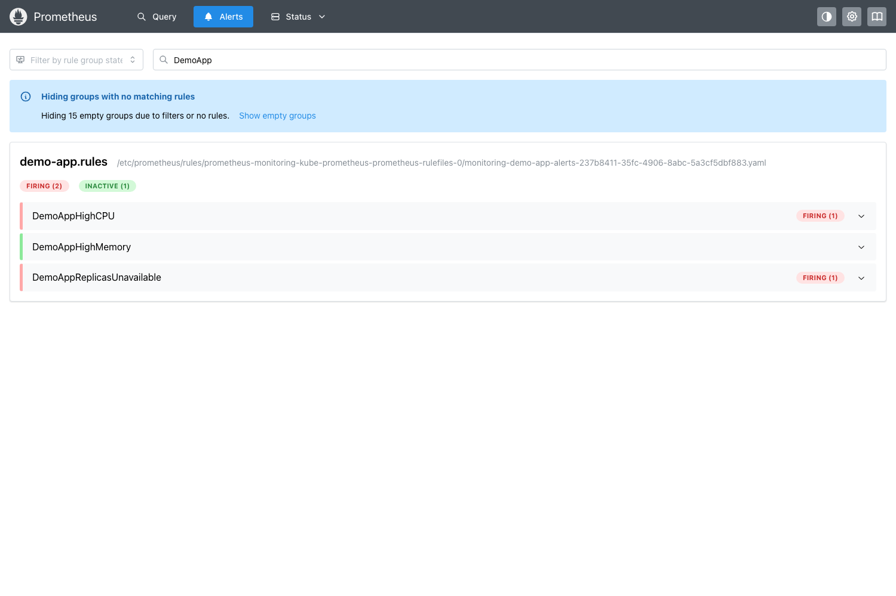
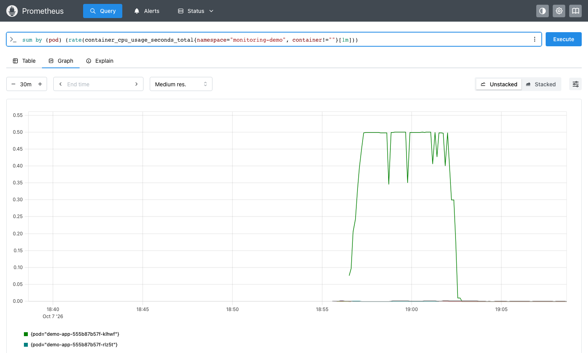
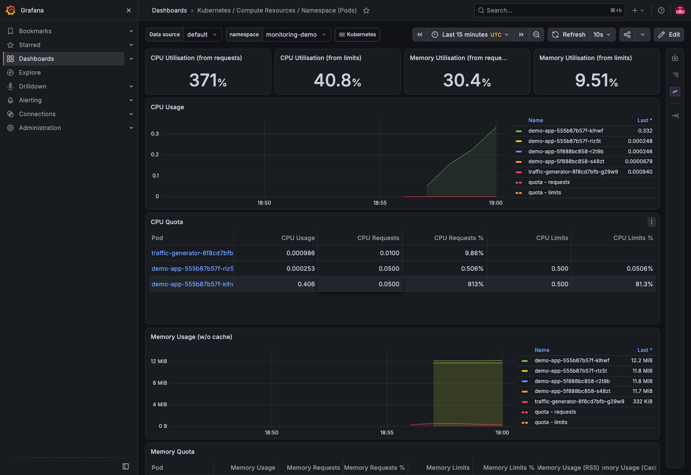
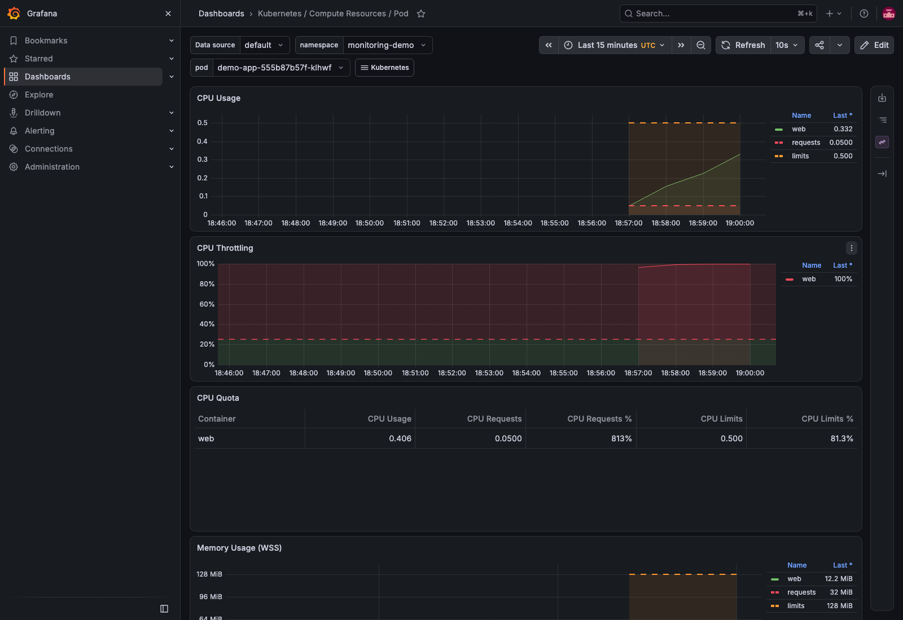

# Task 1: Monitoring Demo (Prometheus + Grafana on minikube)

In this task I installed a monitoring stack on my minikube cluster and used it to watch a small demo app.
I covered: **metrics, logs, alerts, CPU utilization, memory utilization and application health**.

## Setup

```text
                 +-------------------- namespace: monitoring --------------------+
                 |                                                               |
 kubelet/cAdvisor ---> Prometheus  <--- kube-state-metrics   node-exporter       |
 (CPU, memory of       |   |   (scrapes every 15s)                               |
  every container)     |   +--> alert rules (PrometheusRule) --> Alertmanager    |
                       v                                                         |
                    Grafana (dashboards)                                         |
                 +---------------------------------------------------------------+

                 +-------------------- namespace: monitoring-demo ---------------+
                 |  traffic-generator (busybox) --GET / and /notes--> demo-app   |
                 |                                         (nginx, 2 replicas,   |
                 |                                          readiness+liveness)  |
                 +---------------------------------------------------------------+
```

Files in this folder:

| File | What it is |
|---|---|
| [monitoring-values.yaml](monitoring-values.yaml) | Small Helm values for `kube-prometheus-stack` (low requests, 1 day retention, disabled control-plane targets that minikube does not expose) |
| [demo-app.yaml](demo-app.yaml) | Namespace + nginx Deployment (probes, requests/limits) + Service + traffic generator |
| [alert-rules.yaml](alert-rules.yaml) | My `PrometheusRule` with 3 alerts: high CPU, high memory, replicas unavailable |

---

## Step 1: Install kube-prometheus-stack with Helm

`kube-prometheus-stack` installs Prometheus Operator, Prometheus, Alertmanager, Grafana, kube-state-metrics and node-exporter
together, with ready dashboards and default alert rules.

```bash
helm repo update prometheus-community
helm install monitoring prometheus-community/kube-prometheus-stack -n monitoring --create-namespace -f monitoring-values.yaml --wait --timeout 10m
```

```text
Hang tight while we grab the latest from your chart repositories...
...Successfully got an update from the "prometheus-community" chart repository
Update Complete. ⎈Happy Helming!⎈

NAME: monitoring
LAST DEPLOYED: Thu Oct  8 00:22:20 2026
NAMESPACE: monitoring
STATUS: deployed
REVISION: 1
DESCRIPTION: Install complete
NOTES:
kube-prometheus-stack has been installed. Check its status by running:
  kubectl --namespace monitoring get pods -l "release=monitoring"
...
```

```bash
kubectl get pods -n monitoring
kubectl get svc -n monitoring
```

```text
NAME                                                     READY   STATUS    RESTARTS   AGE
alertmanager-monitoring-kube-prometheus-alertmanager-0   2/2     Running   0          2m17s
monitoring-grafana-56b76f56d9-w4frk                      3/3     Running   0          2m40s
monitoring-kube-prometheus-operator-66bcbd7f6-2d99x      1/1     Running   0          2m41s
monitoring-kube-state-metrics-78fd56fc4b-9dwdb           1/1     Running   0          2m41s
monitoring-prometheus-node-exporter-twcg2                1/1     Running   0          2m41s
prometheus-monitoring-kube-prometheus-prometheus-0       2/2     Running   0          2m16s

NAME                                      TYPE        CLUSTER-IP       EXTERNAL-IP   PORT(S)                      AGE
alertmanager-operated                     ClusterIP   None             <none>        9093/TCP,9094/TCP,9094/UDP   2m17s
monitoring-grafana                        ClusterIP   10.103.6.67      <none>        80/TCP                       2m41s
monitoring-kube-prometheus-alertmanager   ClusterIP   10.109.208.104   <none>        9093/TCP,8080/TCP            2m41s
monitoring-kube-prometheus-operator       ClusterIP   10.98.4.5        <none>        443/TCP                      2m41s
monitoring-kube-prometheus-prometheus     ClusterIP   10.105.99.4      <none>        9090/TCP,8080/TCP            2m41s
monitoring-kube-state-metrics             ClusterIP   10.101.192.35    <none>        8080/TCP                     2m41s
monitoring-prometheus-node-exporter       ClusterIP   10.110.50.236    <none>        9100/TCP                     2m41s
prometheus-operated                       ClusterIP   None             <none>        9090/TCP                     2m17s
```

What each part does:

| Component | Job |
|---|---|
| Prometheus | Scrapes (pulls) metrics every 15s and stores them as time series, evaluates alert rules |
| Alertmanager | Receives firing alerts from Prometheus, groups them and sends notifications |
| Grafana | Dashboards on top of Prometheus data |
| kube-state-metrics | Turns Kubernetes object state into metrics (replicas, pod ready, restarts ...) |
| node-exporter | Node level metrics (CPU, memory, disk of the minikube node) |
| kubelet / cAdvisor | Per-container CPU and memory metrics (Prometheus scrapes them from the kubelet) |

To open the UIs I used port-forward (all three were running in the background):

```bash
kubectl port-forward -n monitoring svc/monitoring-kube-prometheus-prometheus 19090:9090
kubectl port-forward -n monitoring svc/monitoring-grafana 13000:80
kubectl port-forward -n monitoring svc/monitoring-kube-prometheus-alertmanager 19093:9093
curl -s localhost:19090/-/ready
curl -s localhost:13000/api/health
```

```text
Prometheus Server is Ready.
{
  "database": "ok",
  "version": "13.2.3",
  "commit": "90ffed056f0884267356c12a0eeb72a022af53f1"
}
```

---

## Step 2: Deploy the demo app and my alert rules

```bash
kubectl apply -f demo-app.yaml
kubectl apply -f alert-rules.yaml
kubectl rollout status deploy/demo-app -n monitoring-demo --timeout=120s
kubectl get pods -n monitoring-demo -o wide
kubectl get prometheusrule -n monitoring | head -3
```

```text
namespace/monitoring-demo created
deployment.apps/demo-app created
service/demo-app created
deployment.apps/traffic-generator created

prometheusrule.monitoring.coreos.com/demo-app-alerts created

Waiting for deployment "demo-app" rollout to finish: 0 of 2 updated replicas are available...
Waiting for deployment "demo-app" rollout to finish: 1 of 2 updated replicas are available...
deployment "demo-app" successfully rolled out

NAME                                READY   STATUS    RESTARTS   AGE   IP            NODE       NOMINATED NODE   READINESS GATES
demo-app-5f888bc858-r2t9b           1/1     Running   0          11s   10.244.0.47   minikube   <none>           <none>
demo-app-5f888bc858-s48zt           1/1     Running   0          11s   10.244.0.48   minikube   <none>           <none>
traffic-generator-8f8cd7bfb-g29w9   1/1     Running   0          11s   10.244.0.49   minikube   <none>           <none>

NAME                                                              AGE
demo-app-alerts                                                   11s
monitoring-kube-prometheus-alertmanager.rules                     2m50s
...
```

What I observed: the operator turns my `PrometheusRule` object into a rule file inside Prometheus automatically
(no restart, no editing `prometheus.yml` by hand like in the docker-compose demo of the session).

> Small change I made after the first apply: at first the liveness probe was also `httpGet /`. For the health demo
> (Step 6) I changed liveness to `tcpSocket` so that "page missing" makes the pod **NotReady** but does not restart it.
> Readiness = "can it serve the page?", liveness = "is the process alive?". I re-applied the file and it rolled out new pods
> (that is why the pod names change from `5f888bc858` to `555b87b57f` below).

---

## Step 3: Metrics - CPU and memory utilization

### With kubectl (metrics-server)

```bash
kubectl top nodes
```

```text
NAME       CPU(cores)   CPU(%)   MEMORY(bytes)   MEMORY(%)
minikube   3020m        20%      2242Mi          11%
```

(`kubectl top pods` first said `error: metrics not available yet` because the pods were only a few seconds old; later it worked, see Step 5.)

### With PromQL (Prometheus HTTP API)

CPU in cores per pod (rate of the CPU-seconds counter):

```bash
curl -s http://localhost:19090/api/v1/query --data-urlencode 'query=sum by (pod) (rate(container_cpu_usage_seconds_total{namespace="monitoring-demo", container!=""}[2m]))'
```

```text
{"pod": "traffic-generator-8f8cd7bfb-g29w9"} => 0.000746257810052298
{"pod": "demo-app-5f888bc858-s48zt"} => 0.00016210572124706596
{"pod": "demo-app-5f888bc858-r2t9b"} => 0.0005846167047473979
```

Memory in MiB per pod:

```bash
curl -s http://localhost:19090/api/v1/query --data-urlencode 'query=sum by (pod) (container_memory_working_set_bytes{namespace="monitoring-demo", container!=""}) / 1024 / 1024'
```

```text
{"pod": "traffic-generator-8f8cd7bfb-g29w9"} => 0.3671875
{"pod": "demo-app-5f888bc858-s48zt"} => 11.65625
{"pod": "demo-app-5f888bc858-r2t9b"} => 11.7109375
```

What I observed: idle nginx uses almost no CPU (< 1 millicore) and about 11-12 MiB memory.
`container_cpu_usage_seconds_total` is a **counter**, so we always use `rate()` on it. Memory is a **gauge**, so we read it directly.

---

## Step 4: Logs

```bash
kubectl logs deploy/traffic-generator -n monitoring-demo --tail=6
```

```text
GET / OK
wget: server returned error: HTTP/1.1 404 Not Found
GET /notes FAILED (404 expected)
GET / OK
wget: server returned error: HTTP/1.1 404 Not Found
GET /notes FAILED (404 expected)
```

```bash
kubectl logs -n monitoring-demo -l app=demo-app --tail=4 --prefix
```

```text
[pod/demo-app-5f888bc858-s48zt/web] 2026/10/07 18:55:47 [error] 30#30: *23 open() "/usr/share/nginx/html/notes" failed (2: No such file or directory), client: 10.244.0.49, server: localhost, request: "GET /notes HTTP/1.1", host: "demo-app"
[pod/demo-app-5f888bc858-s48zt/web] 10.244.0.49 - - [07/Oct/2026:18:55:49 +0000] "GET / HTTP/1.1" 200 615 "-" "Wget" "-"
[pod/demo-app-5f888bc858-s48zt/web] 10.244.0.49 - - [07/Oct/2026:18:55:49 +0000] "GET /notes HTTP/1.1" 404 153 "-" "Wget" "-"
[pod/demo-app-5f888bc858-s48zt/web] 2026/10/07 18:55:49 [error] 30#30: *25 open() "/usr/share/nginx/html/notes" failed (2: No such file or directory), client: 10.244.0.49, server: localhost, request: "GET /notes HTTP/1.1", host: "demo-app"
[pod/demo-app-5f888bc858-r2t9b/web] 10.244.0.1 - - [07/Oct/2026:18:55:43 +0000] "GET / HTTP/1.1" 200 615 "-" "kube-probe/1.37" "-"
[pod/demo-app-5f888bc858-r2t9b/web] 10.244.0.1 - - [07/Oct/2026:18:55:43 +0000] "GET / HTTP/1.1" 200 615 "-" "kube-probe/1.37" "-"
[pod/demo-app-5f888bc858-r2t9b/web] 10.244.0.49 - - [07/Oct/2026:18:55:47 +0000] "GET / HTTP/1.1" 200 615 "-" "Wget" "-"
[pod/demo-app-5f888bc858-r2t9b/web] 10.244.0.1 - - [07/Oct/2026:18:55:48 +0000] "GET / HTTP/1.1" 200 615 "-" "kube-probe/1.37" "-"
```

```bash
kubectl get events -n monitoring-demo --sort-by=.lastTimestamp | tail -8
```

```text
29s         Normal    Started             pod/demo-app-5f888bc858-s48zt            Container started
29s         Warning   Unhealthy           pod/demo-app-5f888bc858-s48zt            Readiness probe failed: Get "http://10.244.0.48:80/": dial tcp 10.244.0.48:80: connect: connection refused
29s         Normal    Created             pod/demo-app-5f888bc858-s48zt            Container created
29s         Normal    Pulled              pod/demo-app-5f888bc858-s48zt            Successfully pulled image "nginx:1.27-alpine" in 8.303s (8.303s including waiting). Image size: 21832241 bytes.
...
```

What I observed:
- Metrics only told me "the pod is fine". The logs told me **what** is happening: which URL, which status code (200 vs 404), who called (`Wget` vs `kube-probe/1.37`).
- The 404 error lines for `/notes` are something metrics from cAdvisor would never show.
- Events are also a kind of log, from Kubernetes itself (the first readiness failure is just nginx still starting).

---

## Step 5: Alerts - make CPU high on purpose

My rules in [alert-rules.yaml](alert-rules.yaml):

| Alert | Expression (short) | for | severity |
|---|---|---|---|
| DemoAppHighCPU | CPU of a `web` container > 0.2 cores | 1m | warning |
| DemoAppHighMemory | memory of a `web` container > 100Mi | 1m | warning |
| DemoAppReplicasUnavailable | available replicas < wanted replicas | 1m | critical |

I started a busy loop inside one demo-app pod (it stops by itself after 330 seconds with `timeout`), and at the same time
broke the other pod for the health test (Step 6):

```bash
kubectl exec -n monitoring-demo demo-app-555b87b57f-klhwf -- timeout 330 sh -c 'while :; do :; done' &
kubectl exec -n monitoring-demo demo-app-555b87b57f-rlz5t -- rm /usr/share/nginx/html/index.html
```

About 2 minutes later:

```bash
kubectl top pods -n monitoring-demo
curl -s http://localhost:19090/api/v1/query --data-urlencode 'query=sum by (pod) (rate(container_cpu_usage_seconds_total{namespace="monitoring-demo", container="web"}[1m]))'
```

```text
NAME                                CPU(cores)   MEMORY(bytes)
demo-app-555b87b57f-klhwf           500m         12Mi
demo-app-555b87b57f-rlz5t           1m           11Mi
traffic-generator-8f8cd7bfb-g29w9   0m           0Mi

{"pod": "demo-app-555b87b57f-rlz5t"} => 0.00013749498617239133
{"pod": "demo-app-555b87b57f-klhwf"} => 0.4985938239070207
```

What I observed: the pod is stuck at exactly 500m = its CPU **limit**. The loop wants more, but Kubernetes throttles it.

Alerts in Prometheus and Alertmanager:

```bash
curl -s http://localhost:19090/api/v1/alerts      # only DemoApp alerts shown
curl -s http://localhost:19093/api/v2/alerts      # what Alertmanager received
```

```text
DemoAppHighCPU firing severity=warning pod=demo-app-555b87b57f-klhwf activeAt=2026-10-07T18:56:42 value=4.985003024629123e-01
DemoAppReplicasUnavailable firing severity=critical pod=monitoring-kube-state-metrics-78fd56fc4b-9dwdb activeAt=2026-10-07T18:57:12 value=1e+00

DemoAppReplicasUnavailable active demo-app has unavailable replicas
DemoAppHighCPU active High CPU on demo-app-555b87b57f-klhwf
```



The CPU spike in the Prometheus graph (green line = the pod with the busy loop, flat at the 0.5 limit, then back to 0 when `timeout` stopped it):



What I observed:
- An alert goes `inactive -> pending -> firing`. It stays `pending` until the condition is true for the whole `for: 1m`. This avoids alerts for very short spikes.
- `DemoAppHighMemory` stayed inactive (memory was only ~12Mi), which is correct.
- The `pod=` label on `DemoAppReplicasUnavailable` is the kube-state-metrics pod, because that metric is scraped from kube-state-metrics. The real info is in the `deployment` label.
- The default rules from the chart also reacted (`CPUThrottlingHigh`, `KubePodNotReady` went pending). So in real life you get many alerts for free.

### Grafana dashboards (CPU + memory)

Login `admin` / the password from `monitoring-values.yaml`. I used the built-in dashboards that come with the chart.

**Kubernetes / Compute Resources / Namespace (Pods)** for `monitoring-demo`: CPU usage graph, CPU quota table
(the busy pod at 0.406 cores = 813% of its 50m request, 81.3% of its limit) and memory usage per pod:



**Kubernetes / Compute Resources / Pod** for the busy pod: CPU usage vs request/limit lines and CPU throttling at 100%:



---

## Step 6: Application health

Health is shown in three ways: probes (Kubernetes), `kube_*` metrics (kube-state-metrics) and the `up` metric (Prometheus scrapes).

Before breaking anything, every container was ready and all scrape targets were up:

```bash
curl -s http://localhost:19090/api/v1/query --data-urlencode 'query=kube_deployment_status_replicas_available{namespace="monitoring-demo"}'
curl -s http://localhost:19090/api/v1/query --data-urlencode 'query=kube_pod_container_status_ready{namespace="monitoring-demo"}'
curl -s http://localhost:19090/api/v1/query --data-urlencode 'query=up{job=~"kubelet|node-exporter|kube-state-metrics|apiserver"}'
```

```text
{... "deployment": "demo-app", ... "namespace": "monitoring-demo" ...} => 2
{... "deployment": "traffic-generator", ... "namespace": "monitoring-demo" ...} => 1

{... "container": "client", ... "pod": "traffic-generator-8f8cd7bfb-g29w9" ...} => 1
{... "container": "web", ... "pod": "demo-app-5f888bc858-r2t9b" ...} => 1
{... "container": "web", ... "pod": "demo-app-5f888bc858-s48zt" ...} => 1

{"__name__": "up", ... "job": "kubelet", "metrics_path": "/metrics/probes" ...} => 1
{"__name__": "up", "container": "node-exporter", ... "job": "node-exporter" ...} => 1
{"__name__": "up", "endpoint": "https", "instance": "192.168.49.2:8443", "job": "apiserver" ...} => 1
{"__name__": "up", ... "job": "kubelet", "metrics_path": "/metrics/cadvisor" ...} => 1
{"__name__": "up", "container": "kube-state-metrics", ... "job": "kube-state-metrics" ...} => 1
{"__name__": "up", ... "job": "kubelet", "metrics_path": "/metrics" ...} => 1
```

(I cut the long label lists with `...`.) `up == 1` means Prometheus could scrape that target; `0` would mean it is down.

After deleting `index.html` in pod `rlz5t` (Step 5), nginx returns 403 for `/`, so the readiness probe fails:

```bash
kubectl get pods -n monitoring-demo
kubectl describe pod -n monitoring-demo demo-app-555b87b57f-rlz5t | grep -A3 -E "Readiness|Warning" | tail -8
curl -s http://localhost:19090/api/v1/query --data-urlencode 'query=kube_deployment_status_replicas_available{namespace="monitoring-demo", deployment="demo-app"}'
```

```text
NAME                                READY   STATUS    RESTARTS   AGE
demo-app-555b87b57f-klhwf           1/1     Running   0          2m31s
demo-app-555b87b57f-rlz5t           0/1     Running   0          2m30s
traffic-generator-8f8cd7bfb-g29w9   1/1     Running   0          3m22s

    Readiness:    http-get http://:80/ delay=0s timeout=1s period=5s #success=1 #failure=3
...
  Warning  Unhealthy  26s (x24 over 2m14s)  kubelet            Readiness probe failed: HTTP probe failed with statuscode: 403

{... "deployment": "demo-app", ... "namespace": "monitoring-demo" ...} => 1
```

What I observed: the pod is `Running` but `0/1` ready, so the Service stops sending traffic to it. Available replicas went from 2 to 1,
and `DemoAppReplicasUnavailable` fired (see the alerts output above). Liveness (tcpSocket) still passed, so no restart.

Fix: delete the broken pod, the Deployment creates a fresh one with the original files:

```bash
kubectl delete pod -n monitoring-demo demo-app-555b87b57f-rlz5t
kubectl rollout status deploy/demo-app -n monitoring-demo --timeout=60s
kubectl get pods -n monitoring-demo
```

```text
pod "demo-app-555b87b57f-rlz5t" deleted from monitoring-demo namespace
deployment "demo-app" successfully rolled out
NAME                                READY   STATUS    RESTARTS   AGE
demo-app-555b87b57f-klhwf           1/1     Running   0          4m56s
demo-app-555b87b57f-xqrbb           1/1     Running   0          1s
traffic-generator-8f8cd7bfb-g29w9   1/1     Running   0          5m47s
```

A few minutes later (CPU loop finished and pod replaced) both alerts were resolved:

```text
$ curl -s http://localhost:19090/api/v1/alerts   (only my DemoApp alerts shown)
(no DemoApp alerts active)

$ curl -s http://localhost:19090/api/v1/query --data-urlencode 'query=sum by (pod) (rate(container_cpu_usage_seconds_total{namespace="monitoring-demo", container="web"}[1m]))'
{"pod": "demo-app-555b87b57f-klhwf"} => 0.0001655406645860116
{"pod": "demo-app-555b87b57f-xqrbb"} => 0.00018444333996023817

$ curl -s http://localhost:19090/api/v1/query --data-urlencode 'query=kube_deployment_status_replicas_available{namespace="monitoring-demo", deployment="demo-app"}'
{... "deployment": "demo-app", ... "namespace": "monitoring-demo" ...} => 2

$ kubectl top pods -n monitoring-demo
NAME                                CPU(cores)   MEMORY(bytes)
demo-app-555b87b57f-klhwf           1m           11Mi
demo-app-555b87b57f-xqrbb           1m           11Mi
traffic-generator-8f8cd7bfb-g29w9   1m           0Mi
```

---

## Step 7: Clean up

The monitoring stack is heavy for a laptop cluster, so I removed everything after taking the outputs and screenshots.

```bash
kubectl delete -f alert-rules.yaml
kubectl delete -f demo-app.yaml
helm uninstall monitoring -n monitoring
kubectl delete namespace monitoring
kubectl get crd -o name | grep monitoring.coreos.com | xargs kubectl delete
```

```text
prometheusrule.monitoring.coreos.com "demo-app-alerts" deleted from monitoring namespace
namespace "monitoring-demo" deleted
deployment.apps "demo-app" deleted from monitoring-demo namespace
service "demo-app" deleted from monitoring-demo namespace
deployment.apps "traffic-generator" deleted from monitoring-demo namespace
release "monitoring" uninstalled
namespace "monitoring" deleted
customresourcedefinition.apiextensions.k8s.io "alertmanagerconfigs.monitoring.coreos.com" deleted
customresourcedefinition.apiextensions.k8s.io "alertmanagers.monitoring.coreos.com" deleted
...
customresourcedefinition.apiextensions.k8s.io "thanosrulers.monitoring.coreos.com" deleted
```

Note: `helm uninstall` does not delete CRDs (Helm never deletes CRDs), so I deleted them by hand. The operator also left
a `monitoring-kube-prometheus-kubelet` Service in `kube-system`, which I deleted with
`kubectl delete svc -n kube-system monitoring-kube-prometheus-kubelet`.

## What I learned

- Prometheus **pulls** metrics; exporters (kube-state-metrics, node-exporter, cAdvisor in kubelet) just expose numbers on `/metrics`.
- CPU from a counter needs `rate()`; memory is a gauge. Requests/limits matter: the busy pod could not go above its 500m limit.
- Alerts = PromQL condition + `for` time. Prometheus decides "firing", Alertmanager decides who gets notified.
- Readiness vs liveness: a pod can be alive but not ready. Monitoring the number of available replicas catches this.
- Metrics say **something** is wrong, logs say **what** is wrong. You need both.
