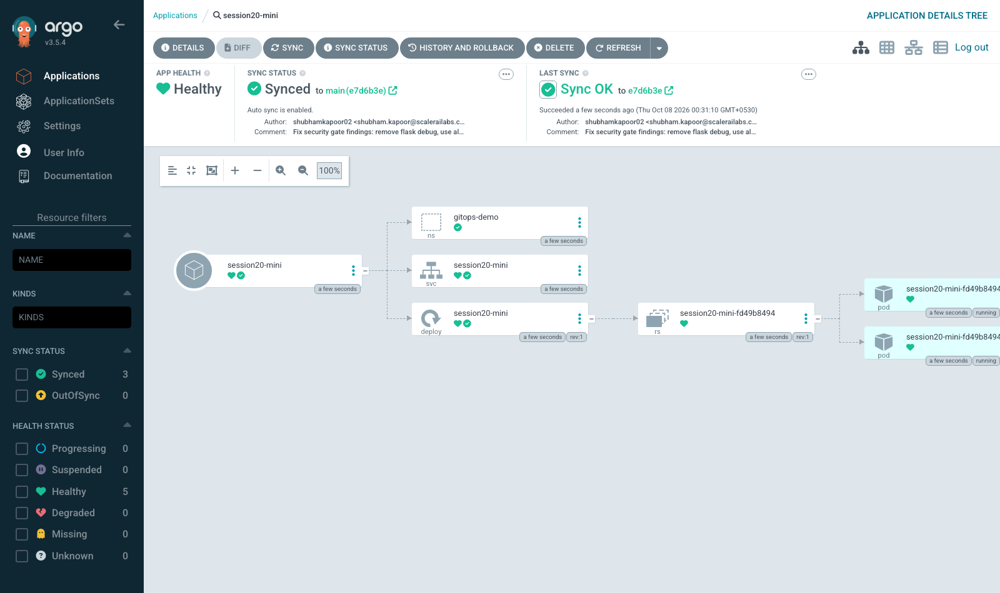
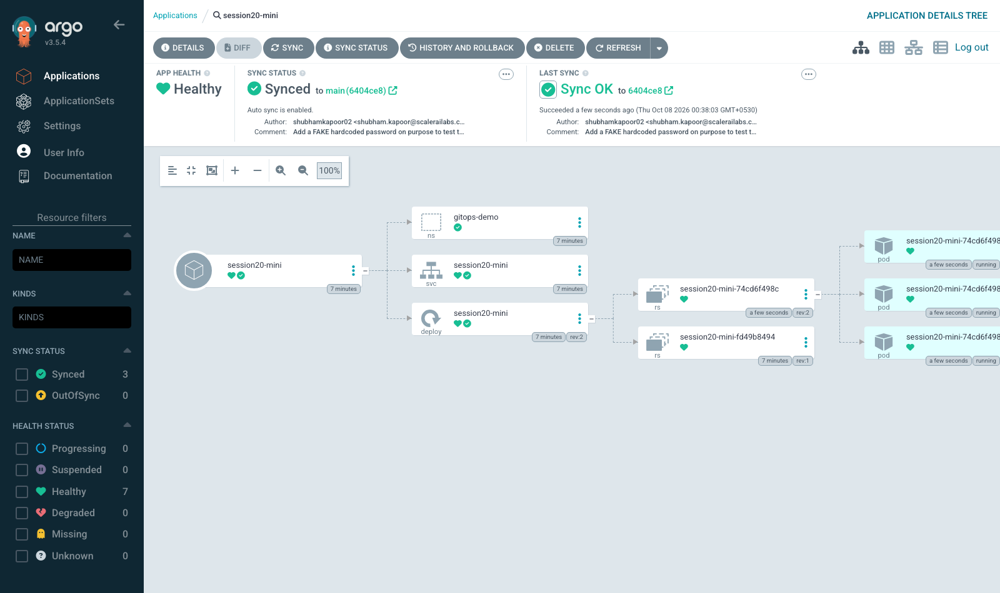

# Task 3: GitOps with Argo CD

In this task I learned GitOps and did the session mini project: Argo CD on minikube watches a folder in **this GitHub repo**
and keeps the cluster in the same state as Git.

---

## 1. What is GitOps?

GitOps is a way of doing deployments where **Git is the only place where you change things**.
You describe the wanted state of the cluster in YAML files in a Git repo, and an agent running inside the cluster
(Argo CD / Flux) keeps pulling the repo and applying it.

```text
Normal CI/CD (push):    developer -> CI pipeline -> kubectl apply -> cluster
GitOps (pull):          developer -> git push -> Git repo <- Argo CD (inside cluster) pulls -> applies
```

The four GitOps principles:

| Principle | Meaning |
|---|---|
| Declarative | The system is described as "what I want" (YAML), not as a list of commands |
| Versioned and immutable | That description is stored in Git, every change is a commit |
| Pulled automatically | An agent pulls the desired state from Git (no one runs kubectl from outside) |
| Continuously reconciled | The agent keeps comparing and fixing differences all the time |

## 2. Git as the source of truth

- The repo says what **should** run. If it is not in Git, it should not be in the cluster.
- Every change has an author, a message, a review (PR) and a time -> full audit log for free.
- Rollback = `git revert` of the bad commit.
- Disaster recovery: a new empty cluster + Argo CD + the repo = everything comes back.
- No need to give developers `kubectl` access to production, they only need access to Git.

## 3. Declarative configuration

```text
Imperative:  kubectl scale deployment session20-mini --replicas=3      (a command, a step)
Declarative: replicas: 3   (in deployment.yaml, a description of the end result)
```

Declarative files can be compared (diff) with what is running, so a tool can find drift and fix it.
My app folder [app/](app/) only contains declarative YAML: `namespace.yaml`, `deployment.yaml`, `service.yaml`.

## 4. Continuous reconciliation

```text
        +------------------+
        |   Git (desired)  |  replicas: 3
        +--------+---------+
                 |  pull (every ~3 min, or webhook)
                 v
            +---------+    compare    +---------------------+
            | Argo CD | <-----------> | Cluster (actual)    |
            +---------+               | replicas: 1 (drift) |
                 |                    +---------------------+
                 +--- sync / self-heal ---> back to replicas: 3
```

Argo CD runs this loop forever: read Git, read cluster, compare, and if different -> `OutOfSync` -> apply Git again.

## 5. GitOps workflow

```text
1. Developer changes YAML (e.g. replicas 2 -> 3, new image tag)
2. git commit + git push (in a team: PR + review + merge)
3. Argo CD notices the new commit on main
4. Argo CD applies the change (auto-sync)
5. Kubernetes rolls out the change
6. Argo CD shows Synced + Healthy
7. If someone changes the cluster by hand -> Argo CD puts it back (self-heal)
```

## 6. Kubernetes + GitOps

- Kubernetes is already declarative and has its own reconcile loops (Deployment controller keeps N pods).
  GitOps adds one more loop on top: **Git -> cluster**.
- Argo CD is itself a Kubernetes controller with a CRD called `Application` (source repo/path -> destination cluster/namespace).
- Same idea works with Helm charts and Kustomize as the source.

---

## Files

```text
03-gitops/
  argocd-application.yaml   <- applied by me with kubectl; NOT inside app/
  app/                      <- the folder Argo CD watches
    namespace.yaml          (gitops-demo)
    deployment.yaml         (session20-mini, nginx)
    service.yaml
```

[argocd-application.yaml](argocd-application.yaml):

```yaml
spec:
  source:
    repoURL: https://github.com/shubhamk0205/devops-homework.git
    targetRevision: main
    path: session-20-monitoring-observability-gitops/03-gitops/app
  destination:
    server: https://kubernetes.default.svc
    namespace: gitops-demo
  syncPolicy:
    automated:
      prune: true      # delete things that are removed from Git
      selfHeal: true   # undo manual changes in the cluster
    syncOptions:
      - CreateNamespace=true
```

The Application file is kept outside `app/` (like the instructor said), otherwise Argo CD would try to manage its own Application object.

Note: the files in `app/` now show the **final** state (`replicas: 3`, `nginx:1.28-alpine`). I started with `replicas: 2` and
`nginx:1.27-alpine` and changed them with commits during the demo (see steps 5 and 7).

---

## Step 1: Push the manifests to GitHub first

Argo CD reads from GitHub, not from my laptop, so I committed and pushed `app/` before creating the Application
(commit `64afa5e Add session 20 GitOps app manifests`, with `replicas: 2` and `nginx:1.27-alpine`).

## Step 2: Install Argo CD

```bash
kubectl create namespace argocd
kubectl apply -n argocd --server-side --force-conflicts -f https://raw.githubusercontent.com/argoproj/argo-cd/stable/manifests/install.yaml | tail -8
```

```text
namespace/argocd created

statefulset.apps/argocd-application-controller serverside-applied
networkpolicy.networking.k8s.io/argocd-application-controller-network-policy serverside-applied
networkpolicy.networking.k8s.io/argocd-applicationset-controller-network-policy serverside-applied
networkpolicy.networking.k8s.io/argocd-dex-server-network-policy serverside-applied
networkpolicy.networking.k8s.io/argocd-notifications-controller-network-policy serverside-applied
networkpolicy.networking.k8s.io/argocd-redis-network-policy serverside-applied
networkpolicy.networking.k8s.io/argocd-repo-server-network-policy serverside-applied
networkpolicy.networking.k8s.io/argocd-server-network-policy serverside-applied
```

I used `--server-side` because the Argo CD CRDs are too big for the normal client-side apply annotation.

```bash
kubectl wait --for=condition=Available deploy --all -n argocd --timeout=280s
kubectl get pods -n argocd
```

```text
deployment.apps/argocd-applicationset-controller condition met
deployment.apps/argocd-dex-server condition met
deployment.apps/argocd-notifications-controller condition met
deployment.apps/argocd-redis condition met
deployment.apps/argocd-repo-server condition met
deployment.apps/argocd-server condition met
NAME                                                READY   STATUS    RESTARTS   AGE
argocd-application-controller-0                     1/1     Running   0          73s
argocd-applicationset-controller-76fd8cdd4f-6cwkc   1/1     Running   0          74s
argocd-dex-server-66c78cf887-p96wr                  1/1     Running   0          74s
argocd-notifications-controller-7fb9868fd6-6ws9t    1/1     Running   0          74s
argocd-redis-bdbdffcb4-9hrfm                        1/1     Running   0          74s
argocd-repo-server-d89c7967d-ggrng                  1/1     Running   0          74s
argocd-server-776b7cdd4d-9ct8x                      1/1     Running   0          73s
```

| Pod | Job |
|---|---|
| argocd-server | API + web UI |
| argocd-repo-server | clones the Git repo and renders the manifests |
| argocd-application-controller | the reconcile loop: compares Git vs cluster and syncs |
| argocd-redis | cache |
| argocd-dex-server | SSO login (not used here) |
| applicationset / notifications controllers | many apps from templates / notifications (not used here) |

UI access:

```bash
kubectl port-forward -n argocd svc/argocd-server 18443:443
kubectl -n argocd get secret argocd-initial-admin-secret -o jsonpath='{.data.password}' | base64 -d
```

Then `https://localhost:18443`, user `admin` + that password (I did not copy the password here).

---

## Step 3: Create the Application

```bash
kubectl apply -f argocd-application.yaml
kubectl get applications -n argocd
kubectl get all -n gitops-demo
```

```text
application.argoproj.io/session20-mini created

NAME             SYNC STATUS   HEALTH STATUS
session20-mini   Synced        Healthy

NAME                                 READY   STATUS    RESTARTS   AGE
pod/session20-mini-fd49b8494-n7429   1/1     Running   0          2s
pod/session20-mini-fd49b8494-xcn64   1/1     Running   0          2s

NAME                     TYPE        CLUSTER-IP      EXTERNAL-IP   PORT(S)   AGE
service/session20-mini   ClusterIP   10.107.245.80   <none>        80/TCP    2s

NAME                             READY   UP-TO-DATE   AVAILABLE   AGE
deployment.apps/session20-mini   2/2     2            2           2s

NAME                                       DESIRED   CURRENT   READY   AGE
replicaset.apps/session20-mini-fd49b8494   2         2         2       2s
```

What I observed: I never ran `kubectl apply` on the app files. Argo CD created the namespace (because of `CreateNamespace=true`),
the Deployment and the Service from GitHub.



The UI says `Synced to main (e7d6b3e)`. That is the latest commit on `main` at that time (other homework sessions were also
being pushed to the same repo; Argo CD always takes the newest commit of `main` and only looks at my `app/` path inside it).

---

## Step 4 (change 1): Scale from 2 to 3 replicas **in Git**

```bash
sed -i '' 's/  replicas: 2/  replicas: 3/' session-20-monitoring-observability-gitops/03-gitops/app/deployment.yaml
git diff session-20-monitoring-observability-gitops/03-gitops/app/deployment.yaml
git add session-20-monitoring-observability-gitops/03-gitops/app/deployment.yaml
git commit -m "Scale session20-mini to three replicas"
git pull -q --rebase origin main
git push origin main
date
```

```text
@@ -6,7 +6,7 @@ metadata:
   labels:
     app: session20-mini
 spec:
-  replicas: 2
+  replicas: 3
   selector:
     matchLabels:
       app: session20-mini

[main 19cd336] Scale session20-mini to three replicas
 1 file changed, 1 insertion(+), 1 deletion(-)

To github.com:shubhamk0205/devops-homework.git
   e7d6b3e..19cd336  main -> main

Thu Oct  8 00:31:50 IST 2026
```

Then I only waited (no kubectl, no clicking "Sync"):

```bash
until [ "$(kubectl get deploy session20-mini -n gitops-demo -o jsonpath='{.status.readyReplicas}')" = "3" ]; do sleep 5; done; date
kubectl get application session20-mini -n argocd -o jsonpath='{.status.sync.revision}{"\n"}{.status.sync.status} {.status.health.status}{"\n"}{.status.operationState.message} at {.status.operationState.finishedAt}{"\n"}'
kubectl get deploy session20-mini -n gitops-demo
kubectl get pods -n gitops-demo
```

```text
Thu Oct  8 00:34:18 IST 2026

19cd336b06972e5e5b7e593df5b39b517f9503e8
Synced Healthy
successfully synced (all tasks run) at 2026-10-07T19:04:14Z

NAME             READY   UP-TO-DATE   AVAILABLE   AGE
session20-mini   3/3     3            3           3m9s

NAME                             READY   STATUS    RESTARTS   AGE
session20-mini-fd49b8494-dmqvf   1/1     Running   0          4s
session20-mini-fd49b8494-n7429   1/1     Running   0          3m9s
session20-mini-fd49b8494-xcn64   1/1     Running   0          3m9s
```

What I observed: push at 00:31:50, synced at 00:34:14 IST (19:04:14 UTC). About **2.5 minutes**, because by default Argo CD
polls Git every ~3 minutes (with a GitHub webhook it would be almost instant). The synced revision is exactly my commit `19cd336`.


---

## Step 5: Self-healing (manual change in the cluster)

Now I acted like someone who changes production by hand:

```bash
kubectl scale deployment session20-mini -n gitops-demo --replicas=1
kubectl get deploy session20-mini -n gitops-demo
sleep 3
kubectl get deploy session20-mini -n gitops-demo
sleep 5
kubectl get deploy session20-mini -n gitops-demo
kubectl get pods -n gitops-demo
```

```text
deployment.apps/session20-mini scaled

NAME             READY   UP-TO-DATE   AVAILABLE   AGE
session20-mini   1/1     1            1           3m27s

NAME             READY   UP-TO-DATE   AVAILABLE   AGE
session20-mini   3/3     3            3           3m31s

NAME             READY   UP-TO-DATE   AVAILABLE   AGE
session20-mini   3/3     3            3           3m36s

NAME                             READY   STATUS    RESTARTS   AGE
session20-mini-fd49b8494-w7qp4   1/1     Running   0          8s
session20-mini-fd49b8494-wlg8v   1/1     Running   0          8s
session20-mini-fd49b8494-xcn64   1/1     Running   0          3m36s
```

What I observed: within ~4 seconds it was back to 3/3. Argo CD watches the cluster all the time, so drift is fixed
fast (much faster than the Git poll). The manual change is simply lost, because Git still says `replicas: 3`.
So the right way to change anything is a commit, not `kubectl`.

---

## Step 6 (change 2): Update the image **in Git**

```bash
sed -i '' 's/nginx:1.27-alpine/nginx:1.28-alpine/' session-20-monitoring-observability-gitops/03-gitops/app/deployment.yaml
git add session-20-monitoring-observability-gitops/03-gitops/app/deployment.yaml
git commit -q -m "Update session20-mini image to nginx 1.28"
git pull -q --rebase origin main
git push -q origin main
git log --oneline -1
git show f256d0c | grep -E '^[-+] '
date
```

```text
f256d0c Update session20-mini image to nginx 1.28
-          image: nginx:1.27-alpine
+          image: nginx:1.28-alpine
Thu Oct  8 00:34:57 IST 2026
```

After waiting (rolling update to the new image finished at 00:38:15):

```bash
kubectl get application session20-mini -n argocd
kubectl get deploy session20-mini -n gitops-demo -o wide
kubectl get pods -n gitops-demo
kubectl exec -n gitops-demo deploy/session20-mini -- nginx -v
kubectl get application session20-mini -n argocd -o jsonpath='{range .status.history[*]}{.id}  {.revision}  {.deployedAt}{"\n"}{end}'
kubectl logs deployment/session20-mini -n gitops-demo --tail=3
```

```text
NAME             SYNC STATUS   HEALTH STATUS
session20-mini   Synced        Healthy

NAME             READY   UP-TO-DATE   AVAILABLE   AGE    CONTAINERS   IMAGES              SELECTOR
session20-mini   3/3     3            3           7m6s   app          nginx:1.28-alpine   app=session20-mini

NAME                              READY   STATUS    RESTARTS   AGE
session20-mini-74cd6f498c-kvbb4   1/1     Running   0          4s
session20-mini-74cd6f498c-mj6h5   1/1     Running   0          4s
session20-mini-74cd6f498c-ssgq6   1/1     Running   0          12s

nginx version: nginx/1.28.3

0  e7d6b3e45b9286abeee3bfcdd7534da614a0b6c4  2026-10-07T19:01:09Z
1  19cd336b06972e5e5b7e593df5b39b517f9503e8  2026-10-07T19:04:14Z
2  6404ce8b4530ea7314fdfde5f1e62c80c92828b3  2026-10-07T19:08:03Z

Found 3 pods, using pod/session20-mini-74cd6f498c-ssgq6
2026/10/07 19:08:11 [notice] 1#1: start worker process 42
2026/10/07 19:08:11 [notice] 1#1: start worker process 43
2026/10/07 19:08:11 [notice] 1#1: start worker process 44
```

What I observed:
- A new ReplicaSet (`74cd6f498c`) was created and the pods were replaced one by one with nginx 1.28.
- Argo CD history has 3 syncs: the first deploy, the scale to 3, and the image change. The last one is `6404ce8`, not my `f256d0c`,
  because another session's commit was pushed on top before Argo CD polled; it still contains my change (same `app/` content).
- From Argo CD history you can also roll back (the "History and Rollback" button), but in GitOps the cleaner way is `git revert`.



---

## Step 7: Clean up

```bash
kubectl delete -f argocd-application.yaml
kubectl delete namespace gitops-demo
kubectl delete -n argocd -f https://raw.githubusercontent.com/argoproj/argo-cd/stable/manifests/install.yaml | tail -3
kubectl delete namespace argocd
```

```text
application.argoproj.io "session20-mini" deleted from argocd namespace
namespace "gitops-demo" deleted
Warning: deleting cluster-scoped resources, not scoped to the provided namespace
networkpolicy.networking.k8s.io "argocd-redis-network-policy" deleted from argocd namespace
networkpolicy.networking.k8s.io "argocd-repo-server-network-policy" deleted from argocd namespace
networkpolicy.networking.k8s.io "argocd-server-network-policy" deleted from argocd namespace
namespace "argocd" deleted
```

Deleting the Application does not delete the app's resources (no finalizer was set), so I deleted the `gitops-demo` namespace myself.

---

## Viva questions (my answers)

| Question | My answer |
|---|---|
| What is GitOps? | Using Git as the single place for the desired state, with an agent in the cluster that pulls and applies it continuously |
| Why is Git the source of truth? | The cluster must match Git; every change is a reviewed, versioned commit that can be reverted |
| What does Argo CD do? | Watches a Git path, compares it with the cluster, syncs differences and shows sync/health status |
| Desired state | What Git says (`replicas: 3`) |
| Actual state | What is really running in the cluster (`kubectl scale` made it 1) |
| Reconciliation | The compare-and-fix loop that brings actual state back to desired state |
| Self-heal | Argo CD automatically undoing manual changes in the cluster (1 -> 3 in ~4 seconds in my test) |
| What happens when replicas change 2 -> 3 in Git? | Argo CD detects the new commit, marks OutOfSync, applies it, Deployment controller starts one more pod, app becomes Synced/Healthy |

## What I learned

- In GitOps I change the cluster only through `git push`; Argo CD did all the `kubectl apply` work.
- Auto-sync from Git took ~2.5 minutes (polling), self-heal of drift took seconds.
- `prune` + `selfHeal` make the cluster strictly follow Git, which is great for consistency but means hand fixes do not survive.
