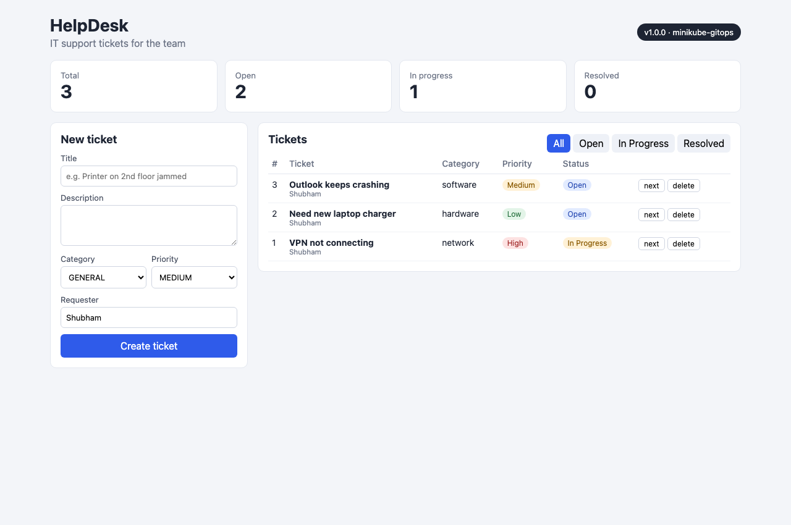
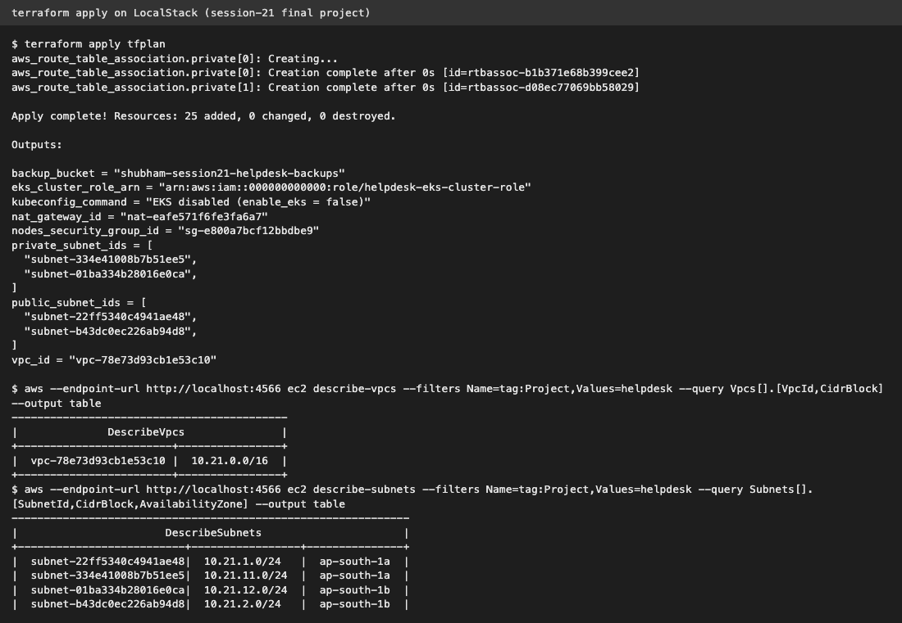
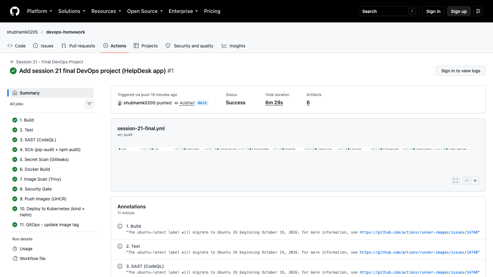
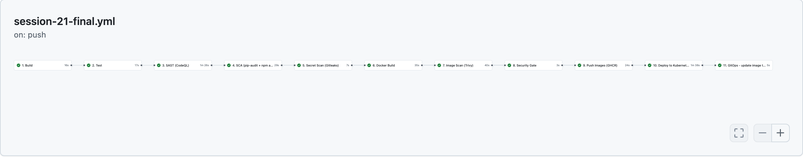
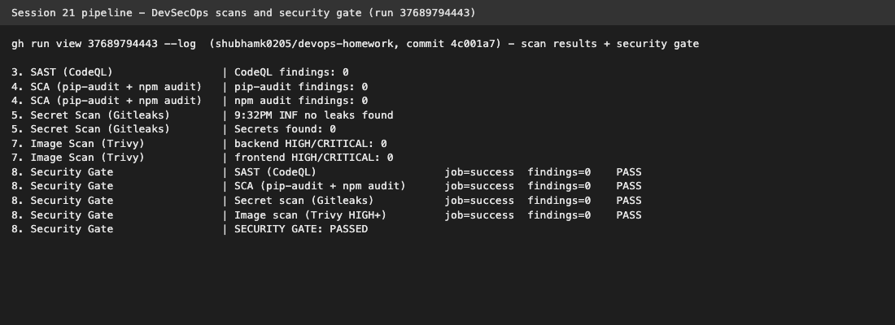
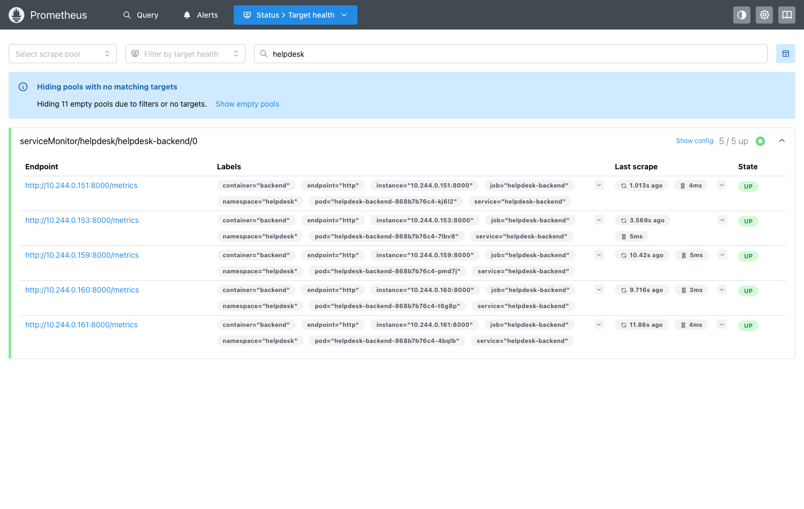
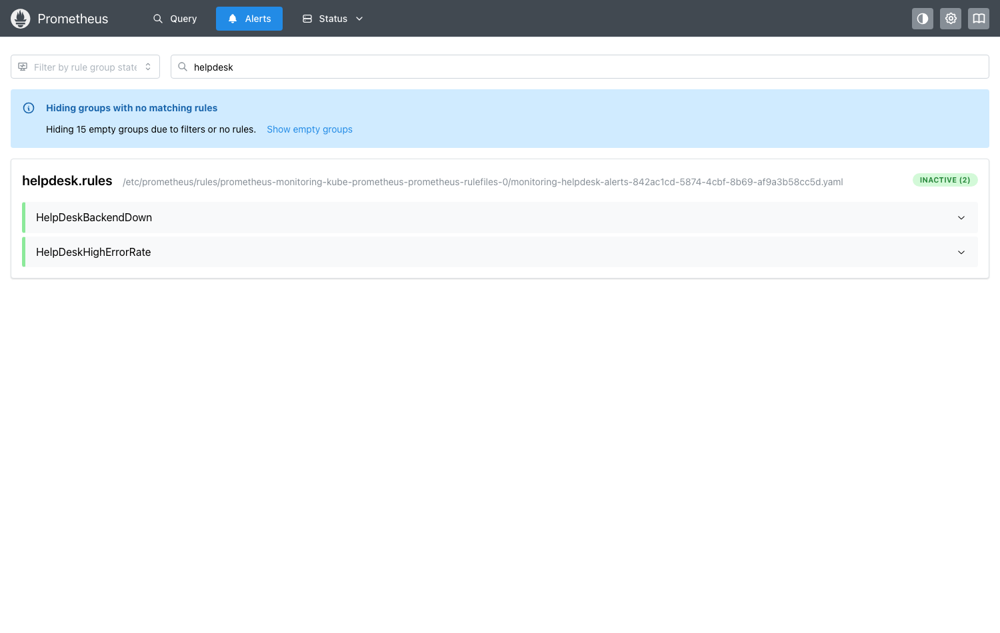
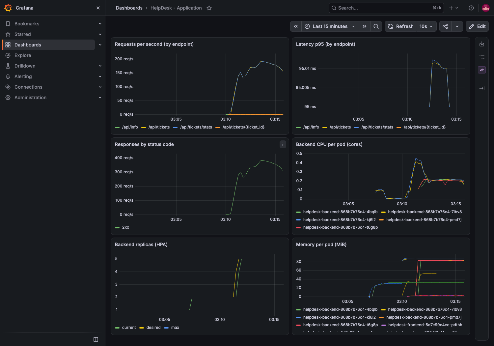
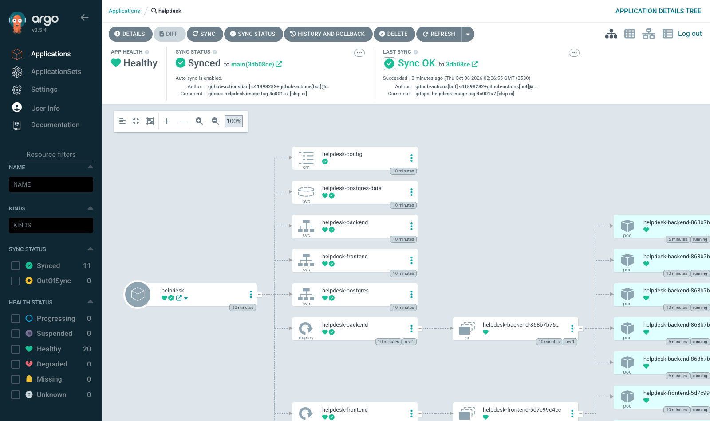
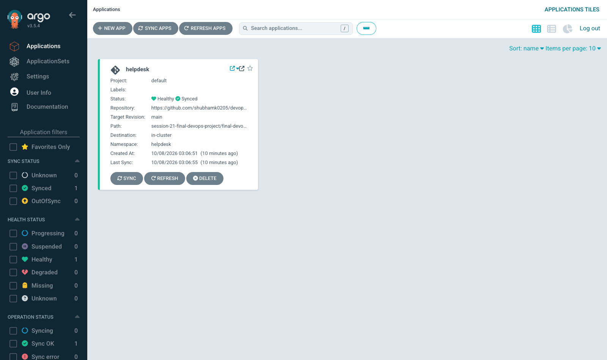

# Final DevOps Project - HelpDesk (Session 21)

## 1. Project overview

For the final project I built a small **HelpDesk ticket app** and took it through the whole DevOps flow that we learned
in the course:

```text
Application -> Git -> GitHub -> CI Pipeline -> Build & Test -> Security Scanning -> Docker Image
            -> Container Registry -> Kubernetes -> Helm -> Monitoring -> GitOps
```

The app itself is simple on purpose (create tickets, change status, see stats), so that most of the work goes into the
DevOps part:

- **backend** - Python FastAPI REST API, PostgreSQL via SQLAlchemy, Alembic migration, `/health`, `/ready`, `/metrics`
- **frontend** - React (Vite) page served by nginx, nginx also proxies `/api` to the backend in docker compose
- **database** - PostgreSQL 17 with a PersistentVolumeClaim in Kubernetes

Everything in this README was really run by me (on 8 Oct 2026). Pipeline run:
[run 37689794443](https://github.com/shubhamk0205/devops-homework/actions/runs/37689794443) - all 11 jobs green.

```text
Laptop: macOS (arm64) | Docker Desktop 29.4.1 | minikube (Kubernetes v1.37.0, docker driver, addons: ingress + metrics-server)
kubectl 1.34 | Helm v4.3.0 | Terraform v1.16.4 | LocalStack 4.4 | Argo CD v3.5.4 | kube-prometheus-stack 92.1.0
```

## 2. Architecture diagram

```text
  Developer (me)
      |  git push
      v
+-----------------------------  GitHub: shubhamk0205/devops-homework  ------------------------------+
|  GitHub Actions  (.github/workflows/session-21-final.yml)                                          |
|                                                                                                    |
|  1 Build -> 2 Test -> 3 SAST -> 4 SCA -> 5 Secret scan -> 6 Docker build -> 7 Image scan (Trivy)   |
|                                                                   |                                |
|                                                     8 SECURITY GATE (all findings must be 0)       |
|                                                                   | pass                           |
|            9 Push images  ------------------------------------>  GHCR (ghcr.io/shubhamk0205/...)   |
|           10 Deploy test  -> kind cluster inside the runner + helm install + smoke test            |
|           11 GitOps       -> commit new tag into gitops/values-gitops.yaml  [skip ci]              |
+----------------------------------------------------------------------------------------------------+
                                       |  Argo CD polls the repo (Git = source of truth)
                                       v
+------------------------------------  minikube  ------------------------------------------------+
|  argocd ns:  Argo CD Application "helpdesk"  (helm chart + gitops values, auto-sync, self-heal)  |
|                                                                                                 |
|  helpdesk ns:                                                                                   |
|    Ingress helpdesk.local  --/api-->  Service helpdesk-backend:8000  --> backend pods (HPA 2..5)  |
|                            --/   -->  Service helpdesk-frontend:80   --> frontend pods (2)        |
|    backend --> Service helpdesk-postgres:5432 --> postgres pod --> PVC 1Gi                       |
|    ConfigMap helpdesk-config (env)   Secret helpdesk-db (user/password)   Secret ghcr-pull       |
|                                                                                                 |
|  monitoring ns: Prometheus (ServiceMonitor -> backend /metrics, PrometheusRule) + Grafana        |
+-------------------------------------------------------------------------------------------------+

  Terraform (terraform/)  ->  AWS infra: VPC, 2 public + 2 private subnets, IGW, NAT, route tables,
                              security group, IAM roles for EKS, S3 backup bucket (EKS optional)
                              -> applied on LocalStack (fake AWS) so it costs nothing
```

## 3. Technologies used

| Area | Tool |
|---|---|
| Application | Python 3.13, FastAPI, SQLAlchemy, Alembic, React + Vite, nginx, PostgreSQL 17 |
| Version control | Git, GitHub |
| CI/CD | GitHub Actions |
| Tests | pytest + pytest-cov (SQLite test DB) |
| SAST | GitHub CodeQL (python + javascript) |
| SCA | pip-audit, npm audit |
| Secret scanning | Gitleaks |
| Image scanning | Trivy |
| Containers | Docker, docker compose |
| Registry | GitHub Container Registry (GHCR) |
| Kubernetes | minikube (my laptop), kind (inside the CI runner) |
| Packaging | Helm chart `helm/helpdesk` |
| Infrastructure as Code | Terraform (AWS provider) on LocalStack |
| Monitoring | kube-prometheus-stack (Prometheus Operator, Prometheus, Grafana), prometheus-fastapi-instrumentator |
| GitOps | Argo CD |

## 4. Folder structure

```text
final-devops-project/
├── application/          backend/ (FastAPI + tests + alembic)  frontend/ (React + nginx template)
├── docker/               backend.Dockerfile, frontend.Dockerfile, docker-compose.yml
├── kubernetes/           namespace, example secret, load generator, troubleshooting/ (broken + fixed)
├── helm/helpdesk/        Chart with Deployments, Services, ConfigMap, PVC, Ingress, HPA, ServiceMonitor
├── terraform/            VPC, subnets, NAT, SG, IAM, S3, optional EKS
├── .github/workflows/    ci-cd.yml (copy - see note below)
├── security/             codeql-config.yml, gitleaks.toml, trivy.yaml, security-gate-policy.md
├── monitoring/           monitoring-values.yaml, grafana-dashboard.yaml, prometheus-rule.yaml
├── gitops/               argocd-application.yaml, values-gitops.yaml (tag updated by CI)
├── screenshots/
└── README.md
```

> Note: GitHub only runs workflows from the **repo root** `.github/workflows/`. The active file is
> [`/.github/workflows/session-21-final.yml`](../../.github/workflows/session-21-final.yml). The file in
> `final-devops-project/.github/workflows/ci-cd.yml` is an identical copy so the project folder is complete.

---

## 5. Application setup

Backend endpoints:

| Method | Path | What it does |
|---|---|---|
| GET | `/health` | liveness - process is alive |
| GET | `/ready` | readiness - runs `SELECT 1` on the database |
| GET | `/metrics` | Prometheus metrics (request count, latency) |
| GET | `/api/info` | app name, version, environment |
| GET/POST | `/api/tickets` | list / create tickets |
| GET/PUT/DELETE | `/api/tickets/{id}` | one ticket |
| GET | `/api/tickets/stats` | counts per status |

Configuration comes only from environment variables (`APP_ENV`, `LOG_LEVEL`, `DB_HOST`, `DB_PORT`, `DB_NAME`,
`DB_USER`, `DB_PASSWORD`), see `application/backend/.env.example`. No password is hard coded.

Tests (`application/backend/tests/test_api.py`) use an SQLite file instead of PostgreSQL. Output from the CI "2. Test" job:

```bash
pip install -r requirements-dev.txt
pytest -v --cov=app --cov-report=term-missing --junitxml=test-results.xml
```

```text
tests/test_api.py::test_health PASSED                                    [ 10%]
tests/test_api.py::test_ready PASSED                                     [ 20%]
tests/test_api.py::test_root PASSED                                      [ 30%]
tests/test_api.py::test_create_ticket PASSED                             [ 40%]
tests/test_api.py::test_create_ticket_validation_error PASSED            [ 50%]
tests/test_api.py::test_list_and_get_ticket PASSED                       [ 60%]
tests/test_api.py::test_update_ticket PASSED                             [ 70%]
tests/test_api.py::test_delete_ticket PASSED                             [ 80%]
tests/test_api.py::test_stats PASSED                                     [ 90%]
tests/test_api.py::test_metrics_endpoint PASSED                          [100%]
...
app/config.py        18      1    94%   26
app/main.py          73      1    99%   65
...
TOTAL               146      2    99%
======================== 10 passed, 1 warning in 0.29s =========================
```

What I observed: all 10 API tests pass and coverage is 99%.

## 6. Docker setup

- `docker/backend.Dockerfile` - `python:3.13-alpine`, installs requirements, **removes pip** (Trivy found CVEs in it),
  runs as user `10001`, runs `alembic upgrade head` then uvicorn.
- `docker/frontend.Dockerfile` - multi-stage: `node:22-alpine` builds the static files, then
  `nginxinc/nginx-unprivileged:1.31-alpine` serves them on port 8080 (non-root). `BACKEND_URL` is put into the nginx
  config at start with envsubst, so the same image works in compose and Kubernetes.
- `docker/docker-compose.yml` - postgres (with healthcheck + volume) + backend + frontend.

```bash
cd docker
docker compose -p helpdesk up -d --build
docker compose -p helpdesk ps
```

```text
 Container helpdesk-postgres-1 Healthy
 Container helpdesk-backend-1 Started
 Container helpdesk-frontend-1 Started
NAME                  IMAGE                COMMAND                  SERVICE    CREATED          STATUS                    PORTS
helpdesk-backend-1    helpdesk-backend     "sh -c 'alembic upgr…"   backend    12 seconds ago   Up 6 seconds              0.0.0.0:8001->8000/tcp, [::]:8001->8000/tcp
helpdesk-frontend-1   helpdesk-frontend    "/docker-entrypoint.…"   frontend   12 seconds ago   Up 6 seconds              0.0.0.0:3080->8080/tcp, [::]:3080->8080/tcp
helpdesk-postgres-1   postgres:17-alpine   "docker-entrypoint.s…"   postgres   12 seconds ago   Up 11 seconds (healthy)   5432/tcp
```

```bash
curl -s http://localhost:8001/health
curl -s -X POST http://localhost:3080/api/tickets -H "Content-Type: application/json" -d '{"title":"Printer not working","priority":"HIGH"}'
curl -s http://localhost:3080/api/tickets/stats
```

```text
{"status":"UP"}
{"title":"Printer not working","description":"","category":"GENERAL","priority":"HIGH","status":"OPEN","requester":"Anonymous","id":1,"created_at":"2026-10-07T21:32:47.337524Z"}
{"total":1,"open":1,"inProgress":0,"resolved":0}
```

What I observed: the backend waited for postgres to be `healthy` (depends_on condition), and the frontend nginx proxied
`/api` to the backend. After testing I stopped it with `docker compose -p helpdesk down`.

---

## 7. Kubernetes deployment

All Kubernetes objects are in the Helm chart (next section). What the chart creates and why:

| Requirement | Object in the chart |
|---|---|
| Deployment | `helpdesk-backend`, `helpdesk-frontend`, `helpdesk-postgres` |
| Service | 3 x ClusterIP (`8000`, `80`, `5432`) |
| ConfigMap | `helpdesk-config` - APP_ENV, LOG_LEVEL, DB_HOST, DB_PORT, DB_NAME (loaded with `envFrom`) |
| Secret | `helpdesk-db` (username, password) via `secretKeyRef`, `ghcr-pull` for the private images. Both created at runtime with kubectl, **never in Git** (`kubernetes/secrets.example.yaml` is only a placeholder) |
| Ingress | host `helpdesk.local`: `/api` -> backend, `/` -> frontend (ingress-nginx) |
| HPA | backend 2..5 replicas, target 50% CPU |
| Probes | backend readiness `/ready` (checks DB), liveness `/health` (does not check DB); frontend `/`; postgres `pg_isready` |
| Storage | PVC `helpdesk-postgres-data` 1Gi for `/var/lib/postgresql/data` |
| Other | init container `wait-for-db`, resource requests/limits, `runAsNonRoot`, checksum annotation so pods restart when the ConfigMap changes |

Secrets created once before Argo CD deploys the app (values never printed or committed):

```bash
kubectl apply -f kubernetes/namespace.yaml
kubectl create secret docker-registry ghcr-pull -n helpdesk --docker-server=ghcr.io \
  --docker-username=shubhamk0205 --docker-password="$(gh auth token)"
kubectl create secret generic helpdesk-db -n helpdesk \
  --from-literal=username=helpdesk --from-literal=password="$(openssl rand -hex 16)"
```

```text
namespace/helpdesk created
secret/ghcr-pull created
secret/helpdesk-db created
```

After Argo CD synced (see GitOps section):

```bash
kubectl get deploy,pods,svc,pvc,hpa,ingress,configmap,secret -n helpdesk
```

```text
NAME                                READY   UP-TO-DATE   AVAILABLE   AGE
deployment.apps/helpdesk-backend    2/2     2            2           2m23s
deployment.apps/helpdesk-frontend   2/2     2            2           2m23s
deployment.apps/helpdesk-postgres   1/1     1            1           2m23s

NAME                                     READY   STATUS    RESTARTS   AGE
pod/helpdesk-backend-868b7b76c4-7lbv8    1/1     Running   0          2m23s
pod/helpdesk-backend-868b7b76c4-kj6l2    1/1     Running   0          2m23s
pod/helpdesk-frontend-5d7c99c4cc-pdthh   1/1     Running   0          2m23s
pod/helpdesk-frontend-5d7c99c4cc-qcfqr   1/1     Running   0          2m23s
pod/helpdesk-postgres-596dffbd4c-zngxf   1/1     Running   0          2m23s

NAME                        TYPE        CLUSTER-IP       EXTERNAL-IP   PORT(S)    AGE
service/helpdesk-backend    ClusterIP   10.98.138.184    <none>        8000/TCP   2m23s
service/helpdesk-frontend   ClusterIP   10.102.212.228   <none>        80/TCP     2m23s
service/helpdesk-postgres   ClusterIP   10.105.239.54    <none>        5432/TCP   2m23s

NAME                                           STATUS   VOLUME                                     CAPACITY   ACCESS MODES   STORAGECLASS   VOLUMEATTRIBUTESCLASS   AGE
persistentvolumeclaim/helpdesk-postgres-data   Bound    pvc-90b7f2e5-3961-4f0a-92b4-c62ec7fa3cb3   1Gi        RWO            standard       <unset>                 2m24s

NAME                                                   REFERENCE                     TARGETS       MINPODS   MAXPODS   REPLICAS   AGE
horizontalpodautoscaler.autoscaling/helpdesk-backend   Deployment/helpdesk-backend   cpu: 9%/50%   2         5         2          2m23s

NAME                                 CLASS   HOSTS            ADDRESS        PORTS   AGE
ingress.networking.k8s.io/helpdesk   nginx   helpdesk.local   192.168.49.2   80      2m23s

NAME                         DATA   AGE
configmap/helpdesk-config    6      2m24s
configmap/kube-root-ca.crt   1      6m16s

NAME                 TYPE                             DATA   AGE
secret/ghcr-pull     kubernetes.io/dockerconfigjson   1      6m16s
secret/helpdesk-db   Opaque                           2      6m16s
```

### 7.1 ConfigMap + Secret injection and probes

```bash
kubectl get configmap helpdesk-config -n helpdesk -o yaml | sed -n '/^data:/,/^kind/p'
kubectl exec -n helpdesk deploy/helpdesk-backend -- sh -c 'env | grep -E "^(APP_ENV|LOG_LEVEL|DB_HOST|DB_NAME|DB_USER)=" | sort; echo DB_PASSWORD length: ${#DB_PASSWORD}'
kubectl describe pod -n helpdesk -l app=helpdesk-backend | grep -E 'Image:|Liveness|Readiness|Environment Variables from|helpdesk-config|DB_USER|DB_PASSWORD' | head -12
```

```text
data:
  APP_ENV: minikube-gitops
  APP_NAME: HelpDesk API
  DB_HOST: helpdesk-postgres
  DB_NAME: helpdesk
  DB_PORT: "5432"
  LOG_LEVEL: INFO
kind: ConfigMap

APP_ENV=minikube-gitops
DB_HOST=helpdesk-postgres
DB_NAME=helpdesk
DB_USER=helpdesk
LOG_LEVEL=INFO
DB_PASSWORD length: 32

    Image:         postgres:17-alpine
    Environment Variables from:
      helpdesk-config  ConfigMap  Optional: false
    Image:          ghcr.io/shubhamk0205/session21-helpdesk-backend:4c001a7
    Liveness:   http-get http://:http/health delay=15s timeout=1s period=15s #success=1 #failure=3
    Readiness:  http-get http://:http/ready delay=5s timeout=1s period=10s #success=1 #failure=3
    Environment Variables from:
      helpdesk-config  ConfigMap  Optional: false
      DB_USER:      <set to the key 'username' in secret 'helpdesk-db'>  Optional: false
      DB_PASSWORD:  <set to the key 'password' in secret 'helpdesk-db'>  Optional: false
```

What I observed: the ConfigMap values arrive as env variables and the password comes from the Secret (I only printed
its length). The first `Image: postgres:17-alpine` line is the `wait-for-db` init container.

### 7.2 App through the Ingress

minikube with the docker driver on Mac does not expose the node IP to the laptop, so I port-forwarded the ingress-nginx
controller and sent the `Host: helpdesk.local` header.

```bash
kubectl port-forward -n ingress-nginx svc/ingress-nginx-controller 8085:80 &
curl -s -H "Host: helpdesk.local" http://localhost:8085/ | head -5
curl -s -H "Host: helpdesk.local" http://localhost:8085/api/info
curl -s -X POST -H "Host: helpdesk.local" -H 'Content-Type: application/json' http://localhost:8085/api/tickets -d '{"title":"VPN not connecting","priority":"HIGH","category":"NETWORK","requester":"Shubham"}'
# (+ 2 more tickets)
curl -s -X PUT -H "Host: helpdesk.local" -H "Content-Type: application/json" http://localhost:8085/api/tickets/1 -d '{"status":"IN_PROGRESS"}'
curl -s -H "Host: helpdesk.local" http://localhost:8085/api/tickets/stats
```

```text
<!doctype html>
<html lang="en">
  <head>
    <meta charset="UTF-8" />
    <meta name="viewport" content="width=device-width, initial-scale=1.0" />

{"app":"HelpDesk API","version":"1.0.0","env":"minikube-gitops"}
{"title":"VPN not connecting","description":"","category":"NETWORK","priority":"HIGH","status":"OPEN","requester":"Shubham","id":1,"created_at":"2026-10-07T21:39:43.673318Z"}
...
{"title":"VPN not connecting","description":"","category":"NETWORK","priority":"HIGH","status":"IN_PROGRESS","requester":"Shubham","id":1,"created_at":"2026-10-07T21:39:43.673318Z"}
{"total":3,"open":2,"inProgress":1,"resolved":0}
```



### 7.3 Storage - data survives a postgres pod restart

```bash
kubectl delete pod -n helpdesk -l app=helpdesk-postgres
kubectl get pods -n helpdesk -l app=helpdesk-postgres
curl -s -H "Host: helpdesk.local" http://localhost:8085/api/tickets/stats
```

```text
pod "helpdesk-postgres-596dffbd4c-zngxf" deleted from helpdesk namespace
NAME                                 READY   STATUS    RESTARTS   AGE
helpdesk-postgres-596dffbd4c-m8lhn   1/1     Running   0          11s
{"total":3,"open":2,"inProgress":1,"resolved":0}
```

What I observed: new postgres pod, same 3 tickets - the data is on the PVC, not inside the container.

### 7.4 HPA under load

`kubernetes/load-generator.yaml` runs 3 busybox pods that call the backend in a loop.

```bash
kubectl apply -f kubernetes/load-generator.yaml
kubectl get hpa helpdesk-backend -n helpdesk -w
```

```text
deployment.apps/load-generator created
NAME               REFERENCE                     TARGETS       MINPODS   MAXPODS   REPLICAS   AGE
helpdesk-backend   Deployment/helpdesk-backend   cpu: 9%/50%   2         5         2          3m25s
helpdesk-backend   Deployment/helpdesk-backend   cpu: 9%/50%     2     5     2     4m10s
helpdesk-backend   Deployment/helpdesk-backend   cpu: 221%/50%   2     5     2     4m25s
helpdesk-backend   Deployment/helpdesk-backend   cpu: 221%/50%   2     5     4     4m40s
helpdesk-backend   Deployment/helpdesk-backend   cpu: 221%/50%   2     5     5     4m55s
helpdesk-backend   Deployment/helpdesk-backend   cpu: 374%/50%   2     5     5     5m25s
helpdesk-backend   Deployment/helpdesk-backend   cpu: 208%/50%   2     5     5     6m55s
```

```bash
kubectl delete -f kubernetes/load-generator.yaml
kubectl get hpa helpdesk-backend -n helpdesk     # a few minutes later
```

```text
deployment.apps "load-generator" deleted from helpdesk namespace
NAME               REFERENCE                     TARGETS       MINPODS   MAXPODS   REPLICAS   AGE
helpdesk-backend   Deployment/helpdesk-backend   cpu: 9%/50%   2         5         5          15m
```

What I observed: CPU went to 221% so the HPA scaled 2 -> 4 -> 5 (max). After I stopped the load, CPU dropped back
to 9% but replicas stay at 5 for a while - the HPA waits 5 minutes (scale-down stabilization) before removing pods.

---

## 8. Helm deployment

Chart: `helm/helpdesk` (values in `values.yaml`, Argo CD overrides in `gitops/values-gitops.yaml`).

```bash
helm lint helm/helpdesk -f gitops/values-gitops.yaml
helm template helpdesk helm/helpdesk -f gitops/values-gitops.yaml | grep "^kind:" | sort | uniq -c
```

```text
==> Linting helm/helpdesk
[INFO] Chart.yaml: icon is recommended

1 chart(s) linted, 0 chart(s) failed

   1 kind: ConfigMap
   3 kind: Deployment
   1 kind: HorizontalPodAutoscaler
   1 kind: Ingress
   1 kind: PersistentVolumeClaim
   3 kind: Service
   1 kind: ServiceMonitor
```

The chart is installed with `helm upgrade --install` in two places:
1. in CI (job 10) on a kind cluster - real output below,
2. on minikube by Argo CD (Argo CD renders the same chart with `helm template` and applies it).

```bash
helm upgrade --install helpdesk helm/helpdesk -n helpdesk \
  --set backend.tag=$TAG --set frontend.tag=$TAG \
  --set config.appEnv=ci-kind --set ingress.enabled=false --wait --timeout 5m
```

```text
NAME: helpdesk
LAST DEPLOYED: Wed Oct  7 21:35:18 2026
NAMESPACE: helpdesk
STATUS: deployed
REVISION: 1
TEST SUITE: None
NOTES:
HelpDesk 1.0.0 installed as release "helpdesk" in namespace "helpdesk".
Backend image : ghcr.io/shubhamk0205/session21-helpdesk-backend:4c001a7
Frontend image: ghcr.io/shubhamk0205/session21-helpdesk-frontend:4c001a7
```

---

## 9. Terraform infrastructure

`terraform/` describes the AWS infrastructure the app would need on a real cloud:

```text
VPC 10.21.0.0/16  (ap-south-1)
 ├── public  10.21.1.0/24 (1a), 10.21.2.0/24 (1b)  -> route table -> Internet Gateway, NAT Gateway (+ EIP)
 ├── private 10.21.11.0/24 (1a), 10.21.12.0/24 (1b) -> route table -> NAT Gateway   (worker nodes go here)
 ├── security group for the nodes
 ├── IAM roles: EKS cluster role + node role (with the 3 node policies)
 ├── S3 bucket for DB backups (versioning, encryption, public access blocked)
 └── EKS cluster + node group  -> only when enable_eks = true (not in free LocalStack)
```

Like in sessions 18/19 I applied it on **LocalStack** (container `localstack` on `localhost:4566`) so nothing costs money.
The provider has the LocalStack endpoints and dummy `test` keys; real credentials are never in the code.

```bash
cd terraform
terraform init
terraform fmt -check -recursive && echo FMT_OK
terraform validate
terraform plan -out=tfplan
```

```text
- Installing hashicorp/aws v6.67.0...
- Installed hashicorp/aws v6.67.0 (signed by HashiCorp)

Terraform has been successfully initialized!
FMT_OK
Success! The configuration is valid.
...
  # aws_eip.nat will be created
  # aws_iam_role.eks_cluster will be created
  # aws_iam_role.eks_nodes will be created
  ...
  # aws_s3_bucket.backups will be created
  # aws_security_group.nodes will be created
  # aws_subnet.private[0] will be created
  ...
  # aws_vpc.main will be created
Plan: 25 to add, 0 to change, 0 to destroy.
```

```bash
terraform apply tfplan
terraform output
```

```text
Apply complete! Resources: 25 added, 0 changed, 0 destroyed.

Outputs:

backup_bucket = "shubham-session21-helpdesk-backups"
eks_cluster_role_arn = "arn:aws:iam::000000000000:role/helpdesk-eks-cluster-role"
kubeconfig_command = "EKS disabled (enable_eks = false)"
nat_gateway_id = "nat-eafe571f6fe3fa6a7"
nodes_security_group_id = "sg-e800a7bcf12bbdbe9"
private_subnet_ids = [
  "subnet-334e41008b7b51ee5",
  "subnet-01ba334b28016e0ca",
]
public_subnet_ids = [
  "subnet-22ff5340c4941ae48",
  "subnet-b43dc0ec226ab94d8",
]
vpc_id = "vpc-78e73d93cb1e53c10"
```

Verify with the AWS CLI (`AWS_ACCESS_KEY_ID=test AWS_SECRET_ACCESS_KEY=test AWS_DEFAULT_REGION=ap-south-1`):

```bash
aws --endpoint-url http://localhost:4566 ec2 describe-vpcs --filters Name=tag:Project,Values=helpdesk --query "Vpcs[].[VpcId,CidrBlock]" --output table
aws --endpoint-url http://localhost:4566 ec2 describe-subnets --filters Name=tag:Project,Values=helpdesk --query "Subnets[].[SubnetId,CidrBlock,AvailabilityZone]" --output table
aws --endpoint-url http://localhost:4566 s3 ls
aws --endpoint-url http://localhost:4566 s3api get-bucket-versioning --bucket shubham-session21-helpdesk-backups
aws --endpoint-url http://localhost:4566 iam list-roles --query "Roles[].RoleName" --output text
```

```text
-------------------------------------------
|              DescribeVpcs               |
+------------------------+----------------+
|  vpc-78e73d93cb1e53c10 |  10.21.0.0/16  |
+------------------------+----------------+
--------------------------------------------------------------
|                       DescribeSubnets                      |
+--------------------------+-----------------+---------------+
|  subnet-22ff5340c4941ae48|  10.21.1.0/24   |  ap-south-1a  |
|  subnet-334e41008b7b51ee5|  10.21.11.0/24  |  ap-south-1a  |
|  subnet-01ba334b28016e0ca|  10.21.12.0/24  |  ap-south-1b  |
|  subnet-b43dc0ec226ab94d8|  10.21.2.0/24   |  ap-south-1b  |
+--------------------------+-----------------+---------------+
2026-10-08 03:01:04 shubham-session21-helpdesk-backups
{
    "Status": "Enabled"
}
helpdesk-eks-node-role	helpdesk-eks-cluster-role
```



```bash
terraform destroy -auto-approve
aws --endpoint-url http://localhost:4566 s3 ls
```

```text
Plan: 0 to add, 0 to change, 25 to destroy.
...
aws_vpc.main: Destruction complete after 0s

Destroy complete! Resources: 25 destroyed.
```

(the `s3 ls` printed nothing - the bucket is gone.) `terraform.tfstate` and `.terraform/` are in `.gitignore`.

What I observed: Terraform created all 25 resources and the AWS CLI shows them. EKS is behind `enable_eks` because the
free LocalStack does not have EKS; on real AWS it would be `terraform apply -var enable_eks=true`.

---

## 10. CI/CD pipeline

Workflow: [`.github/workflows/session-21-final.yml`](../../.github/workflows/session-21-final.yml). It runs on push / PR
to `main` when something in `session-21-final-devops-project/**` or the workflow itself changes, and with
`workflow_dispatch`.

| # | Job | What it does |
|---|---|---|
| 1 | Build | `pip install` + `compileall` (backend), `npm ci` + `vite build` (frontend) |
| 2 | Test | pytest with coverage, JUnit report as artifact |
| 3 | SAST | CodeQL python + javascript, counts findings in the SARIF |
| 4 | SCA | pip-audit + npm audit, JSON reports |
| 5 | Secret scan | Gitleaks on the project folder |
| 6 | Docker build | builds both images, tag = **short commit SHA**, saves them as artifact |
| 7 | Image scan | Trivy (HIGH + CRITICAL) on both image tars |
| 8 | Security gate | fails if any scan job failed or found anything |
| 9 | Push | pushes both images to GHCR (`GITHUB_TOKEN`, `packages: write`) |
| 10 | Deploy | creates a **kind** cluster in the runner, creates the pull secret from `GITHUB_TOKEN` + a random DB secret, `helm upgrade --install --wait`, smoke test with curl, backend logs |
| 11 | GitOps | writes the new tag into `gitops/values-gitops.yaml`, commits with `[skip ci]`, `git pull --rebase` then push (`contents: write`) |

Run [37689794443](https://github.com/shubhamk0205/devops-homework/actions/runs/37689794443) on commit `4c001a7`:

```bash
gh run view 37689794443
```

```text
✓ main Session 21 - Final DevOps Project · 37689794443
✓ 1. Build in 16s (ID 113026747846)
✓ 2. Test in 17s (ID 113026873243)
✓ 3. SAST (CodeQL) in 1m26s (ID 113027016067)
✓ 4. SCA (pip-audit + npm audit) in 29s (ID 113027624715)
✓ 5. Secret Scan (Gitleaks) in 7s (ID 113027840338)
✓ 6. Docker Build in 35s (ID 113027899879)
✓ 7. Image Scan (Trivy) in 40s (ID 113028150868)
✓ 8. Security Gate in 3s (ID 113028441445)
✓ 9. Push Images (GHCR) in 24s (ID 113028478872)
✓ 10. Deploy to Kubernetes (kind + Helm) in 1m38s (ID 113028651822)
✓ 11. GitOps - update image tag in 5s (ID 113029324298)
```





Push step (from the log):

```text
4c001a7: digest: sha256:aefaa6e51de00b584103e8f4fdfad03fa808cf9bad8d15c061482ea85d3f44e5 size: 2405
4c001a7: digest: sha256:926ee81b3915e4f0467a8bd29be099d5b6a4218eabe2e3a957258ced8ac095a7 size: 2613
```

Deploy step on kind - resources and smoke test (from the log):

```text
NAME                                READY   UP-TO-DATE   AVAILABLE   AGE   CONTAINERS   IMAGES
deployment.apps/helpdesk-backend    2/2     2            2           34s   backend      ghcr.io/shubhamk0205/session21-helpdesk-backend:4c001a7
deployment.apps/helpdesk-frontend   2/2     2            2           34s   frontend     ghcr.io/shubhamk0205/session21-helpdesk-frontend:4c001a7
deployment.apps/helpdesk-postgres   1/1     1            1           34s   postgres     postgres:17-alpine
...
persistentvolumeclaim/helpdesk-postgres-data   Bound    pvc-0c701faa-df6d-47f3-a3d9-70a4771ea527   1Gi        RWO            standard
...
--- GET /api/info (through frontend nginx -> backend) ---
{"app":"HelpDesk API","version":"1.0.0","env":"ci-kind"}
--- POST /api/tickets ---
{"title":"Smoke test ticket from CI","description":"","category":"GENERAL","priority":"LOW","status":"OPEN","requester":"Anonymous","id":1,"created_at":"2026-10-07T21:35:58.477596Z"}
--- GET /api/tickets/stats ---
{"total":1,"open":1,"inProgress":0,"resolved":0}
```

GitOps step (from the log):

```text
-  tag: "latest"
+  tag: "4c001a7"
-  tag: "latest"
+  tag: "4c001a7"
[main 3db08ce] gitops: helpdesk image tag 4c001a7 [skip ci]
 1 file changed, 2 insertions(+), 2 deletions(-)
To https://github.com/shubhamk0205/devops-homework
   4c001a7..3db08ce  HEAD -> main
```

What I observed: the whole chain went green in 6m29s. The bot commit has `[skip ci]` so it does not start a new run
(otherwise it would loop forever). After the bot commit I did `git pull --rebase` locally before my next push.

---

## 11. DevSecOps implementation

Config files are in `security/`. Policy (`security/security-gate-policy.md`): any finding in any scanner = gate fails,
and then push, deploy and GitOps are skipped, so a vulnerable image never reaches GHCR or the cluster.

| Check | Tool | Config | Result in run 37689794443 |
|---|---|---|---|
| SAST | CodeQL `security-extended` | `security/codeql-config.yml` (only this project's source) | 0 findings |
| SCA | pip-audit + npm audit | - | 0 + 0 |
| Secret scanning | Gitleaks 8.30.1 (default rules) | `security/gitleaks.toml` | no leaks found |
| Image scanning | Trivy 0.75.0 HIGH/CRITICAL | `security/trivy.yaml` | backend 0, frontend 0 |
| Security gate | bash job | needs all 4 jobs | PASSED |

Lines from the run log:

```text
3. SAST (CodeQL)                 | CodeQL findings: 0
4. SCA (pip-audit + npm audit)   | pip-audit findings: 0
4. SCA (pip-audit + npm audit)   | npm audit findings: 0
5. Secret Scan (Gitleaks)        | 9:32PM INF no leaks found
5. Secret Scan (Gitleaks)        | Secrets found: 0
7. Image Scan (Trivy)            | backend HIGH/CRITICAL: 0
7. Image Scan (Trivy)            | frontend HIGH/CRITICAL: 0
8. Security Gate                 | SAST (CodeQL)                    job=success  findings=0    PASS
8. Security Gate                 | SCA (pip-audit + npm audit)      job=success  findings=0    PASS
8. Security Gate                 | Secret scan (Gitleaks)           job=success  findings=0    PASS
8. Security Gate                 | Image scan (Trivy HIGH+)         job=success  findings=0    PASS
8. Security Gate                 | SECURITY GATE: PASSED
```



(GitHub only shows job logs to signed-in users, so this screenshot is rendered from `gh run view 37689794443 --log`.)

Things I did to get to 0 findings (same lessons as session 17): alpine base images, pip removed from the runtime image,
non-root users in both images, the delete endpoint logs the id from the DB and not the raw URL value (CodeQL
`py/log-injection`), no secrets in Git (Kubernetes Secrets are created at runtime, GHCR login uses `GITHUB_TOKEN`).

---

## 12. Monitoring

I reused the kube-prometheus-stack release `monitoring` (chart 92.1.0) that is already on my minikube from session 20,
installed with my light values file `monitoring/monitoring-values.yaml` (alertmanager off, 1 day retention,
`serviceMonitorSelectorNilUsesHelmValues: false` so it picks up my ServiceMonitor).

```bash
helm list -n monitoring
kubectl apply -f monitoring/prometheus-rule.yaml      # alerts
kubectl apply -f monitoring/grafana-dashboard.yaml    # dashboard ConfigMap (grafana_dashboard: "1")
```

```text
monitoring	monitoring	1	2026-10-08 01:27:19.823767 +0530 IST	deployed	kube-prometheus-stack-92.1.0	v0.94.1
prometheusrule.monitoring.coreos.com/helpdesk-alerts created
configmap/helpdesk-dashboard unchanged
```

- **Metrics**: the backend uses `prometheus-fastapi-instrumentator` -> `/metrics` (`http_requests_total`,
  `http_request_duration_seconds`). The chart's `ServiceMonitor` (enabled in `values-gitops.yaml`) scrapes it every 15s.
- **Alerts** (`monitoring/prometheus-rule.yaml`): `HelpDeskBackendDown` (less than 2 backend pods up, critical) and
  `HelpDeskHighErrorRate` (more than 5% 5xx, warning).
- **Dashboard**: requests/s, p95 latency, status codes, CPU per pod, HPA replicas, memory per pod.

```bash
kubectl port-forward -n monitoring svc/monitoring-kube-prometheus-prometheus 9090:9090 &
kubectl get servicemonitor,prometheusrule -A | grep helpdesk
curl -s 'http://localhost:9090/api/v1/targets?state=active' | jq -r '.data.activeTargets[] | select(.labels.job=="helpdesk-backend") | "\(.labels.pod) \(.scrapeUrl) \(.health)"'
curl -s http://localhost:9090/api/v1/query --data-urlencode 'query=sum by (handler) (rate(http_requests_total{job="helpdesk-backend"}[1m]))' | jq -r '.data.result[] | "\(.metric.handler) \(.value[1])"'
curl -s http://localhost:9090/api/v1/rules | jq -r '.data.groups[] | select(.name=="helpdesk.rules") | .rules[] | "\(.name) state=\(.state) health=\(.health)"'
```

```text
helpdesk     servicemonitor.monitoring.coreos.com/helpdesk-backend                        7m9s
monitoring   prometheusrule.monitoring.coreos.com/helpdesk-alerts                                                   10m

helpdesk-backend-868b7b76c4-t6g8p http://10.244.0.160:8000/metrics up
helpdesk-backend-868b7b76c4-4bqlb http://10.244.0.161:8000/metrics up
helpdesk-backend-868b7b76c4-kj6l2 http://10.244.0.151:8000/metrics up
helpdesk-backend-868b7b76c4-7lbv8 http://10.244.0.153:8000/metrics up
helpdesk-backend-868b7b76c4-pmd7j http://10.244.0.159:8000/metrics up

/api/info 0
/api/tickets 189.13589054085085
/api/tickets/{ticket_id} 0
/api/tickets/stats 188.78035128267808

HelpDeskBackendDown state=inactive health=ok
HelpDeskHighErrorRate state=inactive health=ok
```

What I observed: this was during the HPA load test, so Prometheus found all 5 backend pods automatically (no config
change needed) and each endpoint got ~189 req/s. Both alerts are loaded and inactive (healthy app).







**Logs** - the backend writes normal stdout logs, so `kubectl logs` works:

```bash
kubectl logs -n helpdesk pod/helpdesk-backend-868b7b76c4-kj6l2 -c backend | grep -v -E 'GET /(api/tickets|metrics|health|ready)' | head -15
kubectl logs -n helpdesk pod/helpdesk-backend-868b7b76c4-kj6l2 -c wait-for-db
```

```text
INFO  [alembic.runtime.migration] Context impl PostgresqlImpl.
INFO  [alembic.runtime.migration] Will assume transactional DDL.
INFO:     Started server process [1]
INFO:     Waiting for application startup.
2026-10-07 21:37:27,066 INFO [helpdesk] starting HelpDesk API version=1.0.0 env=minikube-gitops db_host=helpdesk-postgres
INFO:     Application startup complete.
INFO:     Uvicorn running on http://0.0.0.0:8000 (Press CTRL+C to quit)
INFO:     10.244.0.6:51390 - "GET /api/info HTTP/1.1" 200 OK
2026-10-07 21:39:43,687 INFO [helpdesk] ticket created id=1 priority=HIGH category=NETWORK
INFO:     10.244.0.6:54028 - "POST /api/tickets HTTP/1.1" 201 Created
2026-10-07 21:39:43,750 INFO [helpdesk] ticket created id=2 priority=LOW category=HARDWARE
INFO:     10.244.0.6:54038 - "POST /api/tickets HTTP/1.1" 201 Created
2026-10-07 21:39:43,770 INFO [helpdesk] ticket created id=3 priority=MEDIUM category=SOFTWARE
INFO:     10.244.0.6:54050 - "POST /api/tickets HTTP/1.1" 201 Created
2026-10-07 21:39:43,790 INFO [helpdesk] ticket updated id=1 status=IN_PROGRESS

helpdesk-postgres:5432 - no response
waiting for database
helpdesk-postgres:5432 - no response
waiting for database
...
```

What I observed: the init container waited until postgres was up, then Alembic ran the migration and uvicorn started.
Each ticket action has its own log line.

---

## 13. GitOps

Argo CD (v3.5.4, namespace `argocd`) watches this repo. `gitops/argocd-application.yaml` points to the Helm chart and
adds `gitops/values-gitops.yaml` on top. Auto-sync + prune + self-heal are on.

```text
 git push (code) --> CI builds + scans + pushes image :4c001a7
                 --> CI job 11 commits tag "4c001a7" into gitops/values-gitops.yaml
                 --> Argo CD sees new commit 3db08ce on main --> helm template --> applies to minikube
```

```bash
kubectl apply -f gitops/argocd-application.yaml
kubectl get applications -n argocd
kubectl get application helpdesk -n argocd -o jsonpath='{.status.sync.revision}{"\n"}{.status.summary.images}{"\n"}'
```

```text
application.argoproj.io/helpdesk created
NAME       SYNC STATUS   HEALTH STATUS
helpdesk   Synced        Healthy

3db08ce6633795d1358363f1c719855d6d3e343a
["ghcr.io/shubhamk0205/session21-helpdesk-backend:4c001a7","ghcr.io/shubhamk0205/session21-helpdesk-frontend:4c001a7","postgres:17-alpine"]
```

What I observed: Argo CD deployed exactly the commit the pipeline bot made (`3db08ce`) and the images have the tag the
pipeline built (`4c001a7`). Right after the first sync the app was `Degraded` for about a minute (HPA had no CPU
metrics yet and the Ingress had no address), then it became `Healthy` on its own.





---

## 14. Troubleshooting challenge

I broke the project on purpose in 5 different ways. The broken manifests are in
[`kubernetes/troubleshooting/`](kubernetes/troubleshooting/) and the fixed ones in
[`kubernetes/troubleshooting/fixed/`](kubernetes/troubleshooting/fixed/). Scenarios 1-4 run in a separate namespace
`helpdesk-lab` (so the real app keeps working), scenario 5 adds a second Ingress next to the real one.

```bash
bash kubernetes/troubleshooting/00-lab-setup.sh        # namespace + pull secret + copy of DB secret
for f in 01 02 03 04; do sed "s/__TAG__/4c001a7/" kubernetes/troubleshooting/$f-*.yaml | kubectl apply -f -; done
kubectl apply -f kubernetes/troubleshooting/05-bad-ingress.yaml
kubectl get pods -n helpdesk-lab
```

```text
namespace/helpdesk-lab created
secret/ghcr-pull created
secret/helpdesk-db created
...
NAME                         READY   STATUS                       RESTARTS      AGE
lab-api-77cf5bc75c-c6tsn     0/1     CreateContainerConfigError   0             38s
lab-image-86768c849d-b5n5r   0/1     ErrImagePull                 0             38s
lab-probe-7c8c687c68-6bz94   1/1     Running                      2 (12s ago)   38s
lab-web-84b464bfd5-66bzg     1/1     Running                      0             38s
lab-web-84b464bfd5-h6tvw     1/1     Running                      0             38s
```

My process every time: **1. identify** (what is the symptom) -> **2. investigate** (get / describe / events / logs)
-> **3. root cause** -> **4. fix** -> **5. verify**.

### Scenario 1 - wrong image tag (ImagePullBackOff)

1. Identify: `lab-image` pod is `ErrImagePull` / `ImagePullBackOff`.
2. Investigate:

```bash
kubectl describe pod -n helpdesk-lab -l app=lab-image | sed -n '/^Events:/,$p'
```

```text
  Normal   Pulling    26s (x2 over 38s)  kubelet            Pulling image "ghcr.io/shubhamk0205/session21-helpdesk-frontend:v2.0.0"
  Warning  Failed     25s (x2 over 37s)  kubelet            Failed to pull image "ghcr.io/shubhamk0205/session21-helpdesk-frontend:v2.0.0": rpc error: code = NotFound desc = failed to pull and unpack image "ghcr.io/shubhamk0205/session21-helpdesk-frontend:v2.0.0": failed to resolve reference "ghcr.io/shubhamk0205/session21-helpdesk-frontend:v2.0.0": ghcr.io/shubhamk0205/session21-helpdesk-frontend:v2.0.0: not found
  Warning  Failed     25s (x2 over 37s)  kubelet            Error: ErrImagePull
  Normal   BackOff    10s (x2 over 36s)  kubelet            Back-off pulling image "ghcr.io/shubhamk0205/session21-helpdesk-frontend:v2.0.0"
```

3. Root cause: `not found` (not `unauthorized`) - the login is fine, the tag `v2.0.0` was never pushed. My pipeline only
   pushes short-SHA tags.
4. Fix: use the tag from `gitops/values-gitops.yaml` (`fixed/01-image-fixed.yaml`).
5. Verify: `lab-image-747574d698-rlzhf   1/1   Running` (see verify output below).

### Scenario 2 - Service selector does not match the pods

1. Identify: pods are Running, but calling the Service fails.

```bash
kubectl run curl-test -n helpdesk-lab --restart=Never --image=curlimages/curl:8.17.0 -- curl -sS -m 5 http://lab-web/
kubectl logs -n helpdesk-lab curl-test
```

```text
pod/curl-test created
curl: (7) Failed to connect to lab-web port 80 after 2 ms: Could not connect to server
```

2. Investigate:

```bash
kubectl get svc,endpointslices -n helpdesk-lab
kubectl get svc lab-web -n helpdesk-lab -o jsonpath='{.spec.selector}'
kubectl get pods -n helpdesk-lab -l app=lab-web --show-labels
```

```text
NAME              TYPE        CLUSTER-IP     EXTERNAL-IP   PORT(S)   AGE
service/lab-web   ClusterIP   10.96.163.72   <none>        80/TCP    38s

NAME                                           ADDRESSTYPE   PORTS     ENDPOINTS   AGE
endpointslice.discovery.k8s.io/lab-web-cr527   IPv4          <unset>   <unset>     38s

{"app":"lab-frontend"}
NAME                       READY   STATUS    RESTARTS   AGE   LABELS
lab-web-84b464bfd5-66bzg   1/1     Running   0          47s   app=lab-web,pod-template-hash=84b464bfd5
lab-web-84b464bfd5-h6tvw   1/1     Running   0          47s   app=lab-web,pod-template-hash=84b464bfd5
```

3. Root cause: the EndpointSlice is empty because the Service selects `app=lab-frontend` but the pods are `app=lab-web`.
4. Fix: selector `app: lab-web` (`fixed/02-service-fixed.yaml`).
5. Verify:

```text
$ kubectl get endpointslices -n helpdesk-lab
NAME            ADDRESSTYPE   PORTS   ENDPOINTS                   AGE
lab-web-cr527   IPv4          8080    10.244.0.164,10.244.0.163   2m16s

$ kubectl run curl-ok -n helpdesk-lab --restart=Never --image=curlimages/curl:8.17.0 -- curl -sS -m 5 -o /dev/null -w "%{http_code}" http://lab-web/ && kubectl logs -n helpdesk-lab curl-ok
200
```

### Scenario 3 - wrong Secret key (CreateContainerConfigError)

1. Identify: `lab-api` is `CreateContainerConfigError` - the container is never even started, so there are no logs.
2. Investigate:

```bash
kubectl describe pod -n helpdesk-lab -l app=lab-api | sed -n '/^Events:/,$p'
kubectl get secret helpdesk-db -n helpdesk-lab -o jsonpath='{.data}' | jq 'keys'
```

```text
  Normal   Pulled     6s (x5 over 48s)  kubelet            Container image "ghcr.io/shubhamk0205/session21-helpdesk-backend:4c001a7" already present on machine and can be accessed by the pod
  Warning  Failed     6s (x5 over 48s)  kubelet            Error: couldn't find key db-password in Secret helpdesk-lab/helpdesk-db

[
  "password",
  "username"
]
```

3. Root cause: `secretKeyRef.key: db-password`, but the Secret key is `password`. (I only listed the key names, not the values.)
4. Fix: `key: password` (`fixed/03-secret-key-fixed.yaml`).
5. Verify:

```text
$ kubectl exec -n helpdesk-lab deploy/lab-api -- python -c "import urllib.request;print(urllib.request.urlopen('http://localhost:8000/ready').read().decode())"
{"status":"READY"}
```

`/ready` runs a query on PostgreSQL, so READY also proves the password from the Secret is correct.

### Scenario 4 - failing liveness probe (restart loop)

1. Identify: `lab-probe` keeps restarting (`RESTARTS 3` after 48s) and is often `0/1`.
2. Investigate:

```bash
kubectl describe pod -n helpdesk-lab -l app=lab-probe | sed -n '/^Events:/,$p'
kubectl logs -n helpdesk-lab deploy/lab-probe --previous | grep -E 'GET /healthz|Shutting down' | tail -4
```

```text
  Warning  Unhealthy  8s (x6 over 43s)  kubelet            Liveness probe failed: HTTP probe failed with statuscode: 404
  Normal   Killing    8s (x3 over 38s)  kubelet            Container backend failed liveness probe, will be restarted
  ...
  Warning  Unhealthy  7s (x9 over 48s)  kubelet            Readiness probe failed: Get "http://10.244.0.166:8000/ready": dial tcp 10.244.0.166:8000: connect: connection refused

INFO:     10.244.0.1:45308 - "GET /healthz HTTP/1.1" 404 Not Found
INFO:     10.244.0.1:33296 - "GET /healthz HTTP/1.1" 404 Not Found
INFO:     Shutting down
```

3. Root cause: the liveness probe calls `/healthz`, the app only has `/health` -> 404 -> kubelet kills the container.
   The readiness "connection refused" is only a side effect (the container is restarting).
4. Fix: `path: /health` (`fixed/04-probe-fixed.yaml`).
5. Verify:

```text
$ kubectl describe pod -n helpdesk-lab -l app=lab-probe | grep -E 'Liveness|Restart Count'
    Restart Count:  0
    Liveness:       http-get http://:http/health delay=5s timeout=1s period=5s #success=1 #failure=2
```

### Scenario 5 - Ingress points to the wrong Service port (503)

1. Identify: `/` works but `/api/...` returns 503 through the Ingress.

```bash
curl -s -o /dev/null -w '%{http_code}\n' -H 'Host: lab.helpdesk.local' http://localhost:8085/
curl -s -H 'Host: lab.helpdesk.local' http://localhost:8085/api/info | grep -o '<title>.*</title>'
```

```text
200
<title>503 Service Temporarily Unavailable</title>
```

2. Investigate:

```bash
kubectl describe ingress lab-ingress -n helpdesk | sed -n '/Rules:/,/Annotations/p'
kubectl get svc helpdesk-backend -n helpdesk
kubectl logs -n ingress-nginx deploy/ingress-nginx-controller --tail=200 | grep -E 'lab-ingress|helpdesk-backend-8080' | tail -3
```

```text
Rules:
  Host                Path  Backends
  ----                ----  --------
  lab.helpdesk.local  
                      /api   helpdesk-backend:8080 ()
                      /      helpdesk-frontend:80 (10.244.0.152:8080,10.244.0.150:8080)

NAME               TYPE        CLUSTER-IP      EXTERNAL-IP   PORT(S)    AGE
helpdesk-backend   ClusterIP   10.98.138.184   <none>        8000/TCP   13m

127.0.0.1 - - [07/Oct/2026:21:50:29 +0000] "GET /api/info HTTP/1.1" 503 190 "-" "curl/8.7.1" 89 0.000 [helpdesk-helpdesk-backend-8080] [] - - - - 63ed8d64d1226840d76fbf648cbb8f21
```

3. Root cause: the `/api` backend has **no endpoints** `()` because the Ingress asks for port 8080 and the Service only
   has 8000. nginx has no upstream, so it returns 503.
4. Fix: `port.number: 8000` (`fixed/05-ingress-fixed.yaml`).
5. Verify:

```text
$ curl -s -H 'Host: lab.helpdesk.local' http://localhost:8085/api/info
{"app":"HelpDesk API","version":"1.0.0","env":"minikube-gitops"}
```

### Verify all fixes

```bash
for f in kubernetes/troubleshooting/fixed/0[1-4]*.yaml; do sed "s/__TAG__/4c001a7/" $f | kubectl apply -f -; done
kubectl apply -f kubernetes/troubleshooting/fixed/05-ingress-fixed.yaml
kubectl get pods -n helpdesk-lab
```

```text
deployment.apps/lab-image configured
deployment.apps/lab-web unchanged
service/lab-web configured
deployment.apps/lab-api configured
deployment.apps/lab-probe configured
ingress.networking.k8s.io/lab-ingress configured

NAME                         READY   STATUS      RESTARTS   AGE
curl-ok                      0/1     Completed   0          4s
lab-api-d859ff4c8-v5brs      1/1     Running     0          53s
lab-image-747574d698-rlzhf   1/1     Running     0          53s
lab-probe-69c58db664-rxb7t   1/1     Running     0          52s
lab-web-84b464bfd5-66bzg     1/1     Running     0          2m15s
lab-web-84b464bfd5-h6tvw     1/1     Running     0          2m15s
```

At the end I cleaned up the lab: `kubectl delete ns helpdesk-lab` and `kubectl delete ingress lab-ingress -n helpdesk`.

| # | Symptom | Where I found the cause | Root cause | Fix |
|---|---|---|---|---|
| 1 | ImagePullBackOff | describe -> Events (`not found`) | tag never pushed | use real SHA tag |
| 2 | Service refuses connection | empty EndpointSlice + `--show-labels` | selector != pod label | selector `app: lab-web` |
| 3 | CreateContainerConfigError | describe -> Events | wrong Secret key name | `key: password` |
| 4 | restart loop | Events (404) + `logs --previous` | probe path `/healthz` | `/health` |
| 5 | 503 on `/api` | describe ingress `()` + controller log | Ingress port 8080 vs Service 8000 | port 8000 |

---

## 15. Screenshots

| Screenshot | What it shows |
|---|---|
| [app-via-ingress.png](screenshots/app-via-ingress.png) | HelpDesk UI through the Ingress (`helpdesk.local`) on minikube |
| [github-actions-run.png](screenshots/github-actions-run.png) | Run 37689794443, all 11 jobs green |
| [github-actions-graph.png](screenshots/github-actions-graph.png) | Job graph build -> ... -> GitOps |
| [security-gate.png](screenshots/security-gate.png) | Scan results and SECURITY GATE: PASSED (from the run log) |
| [argocd-app-synced.png](screenshots/argocd-app-synced.png) | Argo CD app Synced + Healthy to commit 3db08ce made by the pipeline |
| [argocd-applications.png](screenshots/argocd-applications.png) | Argo CD applications list |
| [grafana-dashboard.png](screenshots/grafana-dashboard.png) | HelpDesk dashboard during the load test (HPA 2 -> 5) |
| [prometheus-targets.png](screenshots/prometheus-targets.png) | ServiceMonitor target, 5/5 backend pods up |
| [prometheus-alerts.png](screenshots/prometheus-alerts.png) | `helpdesk.rules` with the 2 alerts |
| [terraform-apply.png](screenshots/terraform-apply.png) | terraform apply on LocalStack + AWS CLI check |

## 16. Lessons learned

- **Small steps, each one checked.** Every stage (build, test, scan, push, deploy) is its own job, so when something
  breaks I know exactly where.
- **Security gate before push.** Scanning after pushing is too late; with the gate a bad image never reaches GHCR.
- **Secrets never in Git.** Kubernetes Secrets are created at runtime (`gh auth token`, `openssl rand`), CI uses
  `GITHUB_TOKEN`. Gitleaks checks that I did not slip.
- **Readiness vs liveness are different.** Liveness must not check the database, otherwise a DB outage restarts all API
  pods. Scenario 4 showed how a wrong liveness path creates a restart loop.
- **`describe` + Events first.** In 4 of 5 broken cases the answer was already in the Events or in the EndpointSlice;
  logs were only needed when the container actually ran.
- **GitOps needs `[skip ci]`.** The pipeline commits to the same repo, without `[skip ci]` it would trigger itself.
  Also `git pull --rebase` before every push because the bot commits too.
- **HPA scales down slowly on purpose** (5 min stabilization), so it does not flap.
- **LocalStack is great for practicing Terraform** for free, but some services (EKS) are not in the free version, so I
  made EKS optional with a variable.
